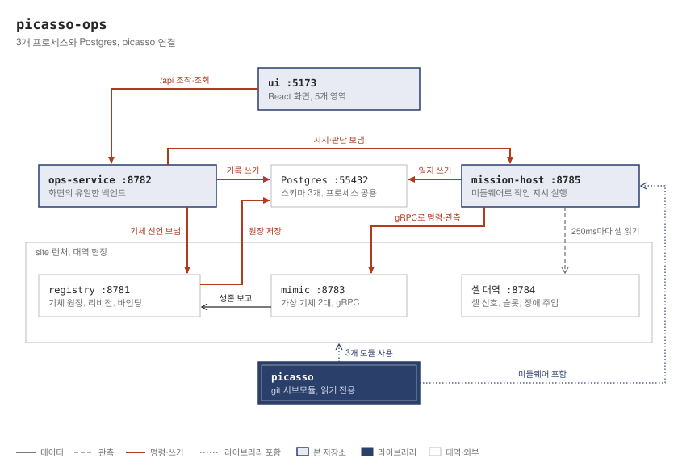
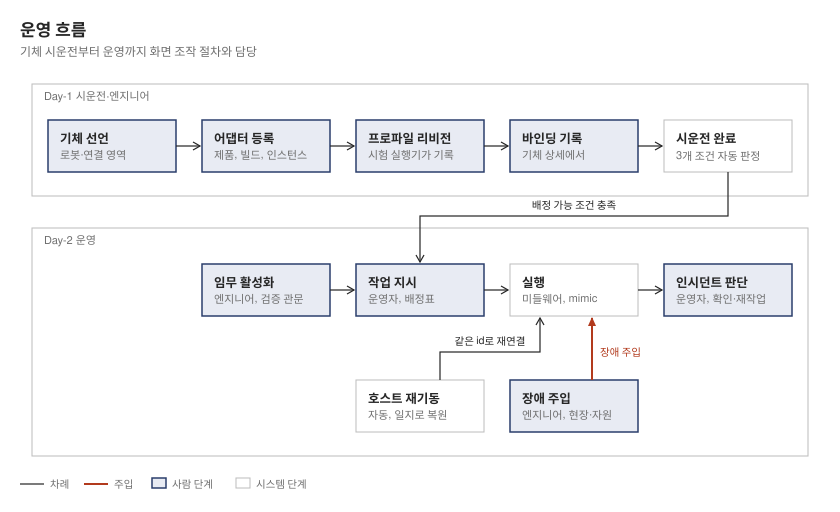
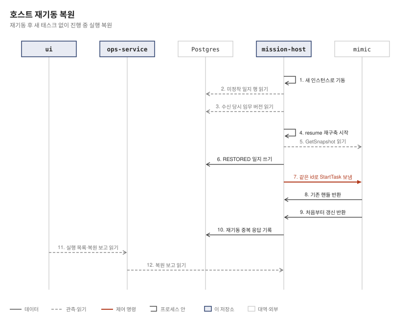

# picasso-ops

## 개요

picasso-ops는 picasso를 라이브러리로 활용하는 담는 측 저장소이자 개념 검증(PoC) 프로젝트입니다. 로봇, 임무, 엔드포인트의 운영 가능성을 입증하는 것을 목표로 합니다.
라이브러리를 사용하는 시스템이 현장 변경, 검증, 이력, 복원을 운영 절차로 매끄럽게 연결하는지 검증합니다.

picasso와 picasso-ops의 역할과 구성 차이는 다음과 같습니다.

| 구분 | picasso | picasso-ops |
|---|---|---|
| 성격 | 라이브러리: 표준 인터페이스 계약 및 미들웨어 | 담는 측 PoC |
| 구성 요소 | 계약(proto, SemVer 0.9.0), `Middleware`(배정, pump, resolve, resume), registry, mimic, harness 모듈 | 세 프로세스(`site`, `mission-host`, `ops-service`), Postgres 스키마(`ops`, `mission`), 관리 화면(`ui/`), 가짜 현장 |
| 제외 요소 | 미들웨어 영속화(임무 카탈로그는 `InMemoryMissionCatalog` 사용, 실행 일지, 송신 기록, 조작 기록 미저장), 관리 화면, 미들웨어를 실행하는 서비스 프로세스 | 실물 로봇, 실물 설비, 인증 |
| 저장소 및 런처 관계 | 서브모듈 `picasso/`, 고정 커밋 `74e4d3d`, 읽기 전용, Gradle `includeBuild` | picasso 변경은 picasso 저장소 PR(P1~P6)로 진행 |

picasso의 `registry` 모듈은 Spring Boot(`RegistryApplication.kt`)와 Postgres(Flyway `V1~V16`)로 구성되며, picasso-ops는 이를 `site` 런처 안에서 함께 구동합니다.
가짜 현장은 registry, mimic 기체(`humanoid-01`, `quadruped-01`), 셀 대역으로 이루어집니다. 보안과 인증 절차는 생략합니다.
운영 중 변경은 코드를 직접 수정하는 대신 관리 화면을 통해 진행하며, 정해진 종류의 현장 변경으로 범위를 한정합니다.
시스템에서는 미들웨어 작업 진행을 위한 pump, 상태 고정을 나타내는 정착과 봉인, 근거 등급 E0 및 E2, P와 S 단계명 등의 용어를 운영 흐름에 맞춰 사용합니다([용어 풀이](docs/reference.md#용어-풀이)).

## 핵심 장점

### 코드 수정 없는 현장 변경

정해진 현장 변경을 코드 수정 없이 화면에서 직접 처리합니다.

화면에서 변경할 수 있는 대상은 다음과 같습니다.

- 현장 설정: 사유 입력이 필수이며 변경 시 새로운 설정 버전이 생성됩니다. 연결 기준 시간과 네 가지 시간값(근거 윈도우 앞 폭 및 뒤 폭, `inDoubtGrace`, `stallWindow`)을 조정합니다.
- 기체: 선언, 퇴역, 복귀 처리를 수행합니다.
- 어댑터: 제품, 빌드, 인스턴스를 등록합니다.
- 프로파일 리비전: 파일 제출, 시험 요청, 활성화, 바인딩, 사이트 명칭 등록 기록을 관리합니다.
- 임무 정의: `PrepareSequencedRack` 데이터 정의 편집, 검증, 모의 실행, 활성화를 수행합니다.
- 운영: 작업 지시, 셀 신호(안전 신호가 아닌 BOOLEAN), 장애 주입, 보류 판단을 처리합니다.

설정 허용 범위는 다음과 같습니다.

- 연결 기준 시간: 60~3600초 (설정 버전 1 = 90초)
- 근거 윈도우 앞 폭: 5~120초 (기본 30초)
- 근거 윈도우 뒤 폭: 5~120초 (기본 15초)
- `inDoubtGrace`: 10~600초 (기본 60초)
- `stallWindow`: 30~3600초 (기본 300초)
- 범위 기준의 원본 소유권은 picasso에 있으며, 운영 서비스는 사본을 보유합니다.

화면에서 변경할 수 없는 대상은 다음과 같습니다.

- 새로운 WorkMaster 생성은 지원하지 않으며, 편집은 `PrepareSequencedRack` 하나만 가능합니다.
- 신호 사양은 셀 대역 픽스처의 코드 상수로 관리되며 화면 편집이나 버전이 없습니다.
- 시간값을 임무별로 덮어쓰는 작업은 불가합니다.
- 화면 밖 작업: 명칭 티칭, 로봇 내부 지도 및 웨이포인트 티칭, mimic 기동
- 화면 밖 제어: 로봇 수준 결함이 다음 단위를 막는 실행 수준 보류의 풀이, 실행 중단

### 잘못된 변경 거부

부적절하거나 유효하지 않은 변경을 사전에 차단합니다.
임무 정의 초안 저장은 자유롭지만, 활성화 시점에는 현재 신호 사양과 시운전을 완료한 기체 스킬을 기준으로 재검증을 거치며 해당 초안의 마지막 모의 실행을 반드시 통과해야 합니다.
셀 대역이 신호 종류, 자리, 안전 여부와 값을 함께 선언하면, 실행 호스트가 이를 검증에 필요한 신호 사양으로 사용합니다.

거부 처리 예시는 다음과 같습니다.

- 신호 사양에 없는 신호 참조: `SIGNAL_NOT_IN_SPEC` 거부 카드가 표시되고 기존 활성 버전이 그대로 유지됩니다 (`MissionVersionTest` 131행).
- 현장에 없는 스킬로 수정한 정의: «초안 1 검증: 거부됨» 문구와 함께 발견 카드가 나타납니다.
- 시험을 거치지 않은 리비전 활성화: `ACTIVATION_REFUSED`로 처리됩니다 (`CommissioningTest` 118행).
- 허용 범위 밖의 시간값: 화면에서 입력을 차단하며 운영 서비스에서 `SETTING_OUT_OF_RANGE` 거부를 반환합니다.
- 이전 기준 버전 위에서 시도한 설정 변경: 버전 충돌 거부가 발생합니다 (`SiteSettingsTest` 132행).
- 모드 불일치: 403 `MODE_NOT_ALLOWED` 오류와 함께 «이 모드에서 할 수 없는 조작» 안내를 표시합니다.
- 시운전 미완료 기체: «시운전이 끝나지 않았다» 메시지와 함께 작업 배정이 불가합니다.

시운전 완료 판정은 원장이 `CONFIRMED` 상태이고 퇴역 상태가 아니며, 활성 바인딩과 명칭 상태(`CONFIRMED` 또는 `NOT_REQUIRED`)를 모두 충족할 때 자동으로 내려집니다. 조건이 누락되면 작업 진행이 차단됩니다.

### 설명 가능성

어느 버전에서 어떤 처리가 일어났는지 명확하게 기록하고 추적합니다.

버전 및 주요 값의 기록 위치는 다음과 같습니다.

| 버전 및 값 | 기록 위치 |
|---|---|
| 현장 설정 버전 및 시간값 넷 | `ops.site_settings`, `SIGNAL_DEADLINE` 등 인시던트(봉인한 라운드 값), 막힘 카드 «근거 버전» |
| 실행 호스트 적용 버전 | 화면 «실행 호스트 반영: 버전 N» (운영 서비스 최신 버전과 구분 표기) |
| 임무 버전 | 실행 일지(수신 시점 버전), 실행 목록 «코드 정의» 및 «버전 N», 인시던트 «임무 버전» |
| 판단 | picasso 인시던트 `resolution`(승인자, 결정, 결과), 조작 기록 `RESOLVE_OPERATOR_HOLD` |
| 판단 사유 | 조작 기록에만 기록되며 picasso 인시던트에는 실리지 않음 |
| 판단자 | 화면 사용자 이름이 picasso `PERSON` 승인자로 기록 |
| 조작 | 조작 기록: 시각, 행위자 «모드/사용자», 대상, 사유, 결과 |
| 작업 응답 | 송신 기록 `mission.job_response_log`, 처분 «송신» 또는 «재기동 중복(송신 안 함)» |

판단이 내려지지 않은 인시던트는 관측 내용만 보여주고, 판단이 완료된 인시던트는 «사람이 판단함: <판단자>, <시각>» 문구와 함께 결정 내용을 관측 영역과 분리된 구역에 표시합니다.
활성 버전 전환 시 새 버전은 다음 작업 지시부터 반영되며, 이미 실행 중인 건은 생성 당시의 버전으로 종료됩니다.

### 재기동 뒤 중복 방지

실행 호스트 재기동 시 중복 명령이나 응답이 발생하지 않도록 제어합니다. 어댑터나 현장 런처의 재기동은 대상 범위에 포함되지 않습니다.
새로운 실행은 응답하기 전에 실행 일지에 먼저 기록하며, 재기동 시 pump를 돌리기 전에 상태를 다시 구성합니다.
기체에는 같은 태스크 id와 `revision`으로 StartTask를 다시 보내지만 기체는 새 태스크를 만들지 않고 기존 핸들을 돌려줍니다.
동일한 작업 응답을 다시 보내지 않으며, 재기동 중복으로 기록하여 단 1회만 송신합니다.

### 시험과 결함 주입을 통한 보증

소프트웨어 안정성을 광범위한 시험과 결함 주입으로 입증합니다.
Gradle `@Test` 421건(site 38건, mission-host 79건, ops-service 241건, e2e 63건), vitest 151건, Playwright 1건을 수행합니다.
결함 주입은 17단계에 걸쳐 합계 532건(S4b 등가 변이 1건 포함)을 실행합니다.
관리 화면에서 제공하는 «장애 주입» 기능은 운영 편의 기능이며, 테스트 스위트가 결함을 정상 감지하는지 확인하는 개발 단계의 결함 주입과 구별됩니다.

## 입증 항목

운영 관리 화면 설계 제안 §10(문서 상태 «제안», picasso PR #78 `cd688ff`, [picasso 운영 관리 화면 설계 제안 문서](https://github.com/LivingLikeKrillin/picasso/blob/74e4d3d68fac3cc83019f5af6b75d1c7cf4351b5/docs/superpowers/specs/2026-10-07-ops-console-lifecycle-design.md))에서 제시한 다섯 가지 핵심 항목을 모두 검증하고 완료했습니다.
종단간 시험 경로는 `e2e/src/test/kotlin/dev/picasso/ops/e2e/`이며, 화면 검증은 Playwright 스크립트 `ui/e2e/lifecycle.spec.ts`의 «화면에서 기체 생애주기와 어댑터 등록을 한 번 돌고 registry 를 멈추면 모름을 본다» 시험으로 확인합니다.
에뮬레이터 환경은 운영 절차를 입증하기 위한 용도로 활용합니다.

| 번호 | 항목 | 단계 | 근거 시험(클래스 · 메서드) | 핵심 한계 |
|---|---|---|---|---|
| 1 | 로봇 등록, 진단 조회 근거 시운전 확인, 가동, 퇴역, 복귀를 화면에서 처리 | S1a, S1b, S1c, S1d, S3a | `LifecycleTest` · «엔지니어가 선언하면 CLAIMED 이고 첫 보고를 기다린다», «보고가 오면 CONFIRMED 이고 바인딩 말고는 막힘이 없다», «운영자가 사유와 함께 퇴역시키면 RETIRED 이다», «복귀하면 퇴역이 풀리고 바인딩 말고는 막힘이 사라진다»; `CommissioningTest` · «명칭을 기록하면 티칭한 기체는 시운전 완료가 되고 티칭 안 한 기체는 CONTRADICTED 로 막힌다»; `JobOrderTest` · «InspectAsset 작업 지시가 배정되어 끝나고 작업 응답이 붙으며 임무 버전은 코드 정의다» | 어댑터 적합성 기록 미개방으로 빌드와 인스턴스 모두 `UNTESTED` 상태 유지 |
| 2 | 현장 시간값 변경을 다음 tick 부터 적용, 인시던트에 값과 버전 기록 | S2, S3c, P5 | `SiteTimingsTest` · «엔지니어가 시간값을 바꾸면 버전 2 이고 실행 호스트가 수 초 안에 버전 2 를 적용한다», «랙 도착 대기 버전으로 낸 작업 지시가 신호 없이 기한을 넘기면 SIGNAL_DEADLINE 인시던트가 설정 버전 2 와 그 값을 싣는다», «둘째 작업 지시가 기다리는 중에 버전 3 으로 바꾸면 기한을 넘긴 인시던트는 버전 3 을 든다»; `SiteSettingsTest` · «버전 2 위에서 3600초로 바꾸면 버전 3 이고 다음 읽기에서 오래됨이 풀린다» | 시간값이 판정을 변경하는지는 picasso 시험에서 확인하며, 통합 시험은 인시던트에 버전과 값이 실리는 범위까지 확인 |
| 3 | `PrepareSequencedRack` 데이터 정의 모의 실행 및 활성화, 실행 중 새 버전 전환, 이전 실행은 이전 버전으로 종료 (설계 문서에서 핵심으로 명시) | S3b, P3 | `MissionVersionTest` · «데이터 정의를 초안 저장하고 검증하고 모의 실행을 통과시킨 뒤 사유를 적어 활성화하면 버전 1 이다», «버전 1 로 도는 실행 중에 버전 2 를 활성화하면 옛 실행은 버전 1 로 끝나고 새 작업 지시는 랙 도착을 기다렸다가 신호를 켜면 끝난다», «실행 호스트를 같은 포트로 다시 띄워도 활성 버전은 2 이고 새 작업 지시가 버전 2 로 선다» | 모의 실행은 이상적인 현장 상태를 가정하므로 실제 현장 사실을 보증하지는 않음 |
| 4 | 신호 사양에 없는 신호 참조를 활성화 단계에서 거부, 부족한 조건 및 후속 조치 제시 | S3b | `MissionVersionTest` · «신호 사양에 없는 신호를 기다리는 초안의 활성화는 SIGNAL_NOT_IN_SPEC 거부 카드로 막히고 활성 버전은 그대로다» | 신호 사양은 코드 상수이며 화면 편집이나 별도 버전이 없음 |
| 5 | 지연, 단절, 묵은 값, 재시작을 인시던트와 사람의 판단으로 연결하고 재시작 뒤 중복 명령 및 중복 작업 응답 방지 | S4a, S4b, P6 | `FaultIncidentTest` · «단계 1 … 스킬 실패를 넣으면 단위가 FAILED 이고 GRASP_FAILED 인시던트가 두 버전과 함께 보인다», «단계 2a … OFFLINE … IN_DOUBT … ONLINE 이면 RUNNING», «단계 2b … 실제 시간으로 오래됨 막힘이 서고 ONLINE 이면 신선으로 돌아온다», «단계 3 … 기한 20초를 넘기면 운영자 보류», «단계 4 … 재작업을 판단하면 … 판단자와 사유가 남는다»; `RestartRecoveryTest` · «단계 1 … 같은 작업 지시가 새 인스턴스에서 … 다시 서고 끝까지 가며 … 도달 근거 등급이 E0 이다», «단계 2 … 끝까지 가도 태스크마다 ACCEPTED 가 한 번뿐이다», «단계 4 … 보류 응답이 매번 재기동 중복으로 적히고 송신은 한 번뿐», «단계 6 … 이전 인스턴스를 실은 판단은 INSTANCE_MISMATCH 로 거부된다» | 재기동 검증 대상은 실행 호스트에 한정됨. 전송 장애(끊김, 지연, 유실, 중복, 순서 바뀜)는 직접 주입하지 않으며 registry 발행 축에만 해당되어 실행에 노출되지 않음. 지연은 연결 상태의 묵은 값으로 갈음 |

## 주요 화면

시스템의 대표 화면 4장과 모의 대역 화면 1장은 다음과 같습니다. 화면의 주요 내용은 캡션을 통해 안내합니다.

<table>
<tr><td width="50%" valign="top"><a href="docs/screens/img/16-robots-overview-populated.png"></a><br>기체 둘, 어댑터, 리비전 등록, <code>humanoid-01</code> 시운전 완료, 엔지니어 모드<br>입증 항목 1</td><td width="50%" valign="top"><a href="docs/screens/img/20-site-overview-changed.png"></a><br><code>stallWindow</code> 600초, 현장 설정 버전 3, «실행 호스트 반영: 버전 3»<br>입증 항목 2</td></tr>
<tr><td width="50%" valign="top"><a href="docs/screens/img/37-missions-overview-active.png"></a><br>초안 2 활성화로 버전 1 생성, 초안 둘, 편집기 및 활성 정의<br>입증 항목 3</td><td width="50%" valign="top"><a href="docs/screens/img/46-operations-incident-detail-held.png"></a><br><code>SIGNAL_DEADLINE</code> 보류 상세, 운영자 판단 폼(완료 확인, 재작업)<br>입증 항목 5</td></tr>
</table>

대역 화면인 `docs/screens/img/55-operations-executions-restored-mock.png`는 재기동 복원 보고(다시 지음 1, 미룸 1, 포기 1) 및 «exec-1 (이전 exec-3)»을 보여줍니다. 이 화면은 `page.route`로 운영 서비스 응답을 S4b JSON 계약 H1 모양으로 바꿔 찍은 대역 화면입니다. 실제 재기동은 일으키지 않았고 실제 재기동 복원 동작은 `RestartRecoveryTest`로 입증합니다.
항목 4의 대안 화면으로는 검증 거부 및 발견 카드를 표시하는 `docs/screens/img/33-missions-validate-refused.png`를 참고할 수 있습니다.
전체 스크린샷 65장과 화면 설계서, 촬영 조건 및 재촬영 절차는 [docs/screens/README.md](docs/screens/README.md)에서 확인할 수 있습니다.

## 시스템 구성



picasso-ops는 세 프로세스와 단일 Postgres 데이터베이스로 구성됩니다.

- 프로세스 구성:
  - `site`: registry, mimic, `site-runner`, 셀 대역을 단일 프로세스에서 실행합니다.
  - `mission-host`: picasso 미들웨어를 사용하여 임무를 실행합니다.
  - `ops-service`: 관리 화면을 지원하는 유일한 백엔드 서비스이며 picasso 모듈을 직접 참조하지 않습니다.
- 호출 관계: 관리 화면 `ui/`는 운영 서비스(`ops-service`)만 호출하며, 운영 서비스는 registry와 실행 호스트의 REST API를 호출합니다.
- 데이터베이스: 단일 Postgres 인스턴스를 사용하며 세 스키마(registry가 사용하는 public, `ops`, `mission`)로 분리하여 데이터를 관리합니다.

## 운영 흐름



운영 절차는 등록, 검증과 시운전, 활성화, 실행, 보류와 판단, 이력 확인 순서로 이어지며, 잘못된 변경이나 조건이 맞지 않는 조작이 막히는 곳은 리비전 활성화(시험 전 활성화 거부), 임무 활성화(검증과 마지막 모의 실행 통과가 관문), 작업 지시(배정 불가 기체는 후보에서 빠짐)이고, 실행과 이력 단계에는 막는 곳이 없습니다.
역할에 따른 작업 범위와 권한은 다음과 같습니다.

| 영역 | 엔지니어 | 운영자 |
|---|---|---|
| 현장·자원 | 사유 입력 후 연결 기준 시간 및 시간값 변경(새 설정 버전 생성), 장애 주입(기체, 종류, 사유) | 조회만 가능 |
| 로봇·연결 | 기체 선언, 어댑터 제품·빌드·인스턴스 등록, 리비전 제출·시험 요청·활성화, 바인딩, 사이트 명칭 등록 기록 | 퇴역 및 복귀 |
| 임무·정책 | `PrepareSequencedRack` JSON 편집, 템플릿 사용, 초안 저장·검증·모의 실행, 사유 입력 후 활성화 | 조회만 가능 |
| 운영 | 작업 지시 입력 및 배정 가능 판정 조회(제출 불가), 셀 신호 제어, 보류 상세 조회 | `InspectAsset`, `PrepareSequencedRack` 작업 지시 제출, 셀 신호 제어, 사유 입력 후 완료 확인 및 재작업 판단 |
| 이력 | 조작 기록 조회 | 조작 기록 조회 |

시운전 완료는 세 가지 조건을 만족해야 합니다. 원장이 `CONFIRMED` 상태이고 퇴역 상태가 아니어야 하며, 활성 바인딩이 존재하고 명칭 상태가 `CONFIRMED` 또는 `NOT_REQUIRED`여야 합니다. 이 조건은 자동으로 판정되며 조건이 누락되면 작업이 막힙니다.
리비전 시험 결과는 사람이 직접 작성하지 않으며, 적재 토큰을 가진 런처가 구동한 `site-runner`만 기록할 수 있습니다.
셀 신호는 엔지니어와 운영자 모두 안전 신호가 아닌 BOOLEAN 신호만 켜거나 끌 수 있으며, 안전 신호는 값 조회만 지원합니다.
설비 신호 중 `rack_present`를 켜면 대기 템플릿의 설비 대기 상태가 종료됩니다.

## 재기동 시퀀스



재기동 시점에는 다음 세 가지 동작이 일어납니다.

- 재기동할 때 pump 시작 전 정착하지 않은 일지 행을 받은 순서대로 `Middleware.resume`으로 다시 짓고, 기체 스냅숏으로 재작업 횟수를 맞춥니다.
- 동일한 태스크 id와 `revision`으로 다시 접속하면 mimic이 새 태스크 대신 기존 핸들을 반환합니다.
- 새 인스턴스의 첫 작업 응답이 가장 최근 송신과 같으면 재기동 중복으로 기록하고 송신하지 않습니다.

근거 시험은 `RestartRecoveryTest` 6단계(약 81초)입니다. 작업 지시, 보류와 운영자 판단을 다루는 다른 시퀀스 둘은 [상세 참고 문서의 주요 시퀀스](docs/reference.md#주요-시퀀스)를 참고합니다.

## 선행 도구

스택 실행과 검증에 필요한 도구 목록입니다.

- Docker: 시험(Testcontainers)과 Postgres 실행에 사용합니다.
- JDK 21 이상: Playwright와 `site/smoke.sh`의 배포본 실행에 필요하며, Gradle은 JDK 21 툴체인을 받아서 씁니다.
- Node 22
- `curl`: `site/smoke.sh` 실행에 사용합니다.
- bash: `site/smoke.sh`(`#!/usr/bin/env bash`), `set -a; . ./.env`, `env -u` 실행에 필요합니다. Windows 환경에서는 git-bash를 사용합니다(계획 실행 결과의 Windows 실측은 git bash 기준입니다).

## 저장소 받기

서브모듈을 포함하여 저장소를 복제합니다.

```bash
git clone --recurse-submodules https://github.com/LivingLikeKrillin/picasso-ops.git
```

복제한 뒤 서브모듈을 초기화하고 갱신합니다.

```bash
git submodule update --init
```

서브모듈이 없으면 첫 빌드가 `picasso/gradle/libs.versions.toml` 위치에서 멈춥니다.

Windows 환경에서 `Filename too long` 오류가 발생하면 아래 설정을 적용하고 체크아웃합니다.

```bash
git -C picasso config core.longpaths true
```

```bash
git -C picasso checkout -f
```

환경 설정 파일인 `.env`는 저장소에 커밋되어 있습니다(`git ls-files`에 포함되어 있으며 첫 커밋은 `3a51f29`(S1a)입니다). 복사나 수정 없이 바로 사용합니다. 로컬 PoC 값(사이트 id `SITE_ID=site-01`, DB 접속값, 포트 다섯 개, 토큰 두 개)이 지정되어 있으며, 첫 행 주석은 «이 기계 밖에서 쓰지 않는다»입니다. 런처, 실행 호스트, 운영 서비스, 시험, CI가 이 설정을 읽습니다.

## 띄우기

전체 스택을 먼저 실행하는 방법과 smoke 스크립트로 부분 확인하는 방법을 안내합니다.

### 전체 스택

터미널 네 개를 열어 각 컴포넌트를 기동합니다.

1. Postgres 컨테이너를 올립니다.

```bash
docker compose -f site/compose.yaml --env-file .env up -d --wait
```

2. 세 컴포넌트의 배포본을 빌드합니다.

```bash
./gradlew :site:installDist :mission-host:installDist :ops-service:installDist
```

3. 네 터미널 모두 각 저장소 루트에서 환경 변수를 적용합니다.

```bash
set -a; . ./.env; set +a
```

4. 터미널 1에서 런처를 실행합니다. 기동 출력에 registry 주소, mimic 기체와 gRPC 포트, 셀 대역 주소가 출력됩니다.

```bash
site/build/install/site/bin/site
```

5. 터미널 2에서 실행 호스트를 실행합니다. 모의 실행 프로파일과 스키마 경로가 작업 디렉터리 기준이므로 반드시 저장소 루트에서 실행합니다.

```bash
env -u PICASSO_INGEST_TOKEN -u PICASSO_OPERATOR_TOKEN mission-host/build/install/mission-host/bin/mission-host
```

6. 터미널 3에서 운영 서비스를 실행합니다. 실행 호스트는 운영 서비스가 `ops` 스키마를 올리기 전까지 미적용 상태를 유지하며 작업 지시를 거부합니다. 운영 서비스 기동 뒤 1초 안에 현장 설정이 적용됩니다.

```bash
env -u PICASSO_INGEST_TOKEN ops-service/build/install/ops-service/bin/ops-service
```

7. 터미널 4에서 화면 개발 서버를 실행합니다.

```bash
cd ui && npm ci && npm run dev
```

접속과 초기 상태 안내:

- 화면 주소는 `http://localhost:5173` 입니다. 해당 포트가 사용 중이면 Vite가 다음 포트를 엽니다.
- 운영 서비스 API 주소는 `http://127.0.0.1:8782/api/robots` 입니다.
- 접속 시 첫 상태는 로봇·연결 영역, «엔지니어» 모드, 사용자 `local` 입니다.
- 첫 조작은 상단 머리의 «엔지니어»와 «운영자» 라디오 버튼, «사용자» 입력 칸입니다.
- 사용자 이름은 정규식 `/^[A-Za-z0-9._-]{1,64}$/`을 따라야 하며, 어긋나면 직전 이름으로 요청합니다.
- 새로고침하면 영역, 모드, 사용자가 처음 상태로 돌아갑니다.
- Gradle run 작업 둘을 한 작업 트리에서 겹쳐 띄우지 않습니다.
- Postgres 볼륨은 보존되므로 다음 기동에도 데이터가 이어집니다. 처음부터 다시 시작하려면 정리 명령을 실행합니다.
- 주의: 정리 명령 실행 시 볼륨과 데이터가 삭제됩니다.

```bash
docker compose -f site/compose.yaml --env-file .env down -v
```

### 부분 확인: smoke 스크립트

핵심 동작을 빠르게 확인할 때 실행합니다.

```bash
bash site/smoke.sh
```

주의 사항과 범위:

- 주의: 종료할 때 같은 compose 프로젝트(`site`)를 `down -v` 처리하므로 직접 띄워 둔 스택의 볼륨과 데이터도 함께 삭제됩니다(`site/smoke.sh:3,9`).
- 확인 범위는 Postgres, 런처, 운영 서비스입니다. registry REST로 기체 하나를 선언하고 45초 안에 `CONFIRMED` 상태에 도달하는지 검증합니다.
- 실행 호스트를 띄우지 않으므로 임무나 운영 영역은 체험할 수 없습니다.
- 로그는 `build/site.log`와 `build/ops.log`에 남습니다.
- 실측 기준 기체 선언 16~17초 뒤 `CONFIRMED`에 도달하며, 종료 코드 0, 남은 컨테이너 0으로 종료합니다.

## 첫 체험 경로

새 스택 및 전체 스택을 기준으로 Playwright 생애주기 순서에서 추린 첫 체험 경로입니다.

| # | 모드·영역 | 조작 | 보이는 결과 |
|---|---|---|---|
| 1 | 엔지니어 · 로봇·연결 | «기체 선언» `humanoid-01` / `HA-0001` 입력 후 «선언» 클릭 | «humanoid-01 선언: 반영됨», 상세 `CONFIRMED`, «바인딩 없음»(런처 mimic이 보고 중이므로 선언 시 보고가 붙음) |
| 2 | 엔지니어 · 로봇·연결 | 제품 `acme`/`fleet` 등록 후 빌드 `1.0.0`, 계약 semver `0.9.0` 입력, 인스턴스 `fleet-gw-01` 등록 | 각 «…: 반영됨», 인스턴스 목록 `UNTESTED` |
| 3 | 엔지니어 · 로봇·연결(프로파일) | 리비전 제출 파일 `picasso/profile/profiles/humanoid-a.json` 지정 후 «시험 요청», «활성화» 클릭 | `TESTED`, «PASS (site-runner)», `ACTIVE`(Playwright 기준 리비전 `picasso-ref/humanoid-a#2`) |
| 4 | 엔지니어 · `humanoid-01` 상세 | «바인딩»(빌드 `acme/fleet 1.0.0` + 리비전) 후 «명칭 등록 기록» 클릭 | «시운전: 완료», «막힘 없음» |
| 5 | 엔지니어 · 현장·자원 | `stallWindow(초)` 600 입력 및 변경 사유 작성 후 «변경» 클릭 | «stallWindow 600초로 변경: 반영됨», 변경 이력에 새 버전 행 생성, 15초 안에 «실행 호스트 반영: 버전 N» |
| 6 | 운영자 · 운영 | 임무 `InspectAsset`, 대상 1 id `T1`, 장소 `bay-7` 입력 후 «작업 지시 내기» 클릭 | 배정 가능 표 `humanoid-01` «가능», «InspectAsset 작업 지시: 배정됨», 실행 목록 «코드 정의», 약 32초(이동 20 + 점검 12, ±10%) 뒤 `PHYSICALLY_DONE` |
| 7 | 엔지니어 · 임무·정책 | «데이터 정의 템플릿 불러오기» 클릭 후 «초안 저장», «검증», «모의 실행», 활성화 사유 입력 뒤 «활성화» 클릭 | «초안 1 검증: 통과», «초안 1 모의 실행: 통과», «버전 1 (활성)» |

선택 조작 및 유의 사항:

- 선택 8: 이력 영역으로 이동하면 조작 기록 행(«엔지니어/local», «운영자/local»)을 확인할 수 있습니다.
- `quadruped-01`은 명칭 티칭이 없으므로 «기체가 아는 명칭 없음» 막힘이 발생하며 이는 정상 동작입니다.
- 근거 코드는 `ui/e2e/lifecycle.spec.ts` 32~208행, 화면 설계는 `docs/screens/screen-design.md` §3을 따릅니다.
- 운영자 보류와 판단 체험(운영자 보류 대기 템플릿, 실제 20초)은 [Playwright 생애주기 시험 단계](docs/reference.md#playwright-생애주기-시험-단계)를 참고합니다. 보류 버전이 DB에 남기 때문에 이후 `PrepareSequencedRack` 임무가 모두 20초 대기로 시작합니다([임무 편집의 한계](docs/reference.md#임무-편집의-한계)).

## 시험

테스트 실행 명령입니다.

Gradle 전체 빌드와 시험:

```bash
./gradlew build
```

UI 단위 시험:

```bash
cd ui && npm ci && npm test
```

Playwright 실행 준비(최초 1회 실행):

```bash
./gradlew :site:installDist :mission-host:installDist :ops-service:installDist
```

```bash
cd ui && npx playwright install chromium
```

Playwright E2E 시험 실행:

```bash
cd ui && npx playwright test
```

주의 사항:

- Playwright는 시작과 종료 시 compose 프로젝트 `site`를 `down -v` 처리하므로 직접 띄운 스택 데이터가 삭제되며 매번 빈 DB로 구동됩니다(`ui/e2e/postgres.mjs:15,21`, `teardown.ts:10`). Gradle e2e는 Testcontainers를 사용하므로 해당하지 않습니다.

판정 방식:

- Gradle: 프로세스 종료 코드 대신 `*/build/test-results/test/*.xml` 파일에 기록된 실패 시험 이름으로 판정합니다.
- Playwright: 출력된 `N passed`, `N failed` 줄과 실패 시험 이름으로 판정합니다.
- 판정 근거: S1 스펙 `docs/superpowers/specs/2026-10-07-s1-skeleton-robot-lifecycle-design.md:336` 규율에 따라 결함 주입 시 시험이 결함을 잡았다고 인정받으려면 실패한 시험 이름이 XML에 남아야 합니다. 또한 picasso `CLAUDE.md` §2.3, §2.4에 명시된 대로 입력을 선언하지 않으면 Gradle `UP-TO-DATE` 메커니즘으로 인해 시험이 돌지 않고 허위 통과가 발생할 수 있습니다.
- 실례: S1c 기준선 측정 당시 Gradle이 시험을 건너뛰어 `--rerun` 옵션을 사용했습니다. P4 결함 주입 실행기가 시험을 돌리지 못하고 놓침 결과만 내어 XML 파일이 없으면 즉시 중단되도록 수정했습니다.

시험 수:

| 대상 | 수 | 기준 |
|---|---|---|
| site | 38 | `main 443a14c` Gradle `@Test` |
| mission-host | 79 | 같음 |
| ops-service | 241 | 같음 |
| e2e | 63 | 같음 |
| vitest | 12 파일, 151 통과 | 2026-10-10 로컬 |
| Playwright | 1 | `ui/e2e/lifecycle.spec.ts` |

Gradle 시험 수는 선언 수와 같으며 `@ParameterizedTest`나 `@Disabled`는 사용하지 않았습니다. 통과 근거는 CI run `37953985650`(`main 443a14c` push) gradle·ui·playwright 성공, run `37941325122`(`9606364`) 성공, S4b 새 클론 빌드 Gradle 421 실패 0, vitest 151, Playwright 1 통과(4.3분)입니다.

실행 시간:

| 실행 | 시간 |
|---|---|
| vitest | 로컬 약 1분(2026-10-10 실측 50초) |
| Playwright | 약 4분(로컬 시험 3.4분, 스택 기동 포함 4.0분) |
| CI `ui` | 32초 |
| CI `playwright` | 6분 30초 |
| CI `gradle` | 11분 3초 |

CI 시간 기준은 `main 9606364` push run `37941325122`입니다(`443a14c` run: gradle 11분 16초, playwright 6분 26초, ui 26초).

Playwright 동작 상세:

- Postgres, 런처, 실행 호스트, 운영 서비스, 화면 순서로 기동하고 시험 종료 시 모두 종료합니다. 화면은 `npm run build && npm run preview`로 포트 4173에 엽니다. 작업자 수는 1, 상한 시간은 420초, expect 대기 시간은 60초입니다.
- Playwright 검증 범위: 기체 생애주기·어댑터, 리비전·시운전, 현장 설정·시간값, 작업 지시·실행, 임무 활성화, 셀 신호, 장애 주입, 운영자 보류·판단, 송신 기록, registry 중단 시 «모름» 상태입니다(전문은 [Playwright 생애주기 시험 단계](docs/reference.md#playwright-생애주기-시험-단계) 참고).
- Playwright가 다루지 않는 범위: 실행 호스트 재기동은 포함하지 않으며 `RestartRecoveryTest`에서 다룹니다.
- CI: Gradle build와 시험 XML 업로드, UI test 및 build, Playwright를 실행합니다. `npm run lint`와 스크린숏 촬영은 돌리지 않습니다.
- e2e 내부 설정과 스크린숏 재촬영 절차는 [상세 참고 문서의 시험](docs/reference.md#시험)을 참고합니다.

## 개발 방식

설계와 구현 검증에 대한 근거 문서는 `docs/superpowers/plans/*.md`의 «실행 결과» 절(17개)과 `docs/superpowers/specs/`입니다.

- 단계별 설계 스펙: 모든 단계마다 설계 스펙을 먼저 작성했습니다. S3a부터는 JSON 계약 문서(S3a, S3b, S3c, S4a, S4b)를 작성해 스파이크의 다음 영역 입력으로 넘겼습니다.
- 검토 절차: 스펙 검토 2회와 계획 검토 1회(S3b 이후 단계)를 거치며 검토 지적 사항을 스파이크에 다시 반영했습니다.
- 스파이크 우선 검증: 스크래치 저장소에서 코드 작성, 시험, 전체 빌드, Playwright, 결함 주입을 먼저 완료했습니다(S1b, S1c는 계획 작성 때 돌린 스크래치 빌드입니다).
- 기계 추출 기반 계획 적용: 계획은 스파이크 결과에서 생성했습니다. 계획의 코드 블록을 기계로 추출(`s2-patches/` 등)하여 구현자가 복사하고 `git apply`로 적용했으며 사람이 손으로 옮기지 않았습니다(S2 계획 검토에서 수작업 전치 위험을 지적받아 S2부터 적용했습니다).
- 하위 에이전트 구현: 작업 묶음마다 하위 에이전트 1명(P3부터 Sonnet)이 구현을 맡고 컨트롤러가 기계 대조와 시험으로 검토했습니다.
- 바이트 대조: 커밋 파일과 스파이크/계획 블록 간 바이트 대조 결과가 모두 일치했습니다. 대상은 S1a 43건 및 `ci.yml`·`smoke.sh`, S1b 39건, S1c 26건, P2a 31건, P2b 23건, S1d 37건, S2 31건, P3 49건, P4 12건, S3a 68건, S3b 64건, P5 15건, P6 7건, S3c 29건, S4a 43건, S4b 46건입니다. 다수 단계에서 트리 해시도 일치했습니다.
- 결함 주입 시험: 고의로 결함을 넣고 되돌리면서 지정 시험이 XML에서 실패하는지 확인했습니다.

| 단계 | 건수 | 비고 |
|---|---|---|
| P1 | 8 | 계획 4건에서 8건으로 확대 |
| S1a | 16 | |
| S1b | 27 | 계획 21건 + 검토 6건 |
| S1c | 25 | 계획 22건 + 검토 3건 |
| P2a | 19 | |
| P2b | 25 | |
| S1d | 26 | |
| S2 | 16 | |
| P3 | 22 | |
| P4 | 7 | |
| S3a | 28 | |
| S3b | 57 | |
| P5 | 17 | |
| P6 | 23 | 워크트리는 대표 1건 |
| S3c | 41 | |
| S4a | 100 | 워크트리는 site 10건 + 대표 5건 |
| S4b | 75 | 74건 탐지 + 등가 변이 1건(I4), 워크트리 대표 5건 |
| 합계 | 532 | |

- 이중 실행과 최적화: 스파이크와 워크트리에서 두 번 실행했습니다(P3~S4a 대부분). S4a부터는 바이트 대조가 일치할 때 워크트리에서 모듈별 대표 항목만 실행하여 1.5~2시간을 단축했습니다(사용자 승인 반영).
- 등가 변이 대응: 등가 변이가 발견되면 시험을 보강하거나 주입 대상에서 제외했습니다. 대상 사례는 S1d(칸 바꿔 읽기), S2(지난 기준 버전 비교), P3(배정이 읽은 쌍), S3c(H2), S4b(I4)입니다.
- 새 클론 빌드 검증: 커밋 파일만으로 짧은 경로에 새로 복제한 뒤 `./gradlew build`, `npm ci && npm test`, Playwright를 실행했습니다(S1a~S4b, P2a~P6).
- 병합: picasso-ops는 S3a부터 묶음별 커밋을 유지해 스택을 보존했습니다(스쿼시 없음). picasso 쪽은 트리 동일을 확인한 뒤 합친 커밋으로 반영했습니다.
- 관련 문서는 [docs/superpowers/](docs/superpowers/)를 참고합니다.

## 중요한 한계

해석과 실행 시 고려해야 할 한계 사항입니다.

- 에뮬레이터 범위: 운영 절차만 입증하며 실물 성능, 안전, 벤더 호환성은 입증하지 않습니다.
- 재기동 복원 범위: 실행 호스트 재기동만 복원합니다. 어댑터와 현장 런처가 함께 재기동하면 기체 태스크 장부가 소실되어 동일한 태스크 id가 새 작업으로 취급됩니다.
- 모의 실행 환경: 목적지 슬롯은 처음부터 기대 자재가 배치되어 있고, 이름 있는 신호는 대기 노드의 기대 값으로 채워지며, 기체 실패 모드는 지원하지 않습니다. 작업 정의가 끝까지 동작하는지만 확인하며 현장 사실을 보증하지 않고 요청은 동기화되지 않습니다. 실제 시간 상한은 30초입니다.
- 인증 없는 로컬 PoC: 보안과 인증은 생략되어 있습니다. 실행 호스트 REST와 셀 대역 인증이 없으므로 동일한 기계의 다른 프로세스가 모드 검사 없이 작업 지시, 임무 활성화, 신호 쓰기를 호출할 수 있습니다. 바닥 소유 검사가 없으며 활성화 권한은 모드 검사로만 제한되고 명부는 제공되지 않습니다.
- 데이터 삭제 주의: `site/smoke.sh`, Playwright(시험 및 스크린숏 촬영), 정리 명령은 모두 compose `down -v`를 수행하므로 띄우기 및 시험 절의 주의 사항을 확인해야 합니다.
- 결과 확인 영향: 판단 뒤 작업 응답은 바로 갱신되지 않습니다(picasso 판단이 작업 응답 갱신을 호출하지 않습니다). 반면 실행 목록 상태와 인시던트는 즉시 변경됩니다.
- 결과 확인 영향: 재기동 뒤 기한 보류는 설정된 기한만큼 늦게 다시 동작하며 그동안 화면에는 진행 중인 것으로 표시됩니다([데이터와 재기동](docs/reference.md#데이터와-재기동) 참고).
- 전체 한계 목록은 [시스템 동작 및 운영 상세](docs/reference.md#시스템-동작-및-운영-상세)를 참고합니다.

## 문서

### 상세 및 설계 문서

| 문서 | 설명 |
| --- | --- |
| [docs/reference.md](docs/reference.md) | 단계 이력, 구성 표, 시퀀스 둘, 알아 둘 것 전체, Playwright 전 단계, 시간값을 다룹니다. |
| [운영 관리 화면 설계 제안](https://github.com/LivingLikeKrillin/picasso/blob/74e4d3d68fac3cc83019f5af6b75d1c7cf4351b5/docs/superpowers/specs/2026-10-07-ops-console-lifecycle-design.md) | §7 화면 구성, §8 유도 순서, §9 검증이 못 잡는 것, §10 입증 항목을 다룹니다. |
| `docs/` | 설계 스펙과 구현 계획 입구입니다. |
| `docs/superpowers/plans/` | 구현 계획 17개가 있습니다. |
| 단계별 스펙·JSON 계약 표 | [단계별 설계 스펙 및 JSON 계약](docs/reference.md#단계별-설계-스펙-및-json-계약)을 참고합니다. |

### 화면 문서

| 문서 | 설명 |
| --- | --- |
| `docs/screens/README.md` | 화면 문서 입구입니다. 65장, 촬영 조건, 다시 찍는 법을 다룹니다. |
| `docs/screens/screen-design.md` | 화면 설계서입니다. |
| `docs/screens/development.md` | 개발 문서입니다. |
| `docs/screens/img/INDEX.md` | 스크린숏 목록입니다. |

### picasso 연계 문서

| 문서 | 설명 |
| --- | --- |
| [picasso `docs/commissioning.md`](https://github.com/LivingLikeKrillin/picasso/blob/74e4d3d68fac3cc83019f5af6b75d1c7cf4351b5/docs/commissioning.md) | 시운전 10단계를 다룹니다. |
| [picasso `docs/orchestration.md`](https://github.com/LivingLikeKrillin/picasso/blob/74e4d3d68fac3cc83019f5af6b75d1c7cf4351b5/docs/orchestration.md) | §8 작업 응답의 바깥 형식과 별도 배치 저장소를 다룹니다. |
| [picasso ADR 47](https://github.com/LivingLikeKrillin/picasso/blob/74e4d3d68fac3cc83019f5af6b75d1c7cf4351b5/docs/adr/0047-operator-decision-is-made-by-a-person.md) | 사람의 판단을 다룹니다. |
| [picasso `docs/glossary.md`](https://github.com/LivingLikeKrillin/picasso/blob/74e4d3d68fac3cc83019f5af6b75d1c7cf4351b5/docs/glossary.md) | 용어 풀이를 다룹니다. |
