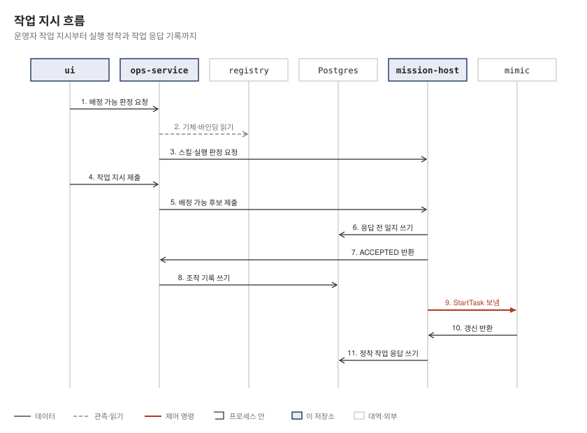
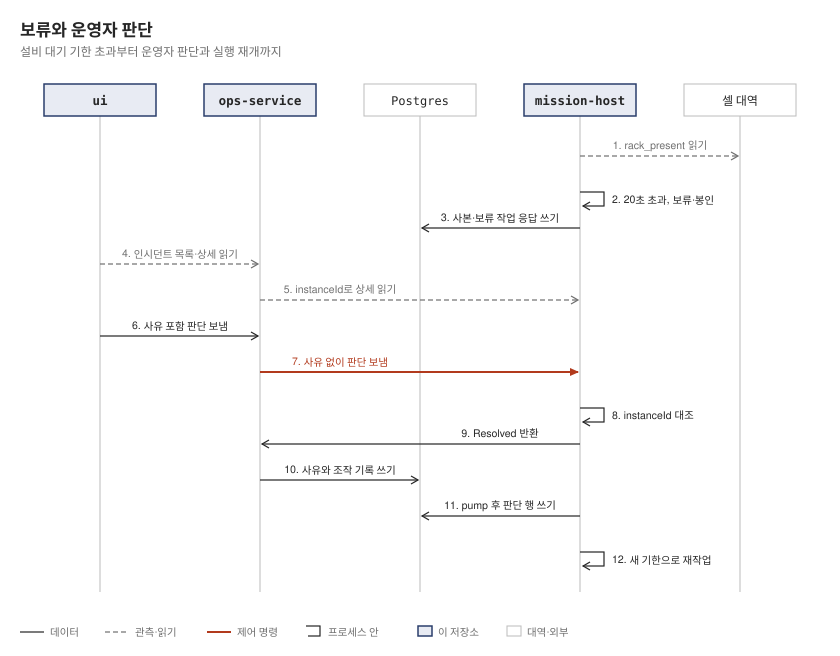

# 상세 참고 문서

## 단계 이력

현재 단계는 S4a 위에 위치한 S4b 단계입니다. 실행 호스트 재기동 뒤 실행 복원과 중복 명령 및 중복 작업 응답 방지를 포함합니다.

두 저장소의 머지 시각 기준 진행 순서는 다음과 같습니다.

P1 → S1a → S1b → S1c → P2a → P2b → S1d → 용어 → S2 → P3 → P4 → S3a → S3b → P5 → S3c → S4a → P6 → S4b → 화면 문서(2026-10-07 13:47 ~ 10-10 00:44 KST)

표는 머지 순서이며 P4(10/8 19:00)가 S3a(10/8 21:54)보다 먼저입니다. P는 picasso PR, S는 picasso-ops PR입니다. 용어 풀이는 [용어 풀이](#용어-풀이)를 참고합니다.

| 단계 | 더한 것 | PR(머지 커밋) |
|---|---|---|
| P1 | registry 어댑터 제품·빌드 등록·조회 운영자 REST 3개 | picasso #79 (`6b1a255`) |
| S1a | site·ops-service·ui·e2e 골격, 다섯 영역, 모드·사용자, 전체 상태 띠 | picasso-ops #1 (`b4fcc56`) |
| S1b | 로봇 선언·퇴역·복귀, 막힘·거부 판정, 기체 상세, Playwright CI | picasso-ops #2 (`d94a5e6`) |
| S1c | 어댑터 제품·빌드·인스턴스 등록과 화면 | picasso-ops #3 (`2a8c617`) |
| P2a | 리비전 시험 요청·집기·보고, 시험 실행기 | picasso #80 (`2370ed3`) |
| P2b | 리비전 제출·활성화·바인딩 REST, 기동 스킬 동기화 | picasso #81 (`41beedb`) |
| 문서 | P2·S1d 스펙, P2a·P2b 계획 | picasso-ops #4 (`3f00dfb`), #5 (`f84e095`) |
| S1d | 리비전·시험·활성화·바인딩·명칭 기록, 시운전 판정 | picasso-ops #6 (`694ea9e`) |
| 용어 | 용어집 대응표에 따른 문서·화면 문구 변경 | picasso-ops #7 (`7254521`) |
| S2 | 현장 설정 버전, 연결 기준 시간 변경, 막힘 근거 버전 | picasso-ops #8 (`16de942`) |
| P3 | 노드형 임무 정의·검증·버전 카탈로그, 실행의 임무 버전 고정 | picasso #82 (`8f0cc04`), 설계 picasso-ops #9 (`f7ca937`) |
| P4 | 기한에 닫힌 태스크 스트림 재부착, mimic 엔진 잠금 | picasso #83 (`1e3f4ae`) |
| S3a | 실행 호스트, 작업 지시·배정 가능·실행 목록·셀 대역 | picasso-ops #10 (`d16b19b`) |
| S3b | 임무 편집·검증·모의 실행·활성화, 셀 신호 조작 | picasso-ops #11 (`b2cce34`), 한계 문서 정정 picasso #84 (`2ca7cd6`) |
| P5 | 현장 시간값 소스 포트, 인시던트 의도의 설정 버전 | picasso #85 (`195c1ee`) |
| S3c | 시간값 넷, 실행 호스트 반영 표시 | picasso-ops #12 (`e482c33`) |
| S4a | 장애 주입, 인시던트, 보류 단위 운영자 판단 | picasso-ops #13 (`8ed1b91`) |
| P6 | 재기동 복원 입구 `Middleware.resume` | picasso #86 (`74e4d3d`) |
| S4b | 재기동 복원 보고, 이전 인스턴스 인시던트, 작업 응답 송신 기록 | picasso-ops #14 (`9606364`) |
| 화면 문서 | 스크린숏 65장, 화면 설계서·개발 내역, 촬영 설정 | picasso-ops #15 (`443a14c`) |

단계별 결함 주입과 바이트 대조 수는 [README 의 개발 방식](../README.md#개발-방식)에 있습니다.

## 구성 상세

### 구성 요소, 포트, 저장

| 구성 요소 | 역할 | 포트·바인딩 | 저장 |
|---|---|---|---|
| `ui/` | React·Vite·TypeScript 관리 화면, 운영 서비스만 호출 | dev 5173, Playwright preview 4173 | 없음 |
| `ops-service/` | 화면의 유일한 백엔드, registry·실행 호스트 REST 호출, 조작 기록·현장 설정 저장, picasso 모듈 미사용(빌드가 `checkNoPicassoOnMain` 으로 집행) | `OPS_PORT=8782`, 루프백 | 스키마 `ops`: `operation_log`, `site_settings`, 뷰 `site_timings_current` |
| `mission-host/` | picasso 미들웨어로 작업 지시 실행, 임무 정의 검증·모의 실행·활성화, 250ms 마다 셀 대역 읽기·pump, 호출자는 운영 서비스뿐 | `HOST_PORT=8785`, 루프백 | 스키마 `mission`: 임무 버전 표 3(`draft`, `mock_run`, `mission_version`) + S4b 표 5(`execution_journal`, `execution_journal_event`, `job_response_log`, `incident_copy`, `incident_copy_resolution`) |
| `site/` | registry·mimic·`site-runner`·셀 대역을 한 프로세스에서 구동 | 아래 세부 구성 요소 참조 | registry 마이그레이션을 런처가 실행 |
| `registry` | 기체 원장, 어댑터·리비전·바인딩·명칭·생존 보고 | `REGISTRY_PORT=8781`, 루프백 | Postgres public |
| `mimic` | `humanoid-01`·`quadruped-01` 가상 기체, 가상 시계, seed 0 | `MIMIC_GRPC_PORT=8783`, 모든 인터페이스 | 메모리 |
| `site-runner` | 1초마다 리비전 시험 요청을 집어 별도 mimic 으로 시험, registry 에 결과 기록 | 없음 | registry |
| 셀 대역 | 셀 신호·자리·슬롯 관측, 신호 쓰기·장애 주입 입구 | `SITE_CELL_PORT=8784`, 루프백 | 메모리 |
| Postgres | registry public, 운영 서비스 `ops`, 실행 호스트 `mission` | `127.0.0.1:55432` | `postgres:16-alpine`, DB `picasso`, `site/compose.yaml` |
| `picasso/` | 고정 커밋 읽기 전용 서브모듈, Gradle `includeBuild` | 없음 | 없음 |
| `e2e/` | 한 JVM 에 Postgres·registry·mimic·실행 호스트·운영 서비스를 띄우는 통합 시험 | 시험 스택 | Testcontainers |

### 핵심 경로

핵심 동작의 호출 경로는 다음과 같습니다.

- 장애 주입: 화면 `/api/faults` → 운영 서비스 `/host/faults` → 실행 호스트 → 현장 루프백 `/faults` → 잠금 아래 mimic 엔진 직접 호출
- 신호 쓰기: 화면 `/api/cell/signals/{name}` → 운영 서비스 `/host/cell/signals/{name}` → 실행 호스트 → 현장 `/cell/signals/{name}`
- 작업 지시: 운영 서비스가 배정 가능 기체만 후보로 선정 → 실행 호스트의 picasso 미들웨어가 하나 선택 → mimic 기체에서 실행

### 기타 구성 및 설정

- 모의 실행: 실행 호스트 내부의 별도 mimic과 가상 시계로 표본 작업 지시 하나를 실행합니다. 현장 기체, 셀 대역, registry에는 접근하지 않으며, 프로파일로 `mission-host/mock-run/humanoid-a.json`을 사용합니다.
- 서브모듈: `picasso 74e4d3d` 커밋으로 고정된 읽기 전용 서브모듈입니다. 버전 카탈로그 `picasso/gradle/libs.versions.toml`을 공유하며, picasso 라이브러리 측 수정은 picasso 저장소 PR로 반영합니다.
- 환경 변수: `.env`에 정의된 변수 이름은 `SITE_ID`, `PICASSO_DB_URL`, `PICASSO_DB_USER`, `PICASSO_DB_PASSWORD`, `REGISTRY_PORT`, `OPS_PORT`, `MIMIC_GRPC_PORT`, `SITE_CELL_PORT`, `HOST_PORT`, `PICASSO_OPERATOR_TOKEN`, `PICASSO_INGEST_TOKEN`이며, 실제 값은 커밋된 `.env`를 따릅니다.
- 기체 명부: `site/robots.json`에 `humanoid-01`(HA-0001, `humanoid-a.json`)과 `quadruped-01`(QB-0001, `quadruped-b.json`)이 정의되어 있습니다.

## 운영 흐름 상세

운영 흐름의 전문은 [README 의 운영 흐름](../README.md#운영-흐름)에 기술되어 있습니다.

설계 제안 §8.1에 따라 초안은 언제나 작성할 수 있으며, 활성화 단계에서만 강한 관문 검증을 적용합니다.

## 주요 시퀀스

### 작업 지시

<picture>
  <source media="(prefers-color-scheme: dark)" srcset="diagrams/sequence-job-order.dark.svg">
  
</picture>

- 배정 가능 판정 분담: 운영 서비스는 시운전과 연결 상태를 판정하고, 실행 호스트는 실행 중인 작업과 스킬 적합성을 판정합니다. 운영 서비스는 배정 가능한 기체만을 후보로 전달합니다.
- 기록 시점: 실행 호스트는 새 실행 정보를 응답하기 전에 실행 일지에 먼저 기록합니다. 운영 서비스는 응답을 받은 뒤 조작 기록에 남깁니다.
- 작업 응답 처리: 접수(`ACCEPTED`) 시점에는 작업 응답을 생성하지 않습니다. pump가 mimic에서 태스크를 시작하며, 실행이 정착하거나 보류될 때 작업 응답을 송신 기록에 남깁니다.
- 재조회 동작: 응답이 없으면 운영 서비스가 1초 뒤 실행 목록을 한 번 재조회합니다.

### 보류와 운영자 판단

<picture>
  <source media="(prefers-color-scheme: dark)" srcset="diagrams/sequence-hold-decision.dark.svg">
  
</picture>

- 운영자 보류 전환: 운영자 보류 대기 템플릿 `ARRIVAL_WAIT_HOLD`의 설비 대기 단위가 20초 기한을 초과하면 단위 운영자 보류로 전환되고 인시던트가 봉인됩니다.
- 상태 기록: 해당 pump 직후 인시던트 사본과 보류 작업 응답이 호스트 DB `mission`에 기록됩니다.
- 운영자 판단 전달: 운영자 판단(완료 확인 또는 재작업, 사유 필수 입력) 시 상세 정보의 `instanceId`를 실어 운영 서비스에서 실행 호스트로 전달합니다.
- 인스턴스 불일치 검증: 실행 호스트 재기동으로 인해 인스턴스가 다르면 409 `INSTANCE_MISMATCH`를 반환합니다.
- 사유 기록 위치: 입력된 사유는 실행 호스트로 전달되지 않으며, 조작 기록에만 남깁니다.
- 판단 기록 반영: 판단 행은 다음 pump 뒤 인시던트 사본에 반영됩니다. 그전에 재기동하면 판단은 조작 기록에만 남습니다.
- 장애 주입 처리: 진행 중 `pick_place` 스킬 실패와 같은 장애 주입은 대개 `GRASP_FAILED` 인시던트로 이어지며, 이는 운영자 판단 대상이 아닙니다.

## 시스템 동작 및 운영 상세

### 데이터와 재기동

새로운 실행이 시작되면 응답을 반환하기 전에 작업 지시와 배정 기체를 실행 일지에 먼저 기록합니다.

복원은 pump 호출 전에 진행됩니다. 아직 정착하지 않은 일지 행을 수신 순서와 수신 당시의 임무 버전 그대로 복원하며, 동일한 태스크 id로 다시 연결되므로 새로운 명령은 생성되지 않습니다.

스냅숏 읽기에 실패하면 해당 행의 처리를 미루고 매 pump마다 재시도를 수행합니다. 해당 기체는 «복원 못 한 실행이 있다» 상태로 분류되어 배정 대상에서 제외됩니다.

재기동 후에도 활성 임무 버전은 그대로 유지되며, 이전 인스턴스의 인시던트는 사본을 통해 조회합니다.

상위 시스템이 없으므로 전선 자리 대신 송신 기록을 보관합니다. 새 인스턴스의 첫 응답이 가장 최근 송신 기록과 같으면 재기동에 따른 중복으로 간주하여 송신하지 않습니다.

사본 기록 시점은 pump 뒤입니다. 운영자 판단 직후 다음 사본 기록 전에 재기동되면 해당 판단은 조작 기록에만 남게 됩니다.

판단은 자동으로 재주입되지 않습니다. 다시 구성된 단위가 보류되면 사람이 직접 다시 판단해야 합니다.

복원 시 앞선 단위는 이번 인스턴스에서 관측하지 못했으므로 근거 등급 E0가 부여되며, 해당 실행의 작업 응답 역시 도달 근거 등급 E0가 됩니다.

기한 보류는 재기동 후 기한만큼 지연되어 다시 발생하며, 그동안 화면에는 도는 것으로 표시됩니다.

실행 일지, 송신 기록, 사본에는 별도의 보존 기한이 없습니다.

`mission` 스키마는 임무 버전 관련 표 3개와 S4b 표 5개로 구성된 덧붙이기 전용 구조입니다. 데이터베이스 트리거가 UPDATE, DELETE, TRUNCATE를 차단하므로 데이터를 삭제하려면 스키마째 제거해야 합니다.

셀 신호 값은 런처 재기동 시 처음 값으로 재설정됩니다.

### 현장 대역의 한계

런처 시계는 기동 직후 mimic 가상 시계를 실제 시각까지 맞춘 뒤, 이후 실제 시간 1초마다 따라잡도록 동작합니다. 가상 시각은 실제 시각보다 앞서지 않으며, 두 시각의 차이는 1초 이내로 유지됩니다.

자재 제시 자리인 `SEQ-IN-02.BIN-A`에는 항상 `ENGINE-COVER-A`가 배치되며, `RACK-204.S01`부터 `S04`까지의 슬롯은 초기에 비어 있습니다.

슬롯은 `pick_place` 작업이 성공할 때 제시 자리의 자재로 채워지며, 자동으로 비워지지 않습니다. 이는 기체의 보고를 근거로 한 것이며 독립된 설비 센서 등을 통한 확인은 아닙니다.

근거 윈도우의 앞 폭 안에 채워진 슬롯을 재사용할 경우, 스킬 실패가 발생했을 때 단위 실패 대신 운영자 보류로 처리될 수 있습니다.

`quadruped-01` 기체는 `pick_place` 케이퍼빌리티가 없으므로 연결 상태 장애만 발생할 수 있습니다.

셀 신호 세트는 `rack_present`, 안전 신호인 `guard_closed`, 그리고 `lot_code`로 구성됩니다. 이 신호들은 시간 경과에 따라 자동으로 바뀌지 않으며, `POST /cell/signals/{name}` 요청으로만 변경할 수 있습니다. 안전 신호에 대한 쓰기 요청은 거부됩니다.

신호 사양은 셀 대역 픽스처 코드에 상수로 정의되어 있으며, 화면 편집이나 버전 관리를 지원하지 않습니다.

신호 품질은 값, 관측 시각, «모름» 상태로만 구분되며, 응답 없음, 단절, 불확실 등의 품질 상태는 표시하지 않습니다.

`pick_place` 단위는 기체별 시드 추첨에 따라 약 6%의 확률로 자연 실패가 발생합니다. 슬롯 4개를 처리하는 `PrepareSequencedRack` 임무에서는 전체 과정 중 어딘가에서 실패할 확률이 약 22%이며, 실패 내역은 실행 목록에 표시됩니다.

화면 시험에서는 현장의 두 `pick_place` 단위 중 첫 번째가 강제로 실패하도록 설정되어 있습니다. 따라서 완주 추첨을 거치지 않으며, seed 0 환경에서 자연 실패가 섞이지 않습니다.

장애 주입 시 현장에서 진행 중인 태스크를 탐색하며, 대상이 없으면 «진행 중 태스크 없음» 오류로 거부됩니다. 작업 지시 직후에는 상태가 `ACCEPTED`이므로 다음 시계 진행이 이루어진 뒤에 장애를 주입해야 합니다.

스킬 실패 주입은 진행 중인 `pick_place`에 `SKILL_EXECUTION_FAILED`(`GRASP_FAILED`)를 전달하는 방식으로 수행됩니다.

연결 상태 장애 주입은 `OFFLINE` 또는 `CONNECTION_BROKEN`을 통해 단절을 유도하고 `ONLINE`으로 복구합니다. 동작 중인 로봇 단위는 단절 시 `IN_DOUBT` 상태로 전환되며, 복구 시 `RUNNING` 상태로 돌아옵니다.

mimic 제어 채널은 열지 않으므로 시계 밀기, 시계 모드, 시드 노출 기능이 제공되지 않습니다.

`PAYLOAD_LOST`, `LOCALIZATION_LOST`, 제어권 상실과 같은 지속 결함은 주입하지 않습니다. picasso 내에 해당 결함을 제거하는 호출이 없어 이를 주입하면 현장을 재기동할 때까지 기체 동작이 차단됩니다.

어댑터 적합성은 기록 기능이 개방되지 않아 빌드와 인스턴스 모두 `UNTESTED` 상태로 유지됩니다.

기체 선언 전에 registry로 전송된 mimic 생존 보고는 거부되며, 거부된 보고는 어디에도 기록되지 않습니다. 기체 선언이 완료된 이후부터 정상적으로 보고가 연결됩니다.

`site/robots.json` 파일에서 `humanoid-01`에는 `dock-3`과 `bay-7`이라는 티칭 명칭이 지정되어 있고 `quadruped-01`에는 명칭이 없습니다. 런처 기동 시 이 정보가 주입되며, `quadruped-01`의 명칭을 기록하려 하면 «기체가 아는 명칭 없음»으로 처리됩니다.

registry는 티칭 명칭의 개수만 대조하며, 명칭 자체의 문자열은 검증하지 않습니다.

### 임무 편집의 한계

임무 편집기는 textarea 형태로 제공되며, 편집기 전용 JSON Schema 파일은 없습니다. 임무 정의에 대한 유효성 검증은 실행 호스트에서 직접 수행합니다.

기본 템플릿 세트는 데이터 정의, 랙 도착 대기, 운영자 보류 대기 세 가지로 구성되며, `mission-host/src/main/resources/mission-templates/` 경로에 위치합니다.

랙 도착 대기 템플릿은 120초 기한이 지나면 실행을 중단하고 `ABORTED` 상태로 전환합니다.

운영자 보류 대기 템플릿인 `ARRIVAL_WAIT_HOLD`는 20초 기한이 경과했을 때 중단하는 대신 대기 단위를 운영자 보류 상태로 전환합니다.

운영자 보류 대기를 활성화하면 이후 발행되는 모든 `PrepareSequencedRack` 작업 지시가 20초 대기로 시작됩니다. 이 상태에서도 기체는 다른 작업에 다시 배정될 수 있습니다.

런처 시계가 실제 시각을 따르므로, 랙 도착 대기 작업 지시가 내려진 뒤 2분 안에 `rack_present` 신호를 켜야 작업이 다음 단계로 진행됩니다.

셀 대역은 한 번 변경된 신호를 이전 상태로 되돌리지 않습니다. 따라서 신호를 한 번 켜 두면 이후의 대기 단위는 즉시 해제됩니다.

모의 실행 프로파일은 실패 모드를 제외한 사본을 사용하며, 무작위 추첨을 수행하지 않습니다.

임무 활성화 근거로는 해당 초안의 마지막 모의 실행 결과만 사용하며, 이전 버전의 모의 실행을 재실행하지 않습니다.

모의 실행 시에는 현장 시간값 대신 케이퍼빌리티 기본값을 사용합니다. 이로 인해 임무 검증 결과의 `basisVersion` 항목은 항상 비어 있습니다.

### 판정과 권한

site는 적재 토큰과 운영자 토큰을 둘 다 받고, 운영 서비스는 운영자 토큰만 받고, 실행 호스트는 둘 다 받지 않습니다(실행 명령의 `env -u`). 브라우저에는 토큰을 보내지 않습니다.

registry, 실행 호스트, 운영 서비스, 셀 대역은 모두 `127.0.0.1`에만 바인딩됩니다.

mimic gRPC 서비스는 picasso가 지정한 주소에 따라 모든 인터페이스에 바인딩됩니다. 인증 체계가 없는 기체 제어 API를 제공하며, 포트 번호는 `.env` 파일에 고정되어 있습니다.

배정 가능 판정에서 물어보지 못한 칸은 «모름»이고, «모름»이 하나라도 있으면 그 기체는 배정 불가입니다.

단위가 보류되면 운영자가 인시던트 상세 화면에서 직접 판단을 내려야 합니다. 운영자가 판단하지 않으면 실행이 정착되지 않으며 해당 기체도 새로 배정할 수 없습니다.

재작업을 선택하면 해당 단위를 다시 계획하며, 대기 단위의 경우 새로운 기한이 적용됩니다.

완료 확인을 선택하면 추가 근거 없이 해당 단위를 완료 처리하고 다음 단위로 진행합니다.

판단은 현재 실행 중인 인스턴스의 인시던트에 대해서만 수행할 수 있습니다. 요청 시 인시던트 상세의 `instanceId`를 전달하며, 요청 도중 실행 호스트가 재기동되면 «실행 호스트가 재기동해 인스턴스가 다름» 오류로 거부됩니다.

판단 요청에 대한 응답이 없으면 운영 서비스가 1초 뒤 인시던트 목록을 한 번 조회하여, 동일한 행위자와 동일한 결정이 요청 시점 이후에 등록되었는지 대조합니다.

실행 호스트가 요청 id를 저장하지 않으므로 처리 중인 상태를 구분하지 못합니다. 잠금 대기로 인해 뒤늦게 반영된 판단은 «반영 안 됨»으로 잘못 판정될 수 있으며, 운영 서비스와 실행 호스트가 동일한 머신에서 동작한다는 전제를 두고 있습니다.

장애 주입은 `INJECT_FAULT` 조작 기록으로 남으며 재조회를 수행하지 않습니다. 따라서 응답을 받지 못하면 실제로 장애가 주입되었는지 여부를 끝내 알 수 없습니다.

registry가 응답하지 않을 경우 기존 목록을 비우지 않고 직전 값에 «모름» 상태를 병합하여 유지합니다.

리비전 시험 실행기(`site-runner`)는 리비전 시험마다 자기 mimic을 따로 띄우므로 현장 기체의 보고와 상태를 바꾸지 않습니다.

## 현장 시간값 상세

앞 폭, 뒤 폭, `inDoubtGrace`는 결과 판정에 직접 영향을 미치는 값입니다. 반면 `stallWindow`는 정체 상태를 화면에 표시하는 시점에만 관여합니다.

변경된 연결 기준은 재기동 없이 다음번 기체 목록 읽기 주기부터 즉시 적용됩니다.

실행 호스트는 원본 표를 직접 읽지 않고 운영 서비스 뷰인 `ops.site_timings_current`를 1초마다 읽기 전용으로 조회하며, 다음 pump 주기부터 적용합니다. 현재 적용 상태는 `GET /host/site-timings` 엔드포인트로 확인합니다.

실행 호스트와 통신할 수 없으면 «모름», 뷰를 아직 읽지 못했으면 «미적용»으로 표시됩니다. «미적용» 상태인 동안에는 신규 작업 지시를 받지 않으며, 기체별 배정 가능 여부의 이유에도 «미적용»이 명시됩니다. 이 상태에서 제출된 작업 지시는 미배정 상태로 남습니다.

시간값 설정은 현장 전체에 하나의 값으로 적용되며, 임무별로 덮어쓸 수 없습니다.

운영 서비스가 뷰를 변경하면 실행 호스트의 조회 로직도 함께 변경되어야 합니다. 통합 시험인 `SiteTimingsTest`의 «실제 현재 버전 뷰의 칸은 실행 호스트가 읽는 뷰 상수의 칸과 이름과 형이 같다» 시험 메서드가 뷰 컬럼의 이름과 타입을 직접 대조하여 검증합니다.

1초의 읽기 주기로 인해 운영 서비스의 최신 버전과 실행 호스트에 적용된 버전 사이에 차이가 발생할 수 있으며, 이 두 수치는 화면에 각각 따로 표시됩니다.

뷰 읽기에 실패하면 마지막으로 정상 적용된 버전을 유지하고 읽기 실패를 표시합니다. 뷰의 값이 picasso 허용 범위를 벗어난 경우에는 적용을 거부하고 해당 버전과 이유를 표시합니다.

근거 기한은 해당 단위가 완료되는 순간의 뒤 폭 값으로 결정됩니다. 단위가 완료된 이후 뒤 폭을 변경하더라도 이미 완료된 단위에는 영향을 주지 않습니다.

인시던트에 기록되는 값은 해당 라운드를 봉인할 당시의 설정 버전과 4가지 시간값입니다. 따라서 단위 완료 시점에 근거 기한을 산출했던 시간값과 서로 다를 수 있습니다.

설비 대기 단위의 기한 판정은 임무 정의에 명시된 `deadlineSeconds` 값을 기준으로 수행하며, 현장 시간값은 사용하지 않습니다.

현장 설정 버전, `inDoubtGrace`, `stallWindow` 값은 picasso 데이터 내보내기 항목에 포함되지 않습니다.

보고의 오래됨 판정은 운영 서비스가 registry의 실제 수신 시각을 기준으로 수행합니다. 연결 기준 하한이 60초로 설정되어 있으므로, 통신이 단절된 뒤 `REPORT_STALE` 상태로 전환되어 기체 배정이 불가능해질 때까지는 실제 1분 이상의 시간이 소요됩니다.

## 시험

### E2E 통합 시험 내부 구조

현장 가상 시계를 시험이 직접 진행합니다. 호스트 기동 전에 `ops` 스키마를 올려 설정 버전 1 적용 상태로 시작합니다.
임무 버전 시험에서는 실행 호스트만 같은 포트로 다시 띄워 활성 버전이 유지되는지 확인합니다.
장애 및 인시던트 시험은 새 스택에서 스킬 실패를 먼저 검증하며, 오래됨 단계에서만 실제 60초를 넘겨 대기합니다.
재기동 시험인 `RestartRecoveryTest`는 6단계로 약 81초가 걸립니다. 재기동은 `E2eStack.restartHost()`로 수행하며, 새 명령 수신 여부는 site의 `Site.taskHistory`로 확인합니다.
실제 대기가 필요한 구간은 1분 넘게 기다리는 오래됨 확인과 20초 동안 대기하는 운영자 보류입니다.
시험 파일은 `SkeletonTest`, `LifecycleTest`, `AdapterTest`, `CommissioningTest`, `SiteSettingsTest`, `JobOrderTest`, `MissionVersionTest`, `SiteTimingsTest`, `FaultIncidentTest`, `RestartRecoveryTest`가 있으며, 도우미 파일로 `E2eStack`, `ExecutionDriver`, `Commissioned`를 사용합니다.

### Playwright 생애주기 시험 단계

`ui/e2e/lifecycle.spec.ts`의 단일 시험에서 전 생애주기 단계를 다음과 같이 검증합니다.

1. 기체 선언, 퇴역, 퇴역 뒤 보고, 복귀를 확인하고 어댑터 제품, 빌드, 인스턴스를 등록합니다.
2. 리비전 제출, 시험 요청, 실행기의 `TESTED`, 활성화, 바인딩, 명칭 기록을 거쳐 `humanoid-01` 시운전을 완료합니다. `quadruped-01` 기체는 «기체가 아는 명칭 없음»으로 막힙니다.
3. 연결 기준 120초의 설정 버전 2를 적용하고 운영자 변경 거부를 확인한 뒤, `stallWindow` 600초인 버전 3과 호스트 반영을 검증합니다.
4. 운영자 `InspectAsset`을 요청하고 `humanoid-01`만 배정 가능한 상태에서 배정하여 «코드 정의» 실행이 `PHYSICALLY_DONE`으로 종료되는지 확인합니다.
5. 데이터 정의 초안 저장, 검증, 모의 실행, 활성화를 거쳐 «버전 1 (활성)» 상태로 만듭니다.
6. `rack_present` 신호를 쓰고 슬롯 하나에 `PrepareSequencedRack` 강제 스킬 실패를 일으켜 `GRASP_FAILED` 인시던트를 발생시킵니다.
7. 운영자 보류 대기의 실제 20초 기한 동안 엔지니어 판단 버튼이 없음을 확인합니다. 운영자 재작업 선택, 신호 켜기, 실행 종료를 거쳐 «사람이 판단함» 상태를 확인합니다. 보류 버전이 DB에 남기 때문에 이 단계를 시험의 끝 쪽에 둡니다.
8. S4b 송신 기록에서 «송신 기록의 작업 지시»를 선택하고, 처분 «송신», «재기동 중복» 0행, «그 가운데 재기동 중복 0건»을 확인합니다.
9. 마지막으로 registry를 중단하고 «모름» 상태를 확인합니다.

해당 시험에는 재기동 단계가 없습니다(시험 주석: «재기동 단계는 통합 시험(RestartRecoveryTest)이 본다»).

### 입증 근거 통합 시험 메서드

통합 시험 소스 파일 경로는 `e2e/src/test/kotlin/dev/picasso/ops/e2e/<클래스>.kt`이며, 메서드 이름 뒤의 괄호는 `main 443a14c` 기준 행 번호입니다.

`LifecycleTest`:

- `엔지니어가 선언하면 CLAIMED 이고 첫 보고를 기다린다`(51)
- `보고가 오면 CONFIRMED 이고 바인딩 말고는 막힘이 없다`(63)
- `운영자가 사유와 함께 퇴역시키면 RETIRED 이다`(73)
- `퇴역 뒤에도 보고가 오면 운영자가 풀 막힘으로 보인다`(81)
- `복귀하면 퇴역이 풀리고 바인딩 말고는 막힘이 사라진다`(102)

`CommissioningTest`:

- `시험 전 활성화는 ACTIVATION_REFUSED 이고 시험을 요청하면 현장 실행기가 TESTED 로 올린다`(118)
- `명칭을 기록하면 티칭한 기체는 시운전 완료가 되고 티칭 안 한 기체는 CONTRADICTED 로 막힌다`(163)

`JobOrderTest`:

- `InspectAsset 작업 지시가 배정되어 끝나고 작업 응답이 붙으며 임무 버전은 코드 정의다`(89)
- `PrepareSequencedRack 작업 지시가 pick_place 가 있는 기체에 배정되어 셀 대역 신호로 E2 에 이른다`(113)

`SiteSettingsTest`:

- `엔지니어가 버전 1 위에서 60초로 바꾸면 버전 2 이고 조작 기록에 성공 행이 남는다`(85)
- `마지막 보고가 60초보다 오래되면 근거 버전 2 의 오래됨으로 막힌다`(101)
- `버전 2 위에서 3600초로 바꾸면 버전 3 이고 다음 읽기에서 오래됨이 풀린다`(120)
- `지난 기준 버전으로 바꾸려 하면 버전 충돌로 거부되고 조작 기록에 거부 행이 남는다`(132)
- `범위 밖 값과 운영자 모드는 보내기 전에 막히고 조작 기록에 남지 않는다`(145)

`SiteTimingsTest`:

- `엔지니어가 시간값을 바꾸면 버전 2 이고 실행 호스트가 수 초 안에 버전 2 를 적용한다`(99)
- `랙 도착 대기 버전으로 낸 작업 지시가 신호 없이 기한을 넘기면 SIGNAL_DEADLINE 인시던트가 설정 버전 2 와 그 값을 싣는다`(114)
- `둘째 작업 지시가 기다리는 중에 버전 3 으로 바꾸면 기한을 넘긴 인시던트는 버전 3 을 든다`(144)
- `범위 밖 시간값은 칸 이름을 실은 SETTING_OUT_OF_RANGE 이고 운영 서비스의 범위 사본은 picasso 범위와 같다`(170)
- `실제 현재 버전 뷰의 칸은 실행 호스트가 읽는 뷰 상수의 칸과 이름과 형이 같다`(203)

`MissionVersionTest`:

- `데이터 정의를 초안 저장하고 검증하고 모의 실행을 통과시킨 뒤 사유를 적어 활성화하면 버전 1 이다`(81)
- `신호 사양에 없는 신호를 기다리는 초안의 활성화는 SIGNAL_NOT_IN_SPEC 거부 카드로 막히고 활성 버전은 그대로다`(131)
- `버전 1 로 도는 실행 중에 버전 2 를 활성화하면 옛 실행은 버전 1 로 끝나고 새 작업 지시는 랙 도착을 기다렸다가 신호를 켜면 끝난다`(156)
- `실행 호스트를 같은 포트로 다시 띄워도 활성 버전은 2 이고 새 작업 지시가 버전 2 로 선다`(231)

`FaultIncidentTest`:

- `단계 1 데이터 정의 버전으로 도는 pick_place 에 스킬 실패를 넣으면 단위가 FAILED 이고 GRASP_FAILED 인시던트가 두 버전과 함께 보인다`(96)
- `단계 2a 로봇 단위가 도는 중 연결을 OFFLINE 으로 바꾸면 시계를 밀지 않아도 실행이 IN_DOUBT 이고 ONLINE 이면 RUNNING 으로 돌아온다`(150)
- `단계 2b 유휴 humanoid-01 을 OFFLINE 으로 두고 연결 기준을 60초로 줄이면 실제 시간으로 오래됨 막힘이 서고 ONLINE 이면 신선으로 돌아온다`(174)
- `단계 3 보류 버전으로 낸 작업 지시가 신호 없이 기한 20초를 넘기면 운영자 보류이고 인시던트가 미해결이며 보류 중이다`(218)
- `단계 4 운영자가 사유를 적어 재작업을 판단하면 대기가 새로 시작되고 신호를 켜면 끝나며 판단자와 사유가 남는다`(258)
- `단계 5 신호를 되돌린 뒤 또 하나의 보류에서 완료 확인을 판단하면 단위가 근거 없이 완료되고 그 표시가 선다`(294)
- `단계 6 모드가 틀리거나 사유가 없으면 사전 거부이고 보류가 아닌 단위의 판단과 도는 태스크 없는 스킬 실패는 거부로 남는다`(324)

`RestartRecoveryTest`:

- `단계 1 도는 실행이 있을 때 다시 띄우면 같은 작업 지시가 새 인스턴스에서 끝난 단위는 끝난 대로 도는 단위는 도는 대로 다시 서고 끝까지 가며 앞서 통과한 대기 때문에 도달 근거 등급이 E0 이다`(97)
- `단계 2 도는 InspectAsset 을 다시 띄워도 시계를 밀기 전 기체의 태스크 로그가 그대로이고 끝까지 가도 태스크마다 ACCEPTED 가 한 번뿐이다`(138)
- `단계 3 작업 지시를 받은 뒤 다른 임무 버전을 활성화하고 다시 띄우면 받은 때의 임무 버전으로 다시 서고 그 버전으로 끝난다`(178)
- `단계 4 운영자 보류에 선 실행을 두 번 다시 띄우면 기한이 다시 지난 뒤의 보류 응답이 매번 재기동 중복으로 적히고 송신은 한 번뿐이며 같은 인스턴스에서 재작업 뒤 다시 선 보류는 송신이다`(199)
- `단계 5 설비 대기 보류를 재작업으로 판단한 뒤 다시 띄우면 대기가 새 기한으로 다시 서고 그 보류 응답은 재기동 중복이며 옛 인시던트와 그 판단은 earlier 에만 있다`(245)
- `단계 6 재기동 뒤 이전 인스턴스의 인시던트와 판단이 보이고 이전 인스턴스를 실은 판단은 INSTANCE_MISMATCH 로 거부된다`(289)

### 스크린숏 촬영

스크린숏 촬영은 CI와 분리된 별도 설정으로 실행합니다.

```bash
cd ui && npx playwright test -c playwright.screens.config.ts
```

동일한 스택을 기동하여 `docs/screens/img/` 경로의 PNG 파일을 모두 삭제한 뒤 다시 촬영하며, `INDEX.md`를 다시 작성합니다. 이때 동일한 Compose 환경의 `down -v` 수행에 유의합니다.
촬영 조건은 해상도 1440×900, 배율 1, 밝은 색 테마, `ko-KR` 언어 환경입니다. 전체 65장 가운데 `-mock` 대상이 9장(55~63번)이며, 작업자 수는 1, 제한 시간은 900초입니다. CI 실행은 포함하지 않습니다.

## 단계별 설계 스펙 및 JSON 계약

| 단계 | 설계 스펙 | JSON 계약 |
|---|---|---|
| S1a, S1b, S1c | `docs/superpowers/specs/2026-10-07-s1-skeleton-robot-lifecycle-design.md` | |
| P2, S1d | `docs/superpowers/specs/2026-10-08-p2-s1d-runner-binding-commissioning-design.md` | |
| S2 | `docs/superpowers/specs/2026-10-08-s2-site-settings-design.md` | |
| P3 | `docs/superpowers/specs/2026-10-08-p3-mission-definition-versions-design.md` | |
| S3a | `docs/superpowers/specs/2026-10-08-s3a-execution-host-design.md` | `docs/superpowers/specs/2026-10-08-s3a-json-contract.md` |
| S3b | `docs/superpowers/specs/2026-10-08-s3b-mission-versions-design.md` | `docs/superpowers/specs/2026-10-08-s3b-json-contract.md` |
| S3c | `docs/superpowers/specs/2026-10-09-s3c-site-timings-design.md` | `docs/superpowers/specs/2026-10-09-s3c-json-contract.md` |
| S4a | `docs/superpowers/specs/2026-10-09-s4a-faults-incidents-design.md` | `docs/superpowers/specs/2026-10-09-s4a-json-contract.md` |
| S4b | `docs/superpowers/specs/2026-10-09-s4b-restart-recovery-design.md` | `docs/superpowers/specs/2026-10-09-s4b-json-contract.md` |

`docs/superpowers/plans/` 경로에 17개 구현 계획이 있습니다: P1, S1a, S1b, S1c, P2a, P2b, P3, P4, S1d, S2, S3a, S3b, P5, P6, S3c, S4a, S4b.

## 용어 풀이

- pump: 실행 호스트가 250ms 고정 지연으로 셀 대역 `GET /cell`을 읽고 `Middleware.pump()`를 호출하는 한 라운드입니다(`MissionHost.kt:793` `PUMP_PERIOD`).
- 정착: 실행이 종료 상태에 도달함을 뜻합니다. 일지 이벤트 `SETTLED`는 `PHYSICALLY_DONE`, `UNVERIFIED`, `FAILED`, `ABORTED`에만 기록되며, `PARTIAL`은 제외됩니다.
- 봉인: 라운드 종료 시 `sealIncidents`로 인시던트를 확정하는 작업입니다. `unresolved`는 봉인 시점에 단위가 OPERATOR_HOLD 또는 IN_DOUBT였는지를 나타내는 칸이며, 봉인 뒤에는 그 값을 유지합니다(picasso `docs/glossary.md` 206행).
- 근거 등급: E2는 셀 슬롯 관측 근거로 확인된 등급이고, E0은 복원 뒤 앞선 단위 등과 같이 설비 근거가 없는 등급입니다.
- P/S: P는 picasso 저장소 단계, S는 picasso-ops 단계를 뜻합니다.
- 인스턴스(`instanceId`): 실행 호스트를 기동할 때마다 새로 생성되는 `Middleware`이며, `exec-N`, `resp-N`, `incident-N` 식별자는 1부터 시작합니다.

## 추가 화면 참고


위 화면은 `32-operations-executions-running.png`로, 코드 정의 `InspectAsset` 실행과 실행 호스트 인스턴스 및 마지막 pump 상태를 보여 줍니다(크기 1408×258, 실제 스택 환경).

그 밖의 참고 화면 목록은 다음과 같습니다.

- `14-robots-detail-commissioned.png`: 시운전 완료 상세 화면입니다.
- `29-operations-order-assigned.png`: 배정됨 화면입니다.
- `49-operations-incident-decided.png`: «사람이 판단함: local» 화면입니다.
- `50-operations-job-responses-filtered.png`: 재기동 중복 0건 화면입니다.
- `54-history-overview-populated.png`: 변경 이력 화면입니다.
- `52-operations-overview-operator.png`: 운영자 개요 화면입니다(1440×3267, 세로 길이가 깁니다).
