# picasso-ops 화면 설계서

기준: picasso-ops `main` = `9606364`, 서브모듈 picasso = `74e4d3d`. 스크린숏은 `img/` 에 있고 목록은 `img/INDEX.md` 입니다. 표기 규칙은 `README.md` 의 «읽는 법» 을 따릅니다. 파일 위치는 따로 적지 않으면 `ui/src/components/` 기준입니다.

## 목차

1. 제품과 사용자
2. 전역 구조
3. 영역별 화면
4. 디자이너 리터치 지침
5. 시험이 기대는 글자
6. 알려진 어긋남

---

## 1. 제품과 사용자

### 1.1 무엇인가

picasso-ops 는 picasso 를 라이브러리로 쓰는 담는 측 저장소이며, 로봇, 임무, 엔드포인트의 운영 가능성을 입증하는 PoC 입니다. 실제 하드웨어 현장은 없고 가짜 현장 런처(registry, mimic 기체, 셀 대역)를 띄웁니다. 운영 중 변경은 코드 수정이 아니라 이 관리 화면에서 합니다(저장소 `README.md` 첫 절).

보안과 인증은 생략합니다. 모드와 사용자 이름은 로그인 없이 화면에서 고르고, 요청 헤더로 운영 서비스에 실립니다(§1.3). 운영 서비스도 모드를 집행해 맞지 않는 조작을 403 `MODE_NOT_ALLOWED` 로 막습니다(S1 스펙 §8).

화면은 브라우저 하나에 영역 다섯을 둔 단일 페이지입니다. URL 이 영역을 기억하지 않으므로 새로고침하면 처음 상태(로봇·연결 영역, 엔지니어 모드, 사용자 `local`)로 돌아갑니다(`App.tsx:19-20`).

### 1.2 두 모드

모드는 머리의 라디오 둘(«엔지니어», «운영자», 이 순서)로 고릅니다. 처음 값은 엔지니어입니다.

| 모드 | 하는 일 |
|---|---|
| 엔지니어 | 기체 선언, 어댑터 제품·빌드 선언과 인스턴스 등록, 프로파일 리비전 제출·시험 요청·활성화, 바인딩, 사이트 명칭 등록 기록, 현장 설정 변경, 장애 주입, 임무 편집(템플릿, 초안 저장, 검증, 모의 실행, 활성화) |
| 운영자 | 퇴역과 복귀, 작업 지시 내기, 보류 단위의 운영자 판단(완료 확인, 재작업) |
| 두 모드 공통 | 모든 조회, 셀 대역 신호 켜기·끄기, 송신 기록의 작업 지시 고르기, 작업 지시 폼 입력과 배정 가능 판정 보기 |

다른 모드의 폼과 버튼은 감추고, 대개 그 자리에 어느 모드에서 하는지를 적습니다. 전체 목록은 §2.3 에 있습니다.

### 1.3 사용자 이름 칸

| 항목 | 사실 | 근거 |
|---|---|---|
| 라벨 | «사용자» | `ModeSwitch.tsx:36-47` |
| 처음 값 | `local` | `App.tsx:19` |
| 규칙 | `/^[A-Za-z0-9._-]{1,64}$/` | `api.ts:308` |
| 어긋날 때 | 칸에 `aria-invalid=true`, 옆에 빨간 글자 «사용자 이름은 영문·숫자·._- 로 1~64자입니다. 요청에는 직전 이름(${session.user})을 씁니다» | `ModeSwitch.tsx:40,48-52` |
| 쓰임 | 모든 요청 헤더 `X-Ops-User`. 모드는 `X-Ops-Mode` | `api.ts:316` |
| 바뀌면 | 다섯 조회를 곧바로 다시 읽음 | `App.tsx:62` |

사용자 이름은 이력 영역의 «행위자», 인시던트의 «사람이 판단함», 운영자 판단 폼의 «판단자는 ${user} 입니다» 에 나옵니다.

### 1.4 다섯 영역

nav 순서대로입니다(`areas.ts:10-16`). 처음 열리는 영역은 둘째 «로봇·연결» 입니다.

| 순서 | 버튼 글자 | 하는 일 | 그리는 컴포넌트 |
|---|---|---|---|
| 1 | «현장·자원» | 현장 설정 버전(연결 기준 시간과 미들웨어 시간값 넷)을 보이고 바꿈. 기체에 장애를 넣음 | `SiteArea`, `FaultPanel` (`App.tsx:97-107`) |
| 2 | «로봇·연결» | 기체 선언과 원장 상태, 연결, 막힘, 시운전. 어댑터와 프로파일 등록. 바인딩과 명칭 기록. 퇴역과 복귀 | `RobotsArea` (`App.tsx:87-96`) |
| 3 | «임무·정책» | 임무 `PrepareSequencedRack` 의 정의를 편집해 초안 저장, 검증, 모의 실행, 활성화. 버전 이력과 초안 | `MissionsArea` (`App.tsx:108-110`) |
| 4 | «운영» | 작업 지시 내기, 기체별 배정 가능, 실행, 인시던트와 운영자 판단, 셀 대역, 작업 응답 송신 기록 | `OperationsArea` (`App.tsx:111-113`) |
| 5 | «이력» | 조작 기록(행위자, 사유, 결과) | `HistoryArea` (`App.tsx:114`) |

---

## 2. 전역 구조

### 2.1 앱 껍데기

| 항목 | 사실 | 근거 |
|---|---|---|
| 문서 | `<html lang="ko">`, `<title>picasso-ops</title>`, viewport `width=device-width, initial-scale=1.0` | `ui/index.html:2,6,7` |
| 파비콘 | `/favicon.svg`, 48×46 SVG, 단색 `#863bff` | `ui/index.html:5`, `ui/public/favicon.svg` |
| 구조 | `<header>`(h1, nav, 모드 전환) → `RegistryBanner` → `<main>`(영역 하나) | `App.tsx:66-116` |
| 영역 전환 | `useState` 값. 영역을 바꾸면 그 영역 컴포넌트가 내려가 안의 상태(마지막 조작 알림, 폼 입력, 고른 기체, 고른 인시던트)가 사라짐 | `App.tsx:20`, `PW:267` |
| 백엔드 | 운영 서비스 `/api` 만 부름 | `ui/vite.config.ts:8-14` |

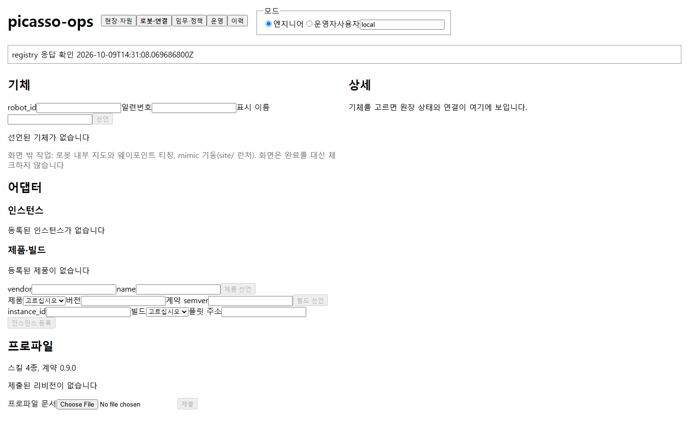

그림 01. 처음 연 화면. 머리(제목, nav, 모드), 전체 상태 띠, 2열 본문. 엔지니어 모드, 실제 스택.

### 2.2 머리

머리는 `display: flex; gap: 16px; align-items: center; flex-wrap: wrap` 입니다(`styles.css:2`). 왼쪽부터 다음이 한 줄에 놓입니다.

| 순서 | 요소 | 사실 | 근거 |
|---|---|---|---|
| 1 | h1 | «picasso-ops». 로고나 이미지는 없음 | `App.tsx:69` |
| 2 | nav | `<nav aria-label="영역">` 안에 영역마다 `<button>`. 고른 버튼에 `aria-current="page"`, CSS 는 굵기 700 만 줌 | `App.tsx:70-80`, `styles.css:3` |
| 3 | 모드 전환 | `<fieldset className="mode">` 와 `<legend>모드</legend>`, 라디오 «엔지니어»·«운영자», 칸 «사용자» | `ModeSwitch.tsx:23-47` |

버튼, 라디오, 입력, fieldset 은 브라우저 기본 모양입니다(그림 01). `.mode` 클래스에는 CSS 규칙이 없습니다.

`areas.ts` 의 `ready: false` 갈래(버튼 뒤 «<small> 다음 단계</small>», 본문 «이 영역은 다음 단계에서 엽니다.»)는 코드에 남아 있지만, 다섯 영역이 모두 `ready: true` 라 지금은 보이지 않습니다(`App.tsx:78,86`).

### 2.3 모드가 가르는 조작

| 조작 | 하는 모드 | 다른 모드에서 보이는 문장 | 근거 |
|---|---|---|---|
| 기체 선언 | 엔지니어 | «선언은 엔지니어 모드에서 합니다» | `RobotsArea.tsx:45-54` |
| 어댑터 제품·빌드 선언, 인스턴스 등록 | 엔지니어 | «어댑터 등록은 엔지니어 모드에서 합니다» | `AdaptersSection.tsx:32-61` |
| 리비전 제출, 시험 요청, 활성화 | 엔지니어 | «프로파일 관리는 엔지니어 모드에서 합니다» (표의 «조작» 열도 사라짐) | `ProfilesSection.tsx:56,90-111,119-126` |
| 바인딩, 명칭 등록 기록 | 엔지니어 | 문장 없이 폼과 버튼만 사라짐 | `CommissioningCards.tsx:49,79-83` |
| 퇴역, 복귀 | 운영자 | «퇴역과 복귀는 운영자 모드에서 합니다» | `RobotDetail.tsx:82-104` |
| 현장 설정 변경 | 엔지니어 | «현장 설정 변경은 엔지니어 모드에서 합니다» | `SiteArea.tsx:153-163` |
| 장애 주입 | 엔지니어 | «장애 주입은 엔지니어 모드에서 합니다» | `FaultPanel.tsx:60-61` |
| 임무 편집(템플릿, 저장, 검증, 모의 실행, 활성화, 초안 열기) | 엔지니어 | «임무 편집은 엔지니어 모드에서 합니다» | `MissionsArea.tsx:196-255,305,326` |
| 작업 지시 내기 | 운영자 (폼 입력은 두 모드 다 보임) | «작업 지시는 운영자 모드에서 냅니다» | `JobOrderFormView.tsx:50-56` |
| 운영자 판단(완료 확인, 재작업) | 운영자 | «보류 중입니다. 운영자 판단은 운영자 모드에서 합니다» | `IncidentSection.tsx:457` |
| 셀 대역 신호 켜기·끄기 | 두 모드 | 없음 | `CellBand.tsx:15` |
| 송신 기록의 작업 지시 고르기 | 두 모드 | 없음 | `JobResponseLog.tsx:30` |

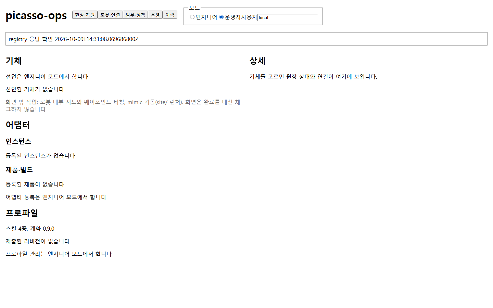

그림 02. 운영자 모드. 선언·등록 폼 자리에 모드 문장이 섭니다. 실제 스택.

### 2.4 전체 상태 띠

머리 바로 아래 한 자리입니다(`RegistryBanner.tsx`). 기체 행마다 되풀이하지 않습니다. 모양은 `.banner`(padding 8px, margin 8px 0, 테두리 1px `#999`)이고, 모름이면 테두리만 `#b23a1d` 로 바뀝니다(`styles.css:4-5`). 배경색과 아이콘은 없습니다.

| 조건 | 요소 | 글자 | 근거 |
|---|---|---|---|
| 운영 서비스 불통 | `div.banner.unknown`, `role="alert"` | «모름: 운영 서비스에 닿지 않습니다 (${opsError})» | `RegistryBanner.tsx:10-15` |
| 첫 읽기 전 | `div.banner` | «확인 중» | `:17` |
| `OK` | `div.banner.ok` (`ok` 에는 규칙 없음) | «registry 응답 확인 ${checkedAt}» | `:20` |
| `REGISTRY_SILENT` | `div.banner.unknown`, `role="alert"` | «모름: registry 가 답하지 않습니다. 해결 담당 엔지니어, registry 상태 확인. 확인 시각 ${checkedAt}» | `:21-27` |
| `REGISTRY_UNAUTHORIZED` | `div.banner.unknown`, `role="alert"` | «모름: registry 가 운영자 토큰을 거절합니다. 해결 담당 엔지니어, 운영자 토큰 설정 확인. 확인 시각 ${checkedAt}» (옛 이름 «거절», §6) | `:28-34` |

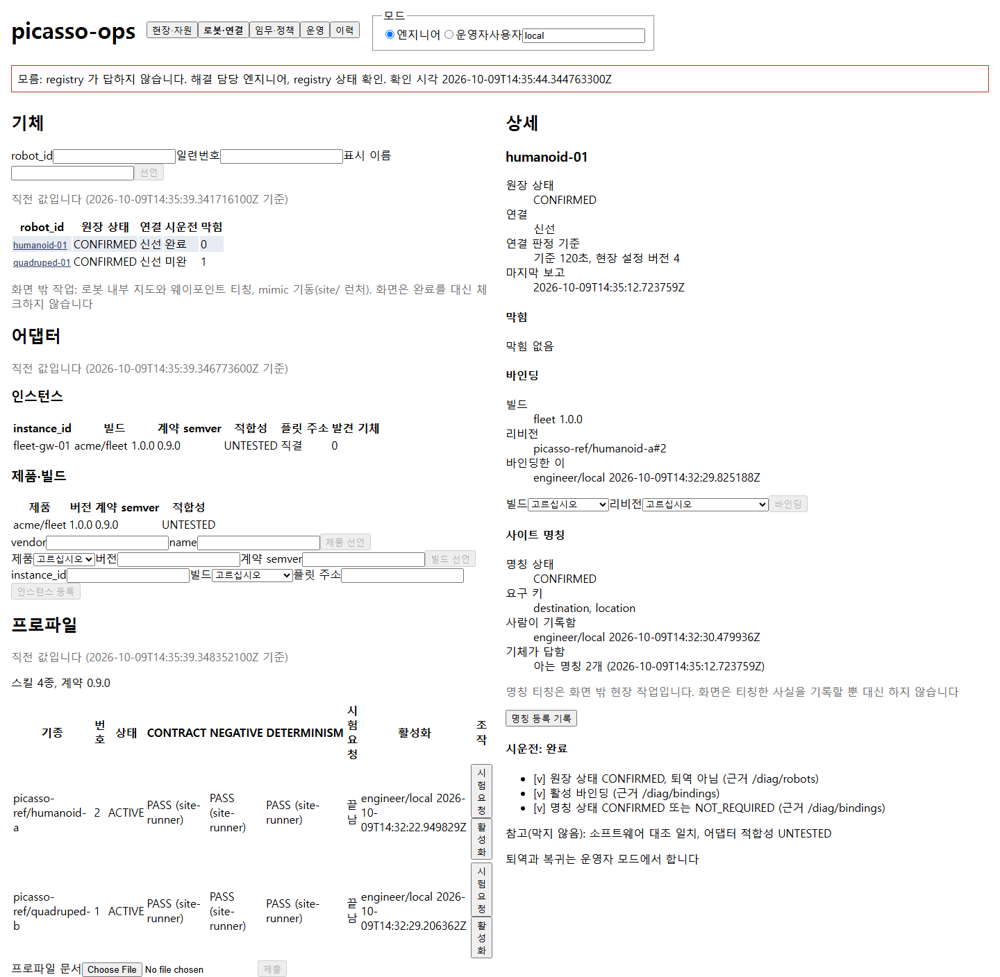

그림 64. registry 불통. 띠가 빨간 테두리의 모름이 되고, 기체, 어댑터, 프로파일 목록마다 회색 «직전 값입니다 (… 기준)» 이 섭니다. 실제 스택(런처를 끔).

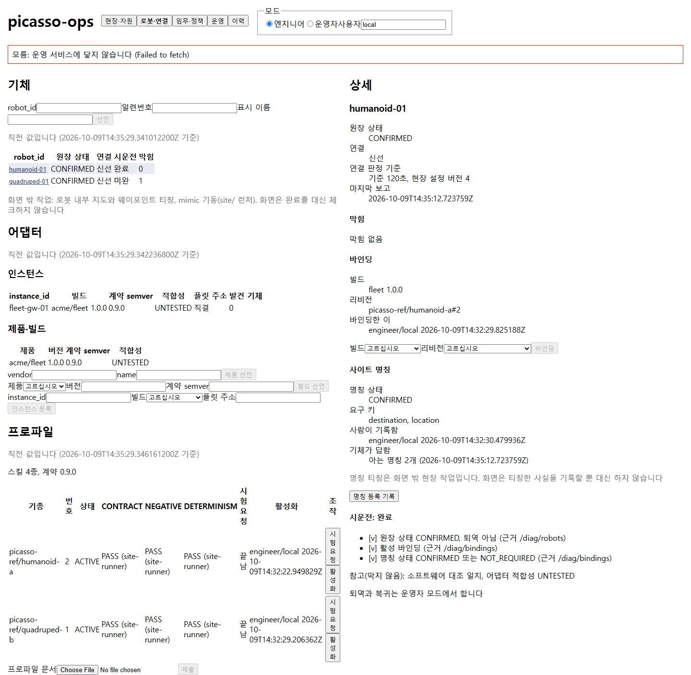

그림 63. 운영 서비스 불통. 대역 응답으로 그린 화면(`/api/**` 요청을 끊음).

### 2.5 읽기 주기

| 무엇 | 주기와 시점 | 근거 |
|---|---|---|
| 다섯 조회 `GET /api/robots`, `/api/adapters`, `/api/profiles`, `/api/operations`, `/api/site-settings` | `Promise.all` 로 묶어 5초(`POLL_MS`)마다, 모드나 사용자가 바뀔 때, 조작이 끝날 때. 하나라도 실패하면 다섯 다 직전 값을 두고 `opsError` 를 세움 | `App.tsx:30-62`, `poll.ts:2` |
| 임무 개요 `GET /api/missions/PrepareSequencedRack` | «임무·정책» 영역이 열려 있을 때만 5초마다, 조작 뒤 | `MissionsArea.tsx:59-76,122` |
| 템플릿 `GET /api/missions/templates/PrepareSequencedRack` | 한 번 읽으면 끝. 못 읽으면 5초마다 다시 | `MissionsArea.tsx:78-93` |
| 실행, 셀 대역, 인시던트 `GET /api/executions`, `/api/cell`, `/api/incidents` | «운영» 영역이 열려 있을 때만 5초마다. 셋을 묶지 않아 따로 실패함 | `OperationsArea.tsx:75-119` |
| 송신 기록 `GET /api/job-responses[?jobOrderId=]` | 5초마다, 고른 작업 지시가 바뀔 때 | `OperationsArea.tsx:122-134`, `api.ts:1101-1105` |
| 배정 가능 `POST /api/job-orders/eligibility` | 폼이 다 찼을 때만. 폼이 300ms(`ELIGIBILITY_DEBOUNCE_MS`) 멈추면 한 번, 그 뒤 5초마다 | `OperationsArea.tsx:146-170`, `poll.ts:5` |
| 고른 인시던트 상세 `GET /api/incidents/{id}?instanceId=` | 운영 영역의 다시 읽기마다 | `IncidentSection.tsx:66-86`, `api.ts:969-979` |
| 신호 조작과 운영자 판단 뒤 | 곧바로 한 번, 500ms(`SIGNAL_SETTLE_MS`) 뒤 한 번 더 | `OperationsArea.tsx:195-205`, `poll.ts:11` |

운영 영역이 여는 실행 호스트 읽기는 다섯 조회와 따로 돕니다. 실행 호스트가 멈춰도 기체 목록 같은 다섯 조회는 직전 값이 되지 않습니다(`OperationsArea.tsx:46-57`).

### 2.6 값의 세 상태: 알 수 있음, 없음, 모름

화면은 «읽었고 비었음» 과 «못 읽음» 을 다른 글자로 보입니다. 새 디자인에서도 이 셋은 서로 달라 보여야 합니다.

| 상태 | 글자 꼴 | 예와 근거 |
|---|---|---|
| 한 번도 못 읽음 | «모름: …» | «모름: 기체 목록을 아직 읽지 못했습니다» `RobotsArea.tsx:115`. 첫 읽기를 기다리는 동안도 같은 글자(별도 로딩 표시 없음) |
| 읽었고 비었음 | «… 없습니다» | «선언된 기체가 없습니다» `RobotsArea.tsx:124` |
| 읽은 적은 있고 지금 못 읽음 | «직전 값입니다 …», 항상 `<p className="stale">`(회색 `#6f6f6f`) | 아래 표 |

직전 값 문장의 꼴은 넷입니다.

| 꼴 | 쓰는 곳 |
|---|---|
| «직전 값입니다 (${asOf} 기준)» | 기체 목록 `RobotsArea.tsx:122`, 어댑터 `AdaptersSection.tsx:77`, 프로파일 `ProfilesSection.tsx:37` |
| «직전 값입니다» | 이력 `HistoryArea.tsx:14`, 현장 설정 `SiteArea.tsx:127` |
| «직전 값입니다. 실행 호스트 불통: ${error}» | 임무 `MissionsArea.tsx:180`, 실행 `ExecutionList.tsx:29`, 셀 대역 `CellBand.tsx:26`, 인시던트 `IncidentSection.tsx:114,160`, 송신 기록 `JobResponseLog.tsx:54` |
| «직전 값입니다 (${error})», «폼이 바뀌어 다시 판정하는 중입니다» | 배정 가능 `EligibilityTable.tsx:39-40` |

판정: 기체, 어댑터, 프로파일은 `asOf !== checkedAt` 이거나 `opsError` 가 있으면 직전 값입니다(`RobotsArea.tsx:119`, `AdaptersSection.tsx:68`, `ProfilesSection.tsx:36`). 토큰 거부(`REGISTRY_UNAUTHORIZED`)여도 새로 읽은 기체 목록은 직전 값이 아닙니다(`RobotsArea.test:205-210`).

칸 하나의 값이 «모름» 인 곳: 배정 가능 표의 칸(`EligibilityTable.tsx:63-65,80,86`), 인시던트의 현장 설정 버전과 시간값(`IncidentSection.tsx:35-36`), 스킬 적합 `UNKNOWN`(`labels.ts:135`), 실행 호스트 반영(`SiteArea.tsx:207`).

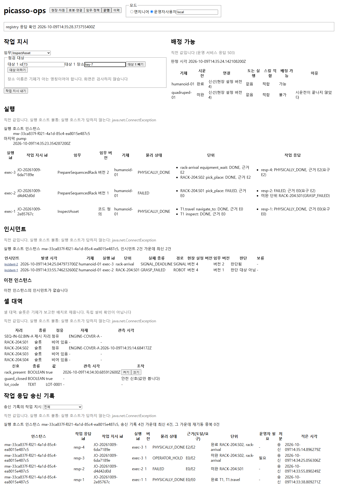

그림 60. 실행 호스트 불통. 구역마다 회색 «직전 값입니다. 실행 호스트 불통: …» 이 서고 앞서 읽은 표가 남습니다. 대역 응답으로 그린 화면.

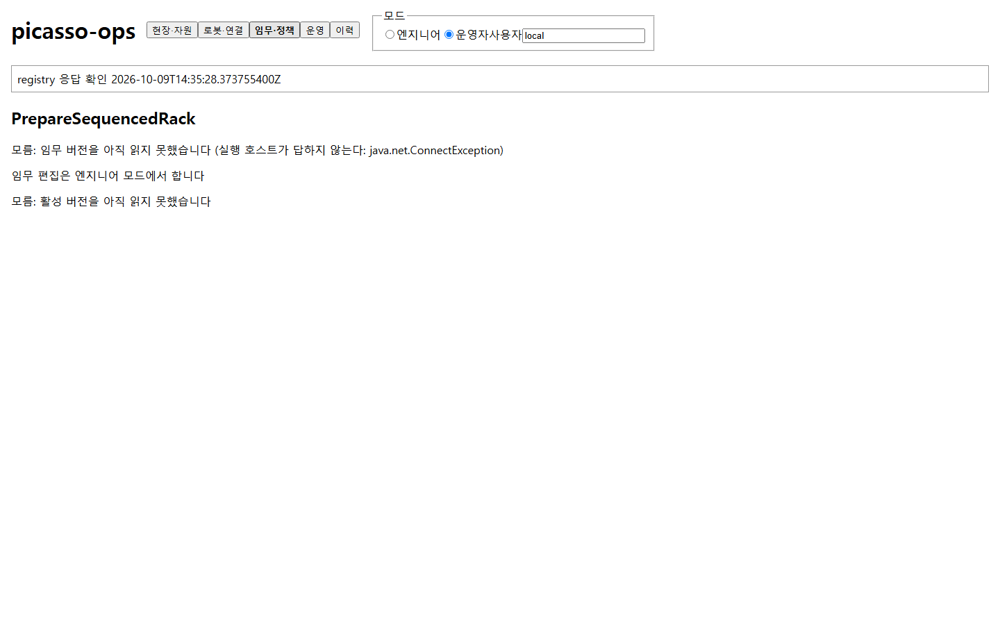

그림 61. 읽은 적이 없으면 직전 값이 아니라 «모름: …» 입니다. 대역 응답으로 그린 화면.

### 2.7 결과 알림

모든 결과 알림은 `role="status"` 이고 «${what}: ${결과}» 꼴입니다. 각 구역은 마지막 하나만 들고 있고(`last` 상태), 닫기 버튼, 시각, 쌓임은 없습니다. 성공과 실패는 같은 모양의 문단이며 색이나 아이콘의 차이가 없습니다.

| 컴포넌트 | 쓰는 곳 | 접근 이름 | 근거 |
|---|---|---|---|
| `OutcomeNotice` | registry 조작(로봇·연결 영역 상세 위), 현장 설정 | 없음 | `OutcomeNotice.tsx` |
| `JobOrderNotice` | 작업 지시 제출 | «제출 결과» | `JobOrderNotice.tsx:19,29,39,51` |
| `MissionNotice` | 임무 초안 저장, 검증, 모의 실행, 활성화 | «임무 조작 결과» | `MissionNotice.tsx:30` |
| `SignalNotice` | 셀 대역 신호 켜기·끄기 | «신호 조작 결과» | `SignalNotice.tsx:16` |
| `FaultNotice` | 장애 주입 | «장애 주입 결과» | `FaultPanel.tsx:151-157` |
| `DecisionNotice` | 운영자 판단 | «판단 결과» | `IncidentSection.tsx:494-500` |

`OutcomeNotice` 의 변형(`OutcomeNotice.tsx`):

| 경우 | 글자 | 행 |
|---|---|---|
| 운영 서비스 사전 거부(400·403) | «${what}: 보내지 않음. ${detail}» | 16-22 |
| 운영 서비스 비정상·끊김 | «${what}: 결과 모름(${cause}). 목록을 다시 읽어 확인하십시오» | 23-29 |
| 성공 | «${what}: 반영됨» | 31 |
| 토큰 거부 | «${what}: registry 가 운영자 토큰을 거절했습니다. 상단의 전체 상태를 보십시오» (옛 이름) | 32-34 |
| registry 거부 | «${what}: 거절됨» (옛 이름) + `FindingCard`(바로 가기 포함) | 35-42 |
| 응답 없음, 다시 읽어 반영 | «${what}: 응답은 없었으나 다시 읽어 보니 반영됨» | 44-45 |
| 응답 없음, 반영 안 됨 | «${what}: 응답 없음. 다시 읽어 보니 반영 안 됨. 다시 하려면 새로 요청하십시오» | 46-47 |
| 응답 없음, 다시 읽기도 실패 | «${what}: 반영되었을 수 있음. 다시 읽지도 못해 확인하지 못했습니다. 목록에서 확인하십시오» | 48-53 |

`cause` 의 기본값은 «운영 서비스 응답 ${status}» 입니다(`api.ts:367`). 사전 거부 본문에 detail 이 없으면 «운영 서비스가 요청을 거절했습니다(HTTP ${status})» 를 씁니다(`api.ts:364`, 옛 이름). 거부 이름을 풀어 쓰는 공용 함수는 `kindLabel`(모르는 이름은 그대로), `rejectionLabel`(null 이면 «이유 없음»), `rejectionText(who, r)` 입니다. 마지막 것은 «${who}(${풀이})» 에 detail 이 있으면 «. ${detail}» 을 붙입니다(`labels.ts:122-129`).

다른 알림 컴포넌트의 변형은 그 구역 절(§3)에 있습니다. 결과 갈래는 컴포넌트마다 같은 틀입니다: 성공, 보내지 않음(사전 거부), 상대가 거부함, 결과 모름, 응답 없음 세 갈래(다시 읽어 반영, 반영 안 됨, 다시 읽지도 못함).

### 2.8 막힘·거부 카드 `FindingCard`

막힘(기체 상세)과 거부(조작 결과)를 같은 카드로 보입니다. `<dl className="finding">` 이고 왼쪽에 3px `#b23a1d` 선이 있으며, dt 는 굵기 700 입니다(`styles.css:9-10`).

| dt | dd | 행 |
|---|---|---|
| «종류» | `kindLabel(kind)` | 17-18 |
| «관측값과 기대값» | «${observed} / 기대: ${expected}» | 19-22 |
| «마지막 확인» | `checkedAt` 그대로 | 23-24 |
| «근거 버전» | «현장 설정 버전 ${n}» 또는 «해당 없음» | 25-26 |
| «해결 담당» | «${담당}(화면 안\|화면 밖): ${action}» | 27-30 |
| «바로 가기» (대상이 있고 `onSelect` 를 넘겼을 때만) | `button.link` «${target} 상세». 누르면 그 기체 상세를 엶 | 31-40 |

담당 이름(`labels.ts:22-27`): SITE «현장», OPERATOR «운영자», ENGINEER «엔지니어», NONE «없음». 기체 상세 안의 막힘 카드는 `onSelect` 를 넘기지 않으므로 «바로 가기» 가 없습니다(`RobotDetail.tsx:71`). 임무 조작의 거부 카드에도 바로 가기가 없습니다(`MissionNotice.tsx:163-171`).

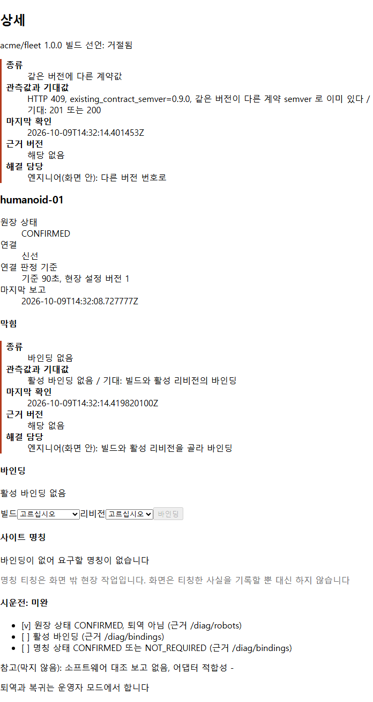

그림 09. 위는 조작 결과의 거부 카드, 아래는 기체 상세의 막힘 카드. 같은 모양입니다. 실제 스택.

### 2.9 거부·막힘 이름과 화면 글자

`labels.ts:30-97` 의 `KIND_LABEL` 입니다. 표에 없는 이름은 값 그대로 보입니다.

| 이름 | 글자 | 이름 | 글자 |
|---|---|---|---|
| AWAITING_FIRST_REPORT | 첫 보고 대기 | UNKNOWN_WORK_MASTER | 받지 않는 임무 |
| REPORT_STALE | 보고 오래됨 | UNIT_ID_CONFLICT | 단위 id 겹침 |
| REPORTING_AFTER_RETIREMENT | 퇴역 뒤 보고 | NO_ELIGIBLE_ROBOT | 배정 가능한 기체 없음 |
| UNREGISTERED_ROW | 출처 없는 행 | MODE_NOT_ALLOWED | 이 모드에서 할 수 없는 조작 |
| BAD_REQUEST | 본문 오류 | ACTOR_REQUIRED | 행위자 없음 |
| WRONG_DOOR | 이미 다른 문으로 들어온 기체 | UNREADABLE | 읽을 수 없는 정의 |
| RETIRED_ALREADY | 이미 퇴역한 기체 | DUPLICATE_NODE_ID | 노드 id 겹침 |
| RETIRE_BAD_REQUEST | 퇴역 요청 오류 | DEADLINE_INVALID | 대기 기한 오류 |
| UNKNOWN_ROBOT | 모르는 기체 | SIGNAL_NOT_IN_SPEC | 신호 사양에 없는 신호 |
| ADAPTER_BAD_REQUEST | 제품·빌드 형식 오류 | SIGNAL_VALUE_INVALID | 신호 종류에 맞지 않는 값 |
| UNKNOWN_ADAPTER | 없는 제품 | FLOOR_UNOWNED | 바닥 소유 없음 |
| VERSION_CONFLICT | 같은 버전에 다른 계약값 | SKILL_NOT_IN_CONTRACT | 계약에 없는 스킬 |
| INSTANCE_BAD_REQUEST | 인스턴스 본문 오류 | SKILL_NOT_ON_SITE | 현장에 없는 스킬 |
| UNBOUND | 바인딩 없음 | SAFETY_SIGNAL_WAIT | 안전 신호 대기 |
| SITE_NAMES_UNREGISTERED | 명칭 기록 없음 | MISSION_BAD_REQUEST | 임무 요청 오류 |
| SITE_NAMES_UNANSWERED | 기체가 명칭에 답하지 않음 | REASON_REQUIRED | 사유 없음 |
| SITE_NAMES_CONTRADICTED | 기체가 아는 명칭 없음 | DRAFT_NOT_FOUND | 없는 초안 |
| PROFILE_UNREADABLE | 읽을 수 없는 문서 | REQUEST_ID_REUSED | 요청 id 재사용 |
| REVISION_NOT_MONOTONIC | 리비전 번호가 오르지 않음 | HOST_SILENT | 실행 호스트 불통 |
| UNKNOWN_REVISION | 없는 리비전 | SIGNAL_BAD_REQUEST | 신호 값 형식 오류 |
| REVISION_NOT_TESTABLE | 시험할 수 없는 상태 | UNKNOWN_SIGNAL | 모르는 신호 |
| ACTIVATION_REFUSED | 활성화 조건 미달 | SAFETY_SIGNAL_READ_ONLY | 안전 신호는 쓸 수 없음 |
| UNKNOWN_BUILD | 없는 빌드 | NO_RUNNING_TASK | 진행 중 태스크 없음 |
| REVISION_NOT_ACTIVE | 활성 리비전이 아님 | UNSUPPORTED_FAULT | 받지 않는 장애 종류 |
| ROBOT_RETIRED | 퇴역한 기체 | FAULT_REFUSED | mimic 엔진이 강제를 거부함 |
| CONTRACT_TOO_OLD | 빌드의 계약이 낮음 | UNSUPPORTED_MEDIA_TYPE | JSON 이 아닌 본문 |
| NO_ACTIVE_BINDING | 활성 바인딩 없음 | FAULT_BAD_REQUEST | 장애 주입 본문 오류 |
| NOTHING_TO_REGISTER | 등록할 명칭 없음 | RESOLVE_BAD_REQUEST | 판단 본문 오류 |
| UNCLASSIFIED | 분류되지 않은 거부 | INSTANCE_MISMATCH | 실행 호스트가 재기동해 인스턴스가 다름 |
| SETTINGS_VERSION_CONFLICT | 현장 설정 버전 충돌 | JOB_RESPONSE_BAD_REQUEST | 송신 기록 요청 오류 |
| JOB_ORDER_BAD_REQUEST | 작업 지시 폼 오류 | | |

그 밖의 열거형 글자(`labels.ts`):

| 표 | 값 → 글자 | 행 |
|---|---|---|
| `CONNECTION_LABEL` | FRESH «신선», STALE «오래됨», NO_REPORT «보고 없음» | 16-20 |
| `OWNER_LABEL` | SITE «현장», OPERATOR «운영자», ENGINEER «엔지니어», NONE «없음» | 22-27 |
| `COMMISSIONING_LABEL` | COMPLETE «완료», INCOMPLETE «미완», RETIRED «퇴역» | 100-104 |
| `SOFTWARE_LABEL` | MATCH «일치», MISMATCH «불일치», UNREPORTED «보고 없음» | 107-111 |
| `TEST_REQUEST_LABEL` | NONE «요청 없음», WAITING «대기», RUNNING «실행 중», EXPIRED «만료», DONE «끝남» | 114-120 |
| `SKILL_FIT_LABEL` | FIT «적합», MISSING «모자람», UNKNOWN «모름» | 132-136 |
| `SUBMIT_RESULT_LABEL` | ACCEPTED «배정됨», IDEMPOTENT «같은 작업 지시의 기존 실행», REJECTED «거부됨», UNASSIGNED «미배정» | 139-144 |
| `MOCK_RUN_FAILURE_LABEL` | DEFINITION «정의(같은 신호에 다른 기대 값)», SUBMISSION_REJECTED «표본 작업 지시 거부», NOT_SETTLED «정착하지 않음», WALL_CLOCK_LIMIT «실제 시간 상한 초과», EXECUTION_FAILED «실행 실패» | 147-153 |
| `mockRunVerdict` | «통과», «실패», «실패(${하위 범주})» | 156-160 |
| `TEMPLATE_LABEL` | DATA_V1 «데이터 정의 템플릿», ARRIVAL_WAIT «랙 도착 대기 템플릿», ARRIVAL_WAIT_HOLD «운영자 보류 대기 템플릿» | 163-167 |
| `FAULT_KIND_LABEL` | SKILL_EXECUTION_FAILED «스킬 실패», CONNECTION «연결 상태» | 170-173 |
| `DISPOSITION_LABEL` | SENT «송신», RESTART_DUPLICATE «재기동 중복(송신 안 함)» | 176-179 |
| `DECISION_LABEL` | CONFIRM_DONE «완료 확인», REWORK «재작업» (판단 버튼 글자이기도 함) | 182-185 |

코드 값을 풀지 않고 그대로 보이는 칸도 있습니다. 원장 상태(CLAIMED, CONFIRMED, RETIRED), 적합성(UNTESTED), 리비전 상태(DRAFT, TESTED, ACTIVE 등), 스위트 결과(PASS, FAIL), 명칭 상태, 물리 상태(RUNNING, PHYSICALLY_DONE, PARTIAL 등), 단위 상태, 신호 종류(BOOLEAN, TEXT), 경로(SIGNAL, ROBOT), 실패 종류(GRASP_FAILED, SIGNAL_DEADLINE), 확인 결과(NOT_REQUESTED 등, S4a 스펙 §8.2 가 풀지 말라고 정함), 결함 유지 종류, 이력 결과(SUCCEEDED 등)입니다. 시험이 이 코드 글자에 기댑니다(§5).

### 2.10 빈 상태와 읽는 중

| 관례 | 사실 |
|---|---|
| 빈 상태 | 표 대신 문장 하나(«… 없습니다»). 일러스트, 아이콘, 행동 유도 버튼 없음 |
| 읽는 중 | 따로 없음. «모름: … 아직 읽지 못했습니다» 가 첫 읽기 대기와 실패를 함께 나타냄. 예외 셋: 띠 «확인 중»(`RegistryBanner.tsx:17`), 배정 가능 «판정 중»(`EligibilityTable.tsx:35`), 인시던트 상세 «상세를 읽는 중입니다»(`IncidentSection.tsx:153`) |
| 조작 중 | 스피너 없음. 조작 버튼이 비활성(`busy`)이 될 뿐 |
| 확인 대화 | 없음(`confirm` 호출 없음). 퇴역, 활성화, 장애 주입, 운영자 판단은 사유 입력이 유일한 관문 |
| 입력 오류 | 보내기 전 검사 문장은 `role="alert"`. 현장 설정, 장애 주입, 임무 활성화 사유, 작업 지시, 운영자 판단, 배정 가능 사전 거부(`EligibilityTable.tsx:28`) |

### 2.11 접근성 장치

시험은 `data-testid` 를 한 곳도 쓰지 않고 역할, 접근 이름, 라벨, 글자, CSS 클래스로 요소를 찾습니다. 그래서 아래 장치는 디자인을 바꿔도 남아야 합니다(§4.2).

| 장치 | 역할 | 쓰임 |
|---|---|---|
| `<section aria-label>` | region | 구역마다 |
| `<form aria-label>` | form | 폼마다 |
| `<table aria-label>`, `<ul aria-label>` | table, list | 표와 목록 |
| `<dl aria-label>`, `<pre aria-label>` | 라벨로 찾음 | 결함 카드, 활성 버전 정의 |
| `<fieldset><legend>` | group | 모드, 결과 판정 값, 정체 표시, 점검 대상, 슬롯 |
| `aria-current="page"` | nav 의 고른 버튼 | `App.tsx:74` |
| `aria-invalid` | 사용자 칸 | `ModeSwitch.tsx:40` |
| `role="alert"` | 띠 셋, 폼 입력 오류, 배정 가능 사전 거부 | |
| `role="status"` | 결과 알림 | |

모든 입력은 `<label>` 로 감싼 암묵 라벨입니다(`for`/`id` 없음). 키보드 처리, 포커스 관리, `aria-live` 지정은 없습니다.

---

## 3. 영역별 화면

### 3.1 현장·자원

region «현장 설정»(`SiteArea`) 다음에 region «장애 주입»(`FaultPanel`)을 세로로 쌓습니다. 감싸는 `.split` 은 없습니다(`App.tsx:97-107`).

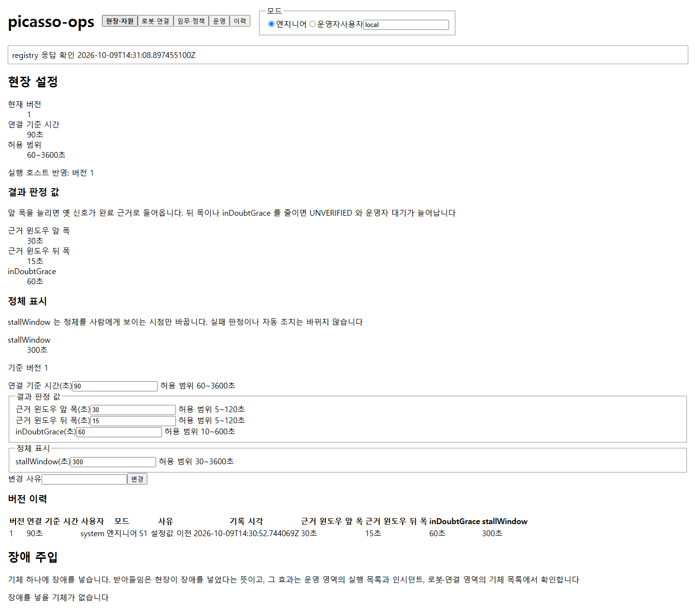

그림 03. 현장 설정 버전 1, 기체 없음. 엔지니어 모드, 실제 스택.

#### 3.1.1 현장 설정 (`SiteArea.tsx`)

목적: 현장 설정 버전(연결 기준 시간과 미들웨어 시간값 넷)과 변경 이력을 보이고, 엔지니어가 새 버전을 올립니다.

| 모드 | 할 수 있는 것 |
|---|---|
| 엔지니어 | 보기, 변경 |
| 운영자 | 보기. 폼 자리에 «현장 설정 변경은 엔지니어 모드에서 합니다» |

데이터: `App` 의 `GET /api/site-settings`(5초). 변경은 `PUT /api/site-settings` 에 `{baseVersion, 값 다섯, reason}` 을 보냅니다(`api.ts:376-378`).

배치(위에서 아래, `:120-197`): h2 «현장 설정» → 마지막 조작 알림 → (직전 값 문장) → dl → 실행 호스트 반영 줄 → 묶음 구역 둘 → 변경 폼 또는 모드 문장 → h3 «버전 이력» → 표.

| 요소 | 글자 | 행 |
|---|---|---|
| 못 읽음 | «모름: 현장 설정을 아직 읽지 못했습니다» (폼도 없음) | 124 |
| dl | «현재 버전» ${n} / «연결 기준 시간» ${n}초 / «허용 범위» ${min}~${max}초 | 128-137 |
| 실행 호스트 반영 | «실행 호스트 반영: 모름» / «실행 호스트 반영: 미적용» / «실행 호스트 반영: 버전 ${n}» | 206-213 |
| 덧붙는 줄 | «실행 호스트 읽기 실패: ${readError}», «실행 호스트가 적용하지 않은 버전 ${v}(범위 밖): ${사유를 '; ' 로 연결}» | 214-219 |
| 묶음 구역 1 | region·h3 «결과 판정 값», 문장 «앞 폭을 늘리면 옛 신호가 완료 근거로 들어옵니다. 뒤 폭이나 inDoubtGrace 를 줄이면 UNVERIFIED 와 운영자 대기가 늘어납니다», dl «근거 윈도우 앞 폭», «근거 윈도우 뒤 폭», «inDoubtGrace» (값 «${n}초») | 74-80, 139-152 |
| 묶음 구역 2 | region·h3 «정체 표시», 문장 «stallWindow 는 정체를 사람에게 보이는 시점만 바꿉니다. 실패 판정이나 자동 조치는 바뀌지 않습니다», dl «stallWindow» | 81-85 |
| 이력 표 | table «현장 설정 버전 이력», 열 순서: 버전, 연결 기준 시간, 사용자, 모드, 사유, 기록 시각, 근거 윈도우 앞 폭, 근거 윈도우 뒤 폭, inDoubtGrace, stallWindow. 모드 칸 ENGINEER «엔지니어», OPERATOR «운영자». 행은 받은 순서(최신부터) | 16, 165-194 |

변경 폼(엔지니어, form «현장 설정 변경», `:248-328`):

| 항목 | 사실 |
|---|---|
| 기준 버전 | «기준 버전 ${n}». 처음 고친 순간(값이든 사유든) 버전과 값 다섯을 고정함 (`:255-264,311`) |
| 입력 순서 | «연결 기준 시간(초)» 단독 → fieldset·legend «결과 판정 값»(«근거 윈도우 앞 폭(초)», «근거 윈도우 뒤 폭(초)», «inDoubtGrace(초)») → fieldset «정체 표시»(«stallWindow(초)») → «변경 사유» → 버튼 «변경». 숫자 칸은 `type="number"` 이고 옆에 «허용 범위 ${min}~${max}초» (`:297-325`) |
| 보내기 전 검사 | `role="alert"`. 칸마다 «${주어} ${min}~${max}초의 정수여야 합니다» 를 «; » 로 연결. 주어: «연결 기준 시간은», «근거 윈도우 앞 폭은», «근거 윈도우 뒤 폭은», «inDoubtGrace 는», «stallWindow 는». 사유가 비면 «변경 사유를 넣으십시오» (`:266-288,326`) |
| 버튼 | `busy` 일 때만 비활성 (`:323`) |
| 결과 | 바뀐 칸만 «${칸 이름} ${값}초» 를 «, » 로 잇고 «로 변경» 을 붙인 것이 what. 바뀐 칸이 없으면 «현장 설정 같은 값으로 새 버전 기록» (`:92-95`). `OutcomeNotice` 로 보임. 거부는 거부 카드(예 SETTINGS_VERSION_CONFLICT, 근거 버전 «해당 없음») |
| 보낸 뒤 | 폼을 비우고 다음 변경은 새 기준 버전에서 시작 (`:291-294`) |

허용 범위(README): 연결 기준 시간 60~3600초, 근거 윈도우 앞 폭 5~120초, 뒤 폭 5~120초, inDoubtGrace 10~600초, stallWindow 30~3600초. 범위의 주인은 picasso 이고, 화면은 운영 서비스가 실어 준 값을 보입니다.

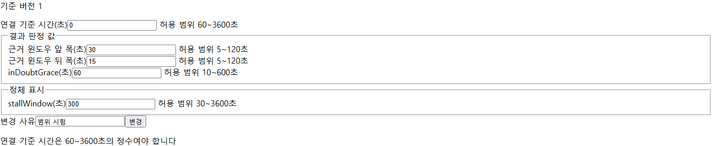

그림 18. 범위 밖 값이라 보내지 않음. 실제 스택.

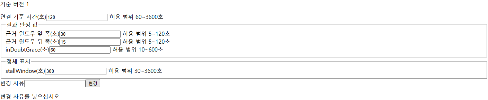

그림 19. 사유가 비어 보내지 않음. 실제 스택.

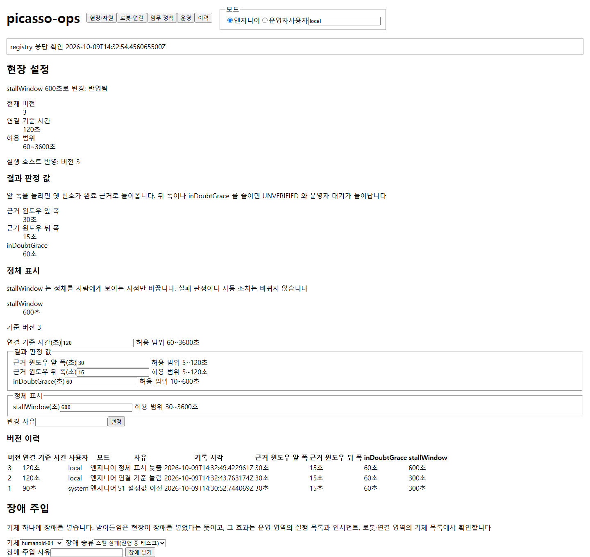

그림 20. stallWindow 변경 반영, 버전 3, 이력 세 줄. 실제 스택.

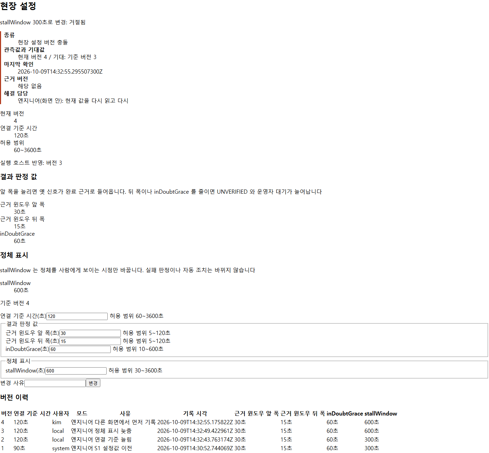

그림 21. 기준 버전이 낡아 거부된 알림과 카드. 알림 글자는 «stallWindow 300초로 변경: 거절됨» (옛 이름). 실제 스택.

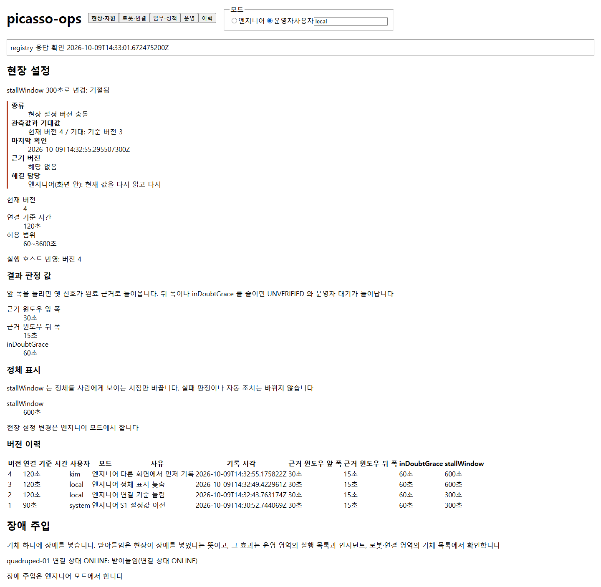

그림 25. 운영자 모드. 변경 폼과 장애 주입 폼 자리에 모드 문장. 실제 스택.

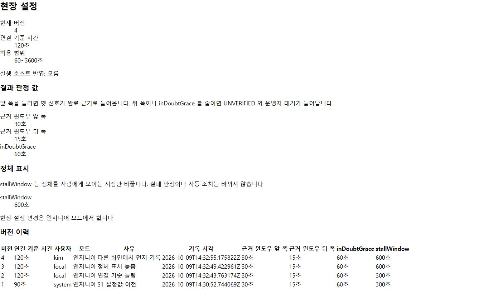

그림 62. «실행 호스트 반영: 모름». 대역 응답으로 그린 화면(`hostTimings` 를 `null` 로).

연결: 바뀐 연결 기준 시간은 다음 기체 목록 읽기부터 로봇·연결 영역의 «연결» 칸과 막힘에 쓰이고, 기체 상세 «연결 판정 기준» 과 막힘 카드 «근거 버전» 에 버전이 보입니다(§3.2.4). 시간값은 인시던트 상세의 «현장 설정 버전», «시간값» 에 실립니다(§3.4.4).

#### 3.1.2 장애 주입 (`FaultPanel.tsx`)

목적: 기체 하나에 스킬 실패나 연결 상태 장애를 넣습니다. 효과는 다른 영역에서 봅니다.

| 모드 | 할 수 있는 것 |
|---|---|
| 엔지니어 | 장애 주입 |
| 운영자 | «장애 주입은 엔지니어 모드에서 합니다» (버튼 0개) |

데이터: 기체 목록은 `App` 의 `/api/robots` 에서 퇴역을 뺀 것이고 순서는 목록 그대로입니다(`:47-50`). 조작은 `POST /api/faults`(`api.ts:1040-1050`)이며, 조작 뒤 다시 읽지 않습니다.

배치(`:53-69`): h2 «장애 주입» → 안내 문장 → 마지막 결과 → 폼 또는 상태 문장.

- 안내 문장: «기체 하나에 장애를 넣습니다. 받아들임은 현장이 장애를 넣었다는 뜻이고, 그 효과는 운영 영역의 실행 목록과 인시던트, 로봇·연결 영역의 기체 목록에서 확인합니다» (`:55-58`)
- 상태 문장: 목록 못 읽음 «모름: 기체 목록을 아직 읽지 못했습니다», 기체 없음 «장애를 넣을 기체가 없습니다» (`:60-66`)

폼(form «장애 주입 폼», `:100-143`):

| 순서 | 칸 | 보기 |
|---|---|---|
| 1 | «기체» select | 퇴역 아닌 기체 |
| 2 | «장애 종류» select | «스킬 실패(진행 중 태스크)», «연결 상태» |
| 3 | «연결 상태» select (종류가 연결 상태일 때만) | «OFFLINE», «CONNECTION_BROKEN», «ONLINE(복구)» |
| 4 | div 안 «장애 주입 사유» + 버튼 «장애 넣기» | |

사유가 비면 alert «장애 주입 사유를 넣으십시오» 가 섭니다. 보낸 뒤에는 사유만 비웁니다. what 은 «${robotId} 스킬 실패» 또는 «${robotId} 연결 상태 ${state}» 입니다(`:36`).

결과(status «장애 주입 결과», `:159-175`):

| 경우 | 글자 |
|---|---|
| 사전 거부 | «보내지 않음(${풀이}). ${detail}» |
| 비정상 | «결과 모름(${cause}). 실행 목록과 기체 목록에서 확인하십시오» |
| 스킬 실패 받아들임 | «받아들임(태스크 ${taskId}, ${taskState})», 이미 서 있었으면 뒤에 «. 같은 결함이 이미 서 있었습니다» |
| 연결 상태 받아들임 | «받아들임(연결 상태 ${state})» / «받아들임(이미 ${state} 상태라 바뀐 것 없음)» |
| 현장 거부 | «현장이 거부함(${풀이}). ${detail}» |
| 응답 없음 | «응답 없음. 넣었는지 모릅니다. 실행 목록과 기체 목록에서 확인하십시오» |


그림 22. 사유가 비어 보내지 않음. 실제 스택.

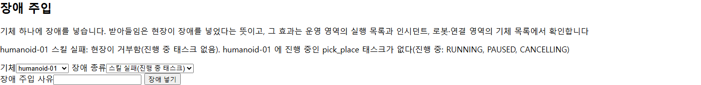

그림 23. 진행 중 태스크가 없어 현장이 거부. 실제 스택.

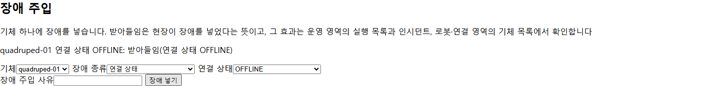

그림 24. 연결 상태 장애 받아들임. «연결 상태» select 가 더 보입니다. 실제 스택.

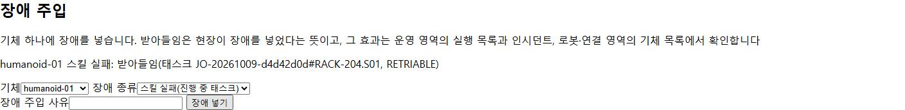

그림 41. 진행 중 태스크에 스킬 실패 받아들임. 실제 스택.

연결: 결과는 운영 영역의 실행 목록과 인시던트(§3.4.3, §3.4.4), 로봇·연결 영역의 기체 목록 «연결» 칸(§3.2.1)에서 봅니다.

### 3.2 로봇·연결 (`RobotsArea.tsx`)

`.split` 2열입니다. 왼쪽에 region «기체 목록» → region «어댑터» → region «프로파일» 을 세로로 쌓고, 오른쪽에 region «상세» 를 둡니다(`:41-102`). 오른쪽 상세는 고정이나 스티키가 아니라 왼쪽과 함께 스크롤됩니다.

조작 결과 알림(`OutcomeNotice`)은 오른쪽 상세 맨 위에 하나뿐이며, 왼쪽 폼의 조작 결과도 여기에 섭니다(`:65`). 조작 중(`busy`)에는 이 영역의 모든 조작 버튼이 비활성이고, 끝나면 다섯 조회를 다시 읽습니다(`:28-36`).

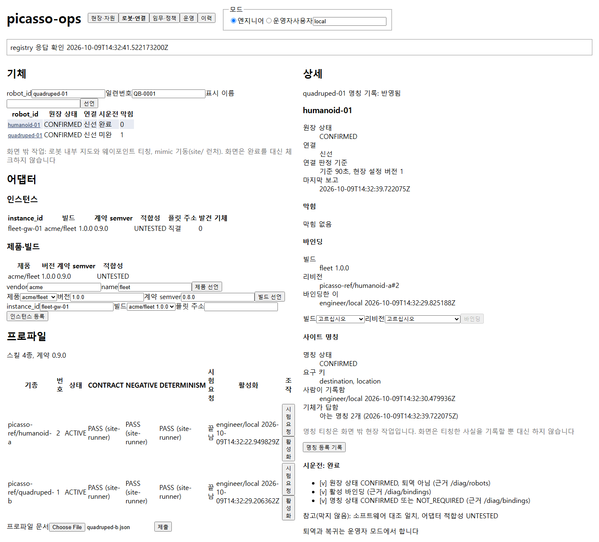

그림 16. 기체 둘, 어댑터, 리비전을 채운 뒤. 엔지니어 모드, 실제 스택. 왼쪽 열 폭이 좁아 프로파일 표의 머리 «시험 요청» 과 «조작» 열 버튼 글자가 한 글자씩 세로로 접힙니다.

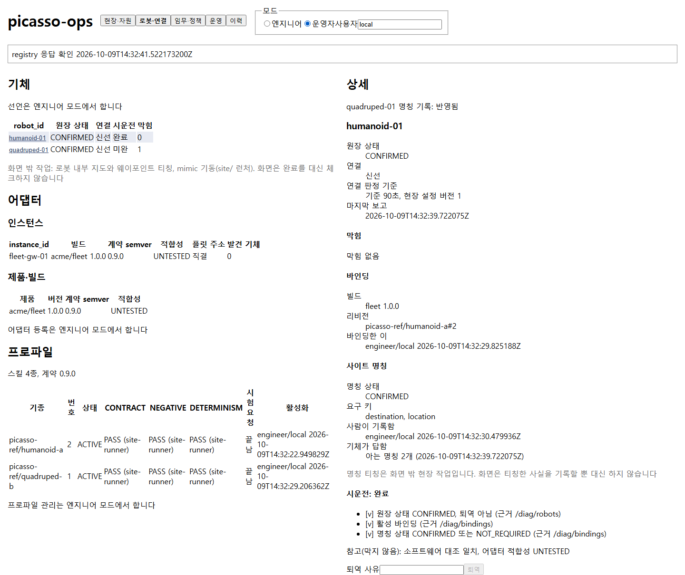

그림 17. 채운 상태, 운영자 모드. 등록 폼 대신 모드 문장, 상세 아래 퇴역 폼. 실제 스택.

#### 3.2.1 기체 목록 (region «기체 목록», h2 «기체»)

| 모드 | 할 수 있는 것 |
|---|---|
| 엔지니어 | 선언 폼(form «기체 선언», `DeclareForm.tsx:23-40`) |
| 운영자 | «선언은 엔지니어 모드에서 합니다» |

선언 폼: «robot_id», «일련번호», «표시 이름»(선택) → 버튼 «선언». robot_id 와 일련번호가 둘 다 차야 버튼이 활성입니다. 사이트 칸은 없습니다. API 는 `POST /api/robots`(`api.ts:381-386`), what 은 «${robotId} 선언» 입니다.

표(aria-label 없음, `RobotsArea.tsx:126-151`):

| 열 | 값 |
|---|---|
| «robot_id» | `button.link`. 누르면 오른쪽 상세 |
| «원장 상태» | 코드 값 그대로(CLAIMED, CONFIRMED, RETIRED 등) |
| «연결» | `CONNECTION_LABEL` |
| «시운전» | `COMMISSIONING_LABEL`, 없으면 «-» |
| «막힘» | 건수 숫자 |

고른 행은 `tr.selected`(배경 `#e8ebf3`)입니다. 퇴역 기체도 목록에 남습니다. 상세는 행 전체가 아니라 robot_id 링크 버튼으로만 엽니다.

상태: «모름: 기체 목록을 아직 읽지 못했습니다» / «선언된 기체가 없습니다» / «직전 값입니다 (${asOf} 기준)» (`:115,122,124`).

표 아래 회색 안내(`.offscreen`): «화면 밖 작업: 로봇 내부 지도와 웨이포인트 티칭, mimic 기동(site/ 런처). 화면은 완료를 대신 체크하지 않습니다» (`:56-58`).

#### 3.2.2 어댑터 (region «어댑터», `AdaptersSection.tsx`, `AdapterForms.tsx`)

데이터는 `GET /api/adapters` 입니다. 못 읽으면 «모름: 어댑터 목록을 아직 읽지 못했습니다» (`AdaptersSection.tsx:30`).

| 순서 | 요소 | 열 또는 칸 | 빈 상태 |
|---|---|---|---|
| 1 | h3 «인스턴스», table «인스턴스 목록» | instance_id, 빌드(«${제품} ${버전}»), 계약 semver, 적합성(값 그대로, 지금은 늘 UNTESTED), 플릿 주소(없으면 «직결»), 발견 기체 | «등록된 인스턴스가 없습니다» (`:78-108`) |
| 2 | h3 «제품·빌드», table «제품·빌드 목록» | 제품(«${vendor}/${name}»), 버전(빌드 없으면 «빌드 없음»), 계약 semver, 적합성. 빌드마다 한 행 | «등록된 제품이 없습니다» (`:109-135`) |
| 3 | 엔지니어 폼 셋(세로) | 아래 표 | |

| 폼 | 칸 → 버튼 | what | API |
|---|---|---|---|
| form «제품 선언» | «vendor», «name» → «제품 선언» | «${vendor}/${name} 제품 선언» | `POST /api/adapters` (`AdapterForms.tsx:25-38`) |
| form «빌드 선언» | «제품» select(첫 보기 «고르십시오», 보기 «${vendor}/${name}»), «버전», «계약 semver» → «빌드 선언» | «${vendor}/${name} ${version} 빌드 선언» | `POST /api/adapters/{id}/versions` (`:61-85`) |
| form «인스턴스 등록» | «instance_id», «빌드» select(«고르십시오», 보기 «${vendor}/${name} ${version}»), «플릿 주소»(선택) → «인스턴스 등록» | «${instanceId} 인스턴스 등록» | `POST /api/adapter-instances` (`:110-136`) |

버튼은 필수 칸이 다 차야 활성입니다. 운영자 모드에는 «어댑터 등록은 엔지니어 모드에서 합니다» 가 섭니다.

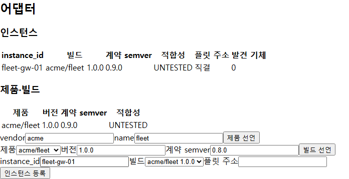

그림 10. 제품, 빌드, 인스턴스 등록 뒤. 실제 스택.

#### 3.2.3 프로파일 (region «프로파일», `ProfilesSection.tsx`)

데이터는 `GET /api/profiles` 입니다. 못 읽으면 «모름: 프로파일 목록을 아직 읽지 못했습니다» (`:33`).

- 카탈로그 한 줄: «스킬 ${n}종, 계약 ${semver}» (`:39-41`). 동기화 버튼은 없습니다.
- table «리비전 목록» (`:45-115`), 없으면 «제출된 리비전이 없습니다» (`:43`):

| 열 | 값 |
|---|---|
| 기종 | «${vendor}/${model}» |
| 번호 | 리비전 번호 |
| 상태 | 코드 값 그대로. DRAFT 이면 `<details><summary>저장됨: 검증 실패</summary>` 안에 사유 목록 |
| CONTRACT, NEGATIVE, DETERMINISM | 각 «${result} (${ranBy})», 없으면 «-». FAIL 이면 `<details><summary>상세</summary>` 안에 «${check}: 기대 ${expected}, 관측 ${observed}» |
| 시험 요청 | `TEST_REQUEST_LABEL` |
| 활성화 | «${activatedBy} ${activatedAt}» 또는 빈칸 |
| 조작 (엔지니어만) | 버튼 «시험 요청», «활성화» |

- 엔지니어 제출 폼(form «리비전 제출», `:180-188`): «프로파일 문서» `type="file"`, accept `.json,application/json` → «제출»(파일을 골라야 활성). 파일 글자를 그대로 `POST /api/profile-revisions` 로 보냅니다.
- what: «${vendor}/${model}#${revision} 시험 요청|활성화|제출». 문서에서 좌표를 못 읽으면 «${파일 이름} 제출» (`:96,105,122,135-145`).
- 운영자: «프로파일 관리는 엔지니어 모드에서 합니다».
- 시험 결과는 사람이 적지 않고 런처의 시험 실행기(`site-runner`)가 적습니다(저장소 README).

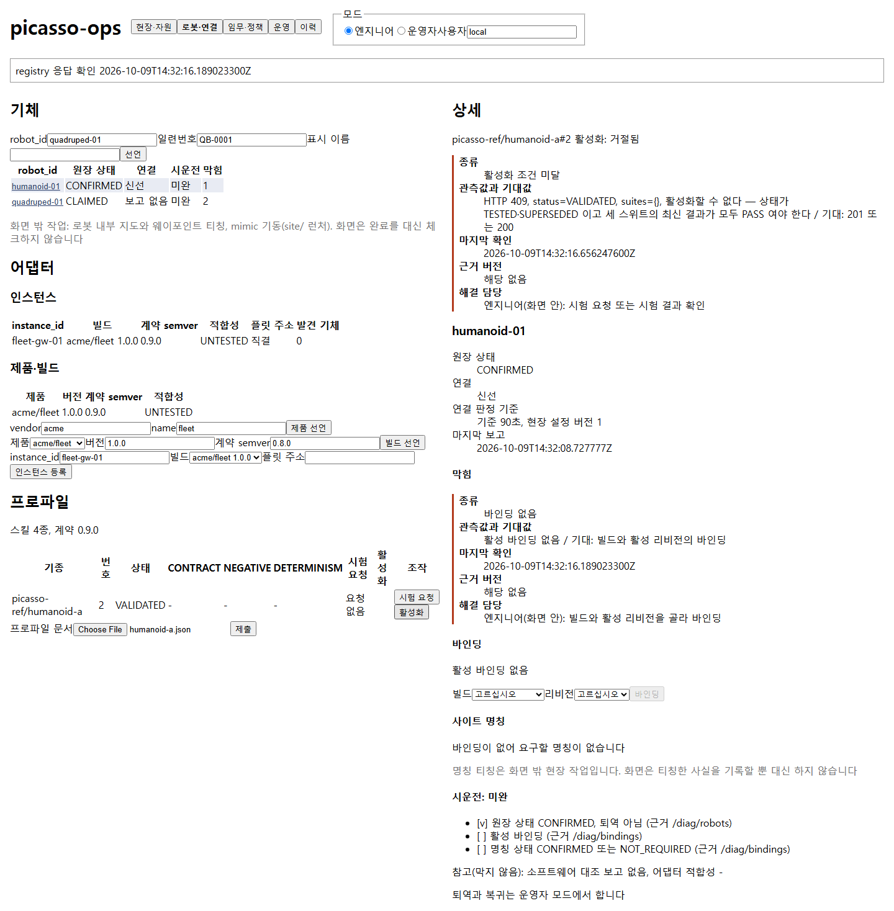

그림 11. 시험 전 활성화가 거부된 알림과 카드, 리비전 VALIDATED, 시험 요청 «요청 없음». 알림 글자는 «… 활성화: 거절됨» (옛 이름). 실제 스택.

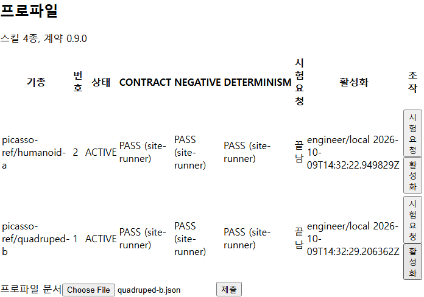

그림 12. 리비전 둘 시험 통과와 활성화 뒤. 실제 스택.

#### 3.2.4 상세 (region «상세», h2 «상세»)

| 상태 | 글자 | 근거 |
|---|---|---|
| 고르지 않음 | «기체를 고르면 원장 상태와 연결이 여기에 보입니다.» | `RobotsArea.tsx:66-71` |
| 목록에 없는 id | «목록에 없는 기체입니다: ${id}» | 같은 곳 |

기체 상세(`RobotDetail.tsx`, region «${robotId} 상세», h3 ${robotId}), 위에서 아래:

| 순서 | 요소 | 내용 | 행 |
|---|---|---|---|
| 1 | dl | «원장 상태»(코드 값), «연결»(`CONNECTION_LABEL`), «연결 판정 기준»(«기준 ${seconds}초, 현장 설정 버전 ${version}», 목록이 실을 때만), «마지막 보고»(없으면 «보고 없음»), 퇴역이면 «퇴역» «${retiredAt} (${retiredReason})» | 43-66 |
| 2 | h4 «막힘» | 없으면 «막힘 없음», 있으면 `FindingCard` 여러 장(바로 가기 없음) | 67-72 |
| 3 | 카드 셋 | `CommissioningCards`. 운영 서비스가 시운전 칸을 실을 때만 | 73-81 |
| 4 | 맨 아래 | 엔지니어 «퇴역과 복귀는 운영자 모드에서 합니다» / 운영자·퇴역 기체 버튼 «복귀»(`DELETE /api/robots/{id}/retirement`) / 운영자·현역 form «퇴역»: «퇴역 사유» + «퇴역»(사유가 비면 비활성, `POST …/retirement`) | 82-104 |

what: «${robotId} 퇴역», «${robotId} 복귀» (`RobotsArea.tsx:84,87`).

카드 셋(`CommissioningCards.tsx`)은 각각 `<section className="card" aria-label>` 입니다. `.card` 에는 CSS 규칙이 없어 구분선이나 배경이 없습니다.

| 카드 | 내용 | 조작(엔지니어) | 행 |
|---|---|---|---|
| region «바인딩», h4 «바인딩» | 없으면 «활성 바인딩 없음». 있으면 dl «빌드» «${adapterName} ${adapterVersion}», «리비전» «${vendor}/${model}#${revision}», «바인딩한 이» «${boundBy} ${boundAt}» | 현역이면 form «바인딩»: «빌드» select(«고르십시오» + 빌드), «리비전» select(«고르십시오» + ACTIVE 리비전만) → «바인딩». what «${robotId} 바인딩». `POST /api/robots/{id}/binding` | 29-50, 117-158 |
| region «사이트 명칭», h4 «사이트 명칭» | 바인딩이 없으면 «바인딩이 없어 요구할 명칭이 없습니다». 있으면 dl «명칭 상태»(코드 값), «요구 키»(없으면 «없음»), «사람이 기록함»(«기록 없음» 또는 «${by} ${at}»), «기체가 답함»(«아직 응답 없음» / «명칭을 지원하지 않음 (${at})» / «아는 명칭 ${n}개 (${at})»). 회색 «명칭 티칭은 화면 밖 현장 작업입니다. 화면은 티칭한 사실을 기록할 뿐 대신 하지 않습니다» | 바인딩이 있으면 버튼 «명칭 등록 기록». what «${robotId} 명칭 기록». `POST /api/robots/{id}/site-names` | 52-84 |
| region «시운전», h4 «시운전: ${완료\|미완\|퇴역}» | 체크 목록 셋(글자 «[v]»/«[ ]»): «원장 상태 CONFIRMED, 퇴역 아님 (근거 /diag/robots)», «활성 바인딩 (근거 /diag/bindings)», «명칭 상태 CONFIRMED 또는 NOT_REQUIRED (근거 /diag/bindings)». 참고 줄 «참고(막지 않음): 소프트웨어 대조 ${…}, 어댑터 적합성 ${…\|-}» | 없음 | 86-107 |

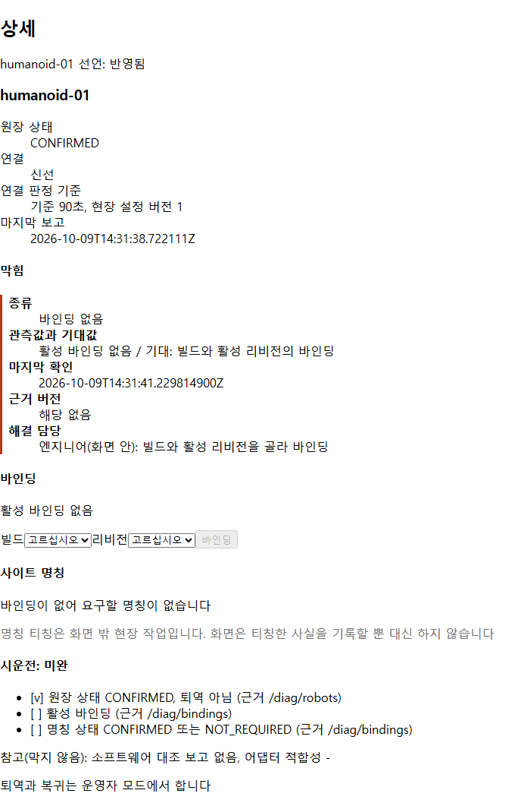

그림 07. 선언 직후 알림, 바인딩 없음 막힘 카드, 시운전 미완. 엔지니어 모드, 실제 스택.

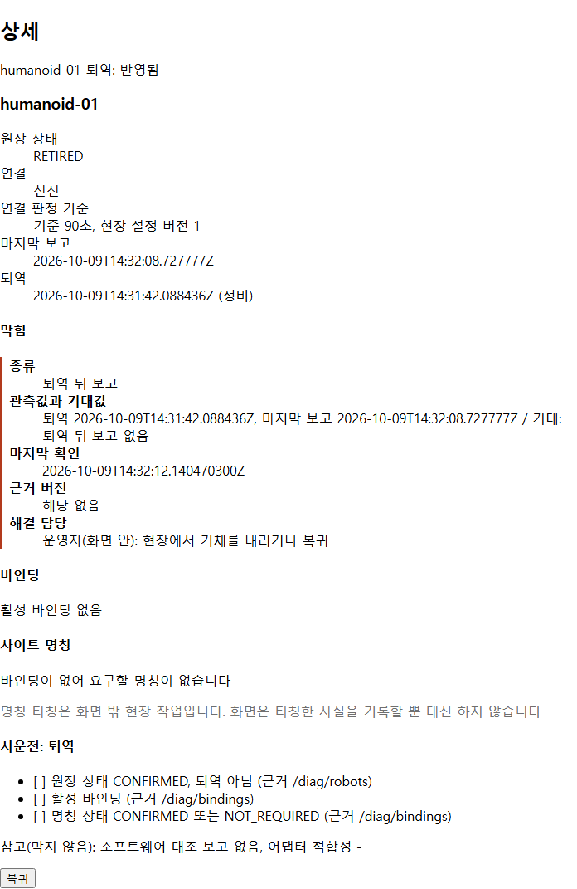

그림 08. 퇴역 뒤 보고 막힘 카드와 복귀 버튼. 운영자 모드, 실제 스택.

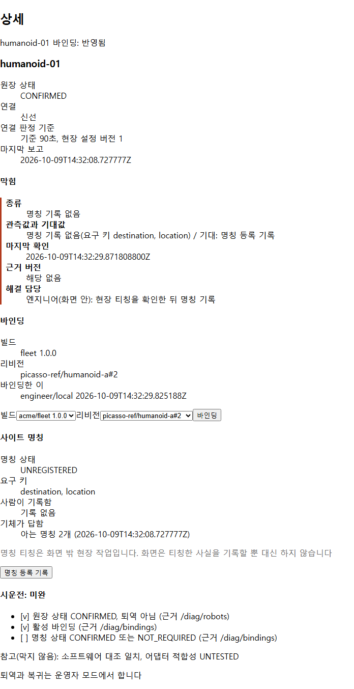

그림 13. 바인딩 뒤 명칭 기록 없음 막힘. 실제 스택.

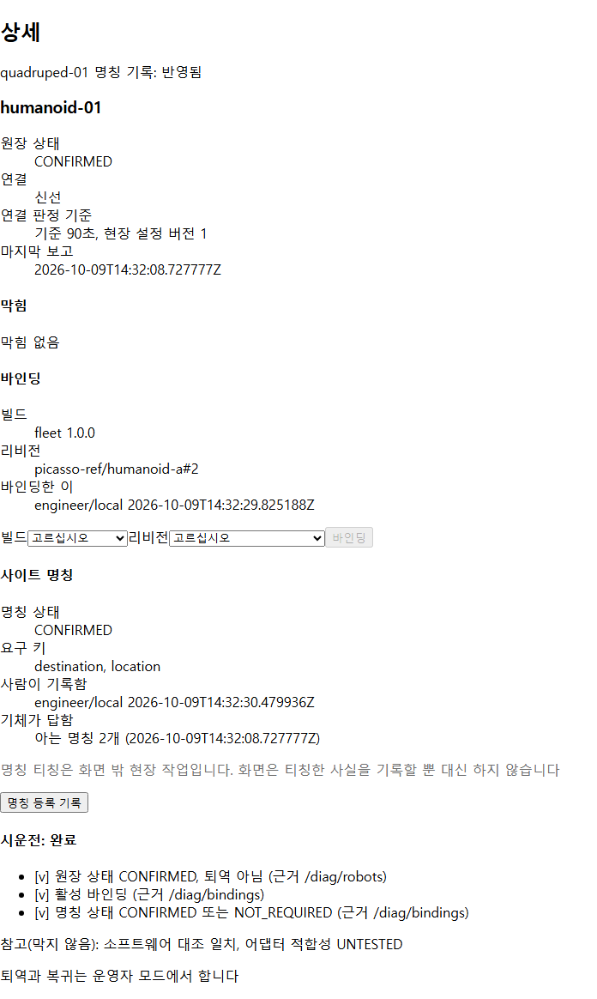

그림 14. 시운전 완료, 막힘 없음. 실제 스택.

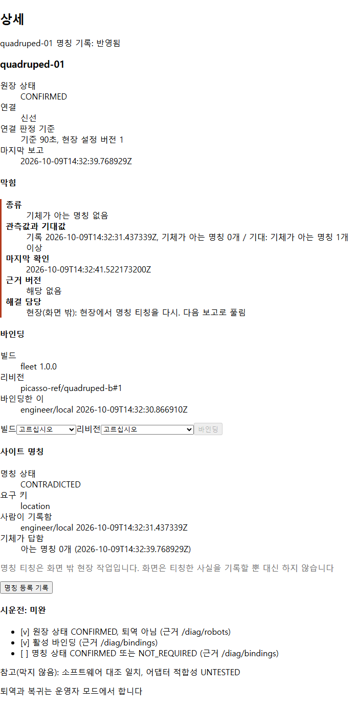

그림 15. 시운전 미완, 기체가 아는 명칭 없음 막힘 카드(해결 담당 «현장(화면 밖)»). 실제 스택.

연결: 막힘 카드의 «근거 버전» 과 «연결 판정 기준» 은 현장 설정 버전입니다(§3.1.1). 시운전 «완료» 인 기체만 운영 영역에서 배정 가능합니다(§3.4.2).

### 3.3 임무·정책 (`MissionsArea.tsx`)

목적: 편집 대상 임무 하나(`PrepareSequencedRack`, `api.ts:619`)의 활성 버전, 버전 이력, 초안을 보이고, 엔지니어가 정의 JSON 을 편집해 초안 저장 → 검증 → 모의 실행 → 활성화를 합니다. 편집 대상 임무는 하나로 고정이며 h2 는 임무 id 글자 그대로입니다(`:175`).

| 모드 | 할 수 있는 것 |
|---|---|
| 엔지니어 | 템플릿 불러오기, 편집, 초안 저장, 검증, 모의 실행, 활성화, 초안 열기 |
| 운영자 | 보기. 편집 구역에 «임무 편집은 엔지니어 모드에서 합니다» 와 활성 정의만 |

데이터: `GET /api/missions/PrepareSequencedRack`(이 영역이 열려 있을 때 5초), `GET /api/missions/templates/PrepareSequencedRack`(한 번). 조작은 `POST …/drafts`, `…/drafts/{id}/validate`, `…/mock-run`, `…/activate {reason}` 입니다(`api.ts:805-818`). 4xx 와 503 은 사전 거부로 봅니다(`api.ts:789`).

배치(위에서 아래, 구역 넷, `:174-341`). 편집 구역 안만 `.split` 2열(편집기 | 활성 정의)입니다.

| 구역 | 내용 | 행 |
|---|---|---|
| region «임무 PrepareSequencedRack» (h2 = 임무 id) | 못 읽음 «모름: 임무 버전을 아직 읽지 못했습니다» 뒤에 오류가 있으면 « (${error})». dl «활성 버전»(«코드 정의» / «버전 ${n}»), «활성화»(«${by} ${at}: ${reason}», 데이터 버전일 때만) | 174-195 |
| region «임무 편집» (엔지니어, h2 «편집») | 마지막 결과(`MissionNotice`) → 템플릿 목록 → `.split`[라벨 «임무 정의 JSON» textarea(rows 24, spellCheck off) \| 활성 정의] → 대상 줄 → `.actions`[«초안 저장», «검증», «모의 실행», «활성화 사유» 입력, «활성화»] → alert | 196-249 |
| region «임무 편집» (운영자) | «임무 편집은 엔지니어 모드에서 합니다» + 활성 정의만 | 250-255 |
| region «버전 이력» (h2) | table «임무 버전 이력»: 버전(«버전 ${n}», 활성이면 « (활성)», 그 행 `selected`), 초안(«초안 ${id}»), 활성화한 사람, 사유, 활성화 시각. 없으면 «활성화한 버전이 없습니다. 코드 정의로 돕니다» | 258-292 |
| region «초안» (h2) | table «임무 초안 목록»: 초안(«초안 ${id}»), 저장한 사람, 저장 시각, 마지막 모의 실행(«없음» 또는 `<details><summary>${판정} ${finishedAt}</summary>` + 모의 실행 보고), 엔지니어면 «조작»(버튼 «초안 ${id} 열기»). 대상 초안 행 `selected`. 없으면 «저장한 초안이 없습니다» | 293-338 |

편집 구역의 세부:

| 요소 | 사실 | 행 |
|---|---|---|
| 템플릿 | `<ul aria-label="템플릿">`, 항목마다 버튼 «${TEMPLATE_LABEL} 불러오기» 뒤에 호스트가 준 제목. 못 읽음 «모름: 템플릿을 아직 읽지 못했습니다» (+ 오류). 불러오면 편집기만 바뀌고 저장하지 않음 | 346-372 |
| 활성 정의 | «활성: 코드 정의» / «활성: 버전 ${n}» 뒤에 «, 편집기와 같음» / «, 편집기와 다름». 코드 정의면 «코드 정의는 정의 JSON 이 없습니다», 아니면 `<pre aria-label="활성 버전 정의">`. 못 읽음 «모름: 활성 버전을 아직 읽지 못했습니다» | 378-401 |
| 편집기 처음 내용 | 활성 정의, 없으면 첫 템플릿 | 100-102 |
| 대상 줄 | «저장한 초안이 없습니다. 초안을 저장하면 검증·모의 실행·활성화할 수 있습니다» / «대상: 초안 ${id}, 마지막 모의 실행 ${판정\|없음}» / «편집기 내용이 초안 ${id} 의 내용과 다릅니다. 검증하려면 초안을 다시 저장하십시오» | 221-229 |
| 버튼 활성 조건 | «초안 저장» 은 임무 개요를 읽은 뒤. «검증», «모의 실행», «활성화» 는 편집기 글자가 저장한 초안과 같을 때 | 103, 231-246 |
| 활성화 사유 | 비면 alert «활성화 사유를 넣으십시오». 사유는 `ACTIVATED` 일 때만 지움 | 116-118, 150-154 |
| what | «초안 저장», «초안 ${id} 검증», «초안 ${id} 모의 실행», «초안 ${id} 활성화» | 127-162 |

편집기는 `<textarea>` 입니다. 문법 강조, 자동 들여쓰기, JSON 검사가 없으며, 옳고 그름은 실행 호스트의 검증이 판정합니다(`:210-218`).

결과(`MissionNotice.tsx`, status «임무 조작 결과», `<div>` 안 여러 `<p>`):

| 경우 | 글자 | 행 |
|---|---|---|
| 시운전 완료 기체 모름(503 `COMMISSIONED_ROBOTS_UNKNOWN`) | «${what}: 모름. ${detail}. 판정하지 않았습니다» | 96-101 |
| 그 밖 사전 거부 | «${what}: 막힘(${풀이})» + «${detail}» | 103-110 |
| 비정상 | «${what}: 결과 모름(${cause}). 초안·버전 목록을 다시 읽어 확인하십시오» | 112-118 |
| 응답 없음 세 갈래 | «${what}: 응답은 없었으나 다시 읽어 보니 반영됨. 초안·버전 목록에서 보십시오» / «…응답 없음. 다시 읽어 보니 반영 안 됨. 다시 하려면 새로 요청하십시오» / «…반영되었을 수 있음. 다시 읽지도 못해 확인하지 못했습니다. 초안·버전 목록에서 확인하십시오» | 178-186 |
| 호스트 거부 | «${what}: 실행 호스트가 거부함(${풀이})» + «${detail}» | 135-144 |
| 본문 없음 | «${what}: 결과 모름. 초안·버전 목록을 다시 읽어 확인하십시오» | 150-152 |
| INPUT_UNKNOWN | «${what}: 모름. ${detail 또는 '판정 입력을 읽지 못했습니다'}. 판정하지 않았습니다» | 157-162 |
| REFUSED | «${what}: 거부됨» + `FindingCard` 여러 장(바로 가기 없음) | 163-171 |
| 저장 성공 | «${what}: 초안 ${id} 저장됨» | 41-46 |
| 검증 통과 | «${what}: 통과» | 50 |
| 모의 실행 | «${what}: ${판정}» + 모의 실행 보고 | 57-64 |
| MOCK_RUN_REQUIRED | «${what}: 막힘. 이 초안에 통과한 모의 실행이 없습니다. 모의 실행을 먼저 하십시오» + «마지막 모의 실행: ${판정}» | 72-78 |
| 활성화 성공 | «${what}: 버전 ${n} 활성화됨. 다음 작업 지시부터 이 버전을 씁니다» | 80-84 |

모의 실행 보고(`MockRunReport.tsx:12-53`): 첫 줄 «모의 실행 ${id}: ${판정}» (detail 이 있으면 «. ${detail}») → dl «표본 작업 지시»(«없음» 또는 «${jobOrderId}, 슬롯 ${…}, 자재 ${…}, 요구 근거 ${…}»), «물리 상태»(없으면 «실행이 서지 않음»), «가상 경과» ${n}초 → 단위가 있으면 table «모의 실행 ${id} 단위»: 단위, 경로(SIGNAL «설비 대기», 그 밖 «기체»), 스킬, 상태, 근거, 실패 분류(없으면 «-»).

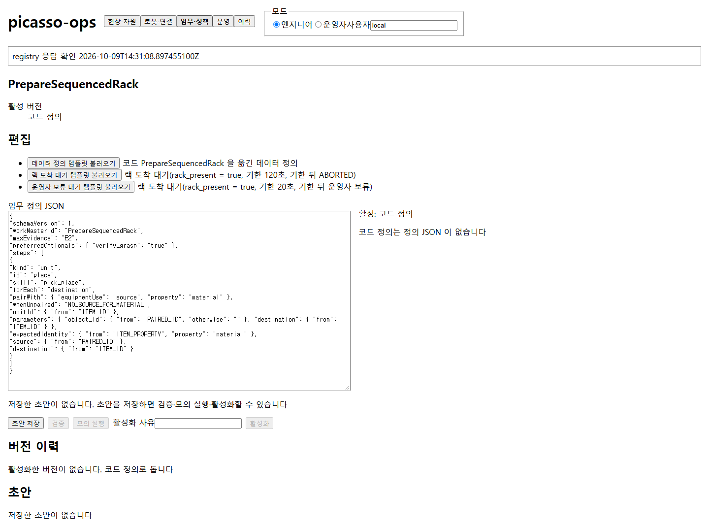

그림 04. 코드 정의, 버전과 초안 없음. 엔지니어 모드, 실제 스택.

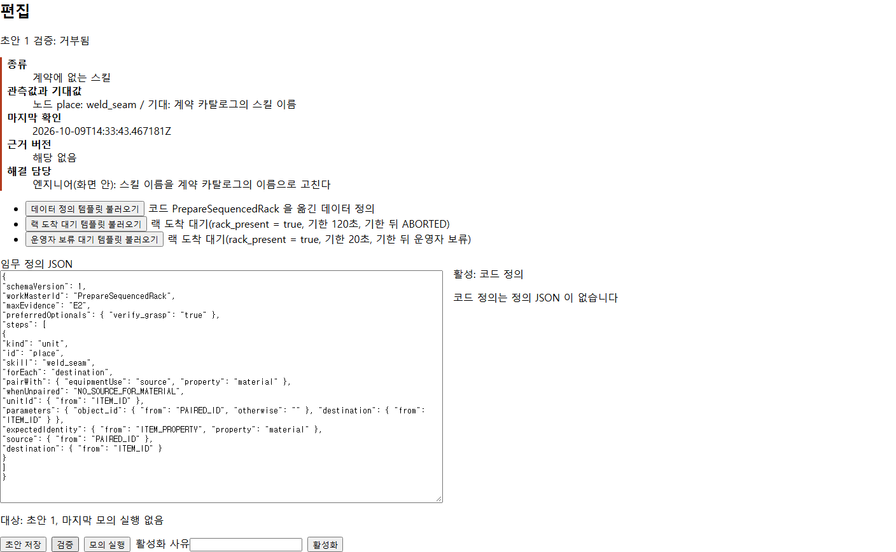

그림 33. 현장에 없는 스킬로 고친 정의의 검증 거부와 카드. 실제 스택.

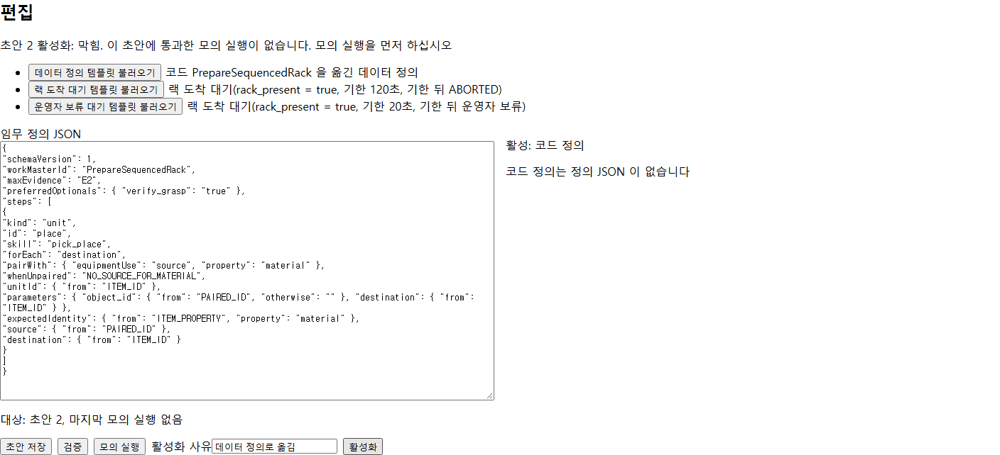

그림 34. 모의 실행 없이 활성화해 막힘. 실제 스택(파일 이름의 `mock-run` 은 기능 이름).

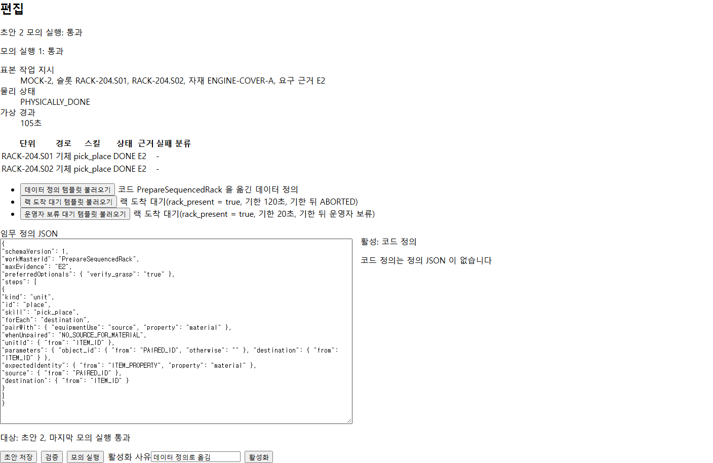

그림 35. 모의 실행 통과 보고(표본 작업 지시, 단위 표). 실제 스택.

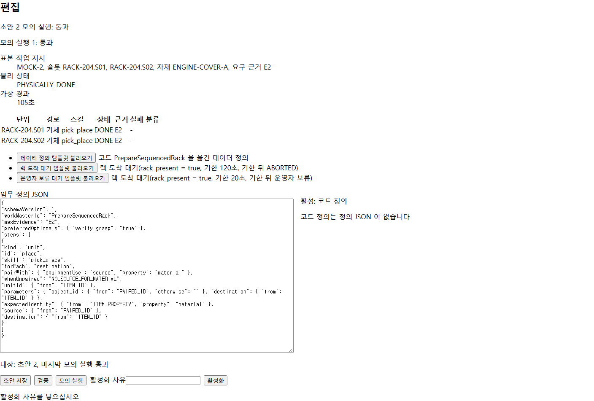

그림 36. 사유가 비어 보내지 않음. 실제 스택.

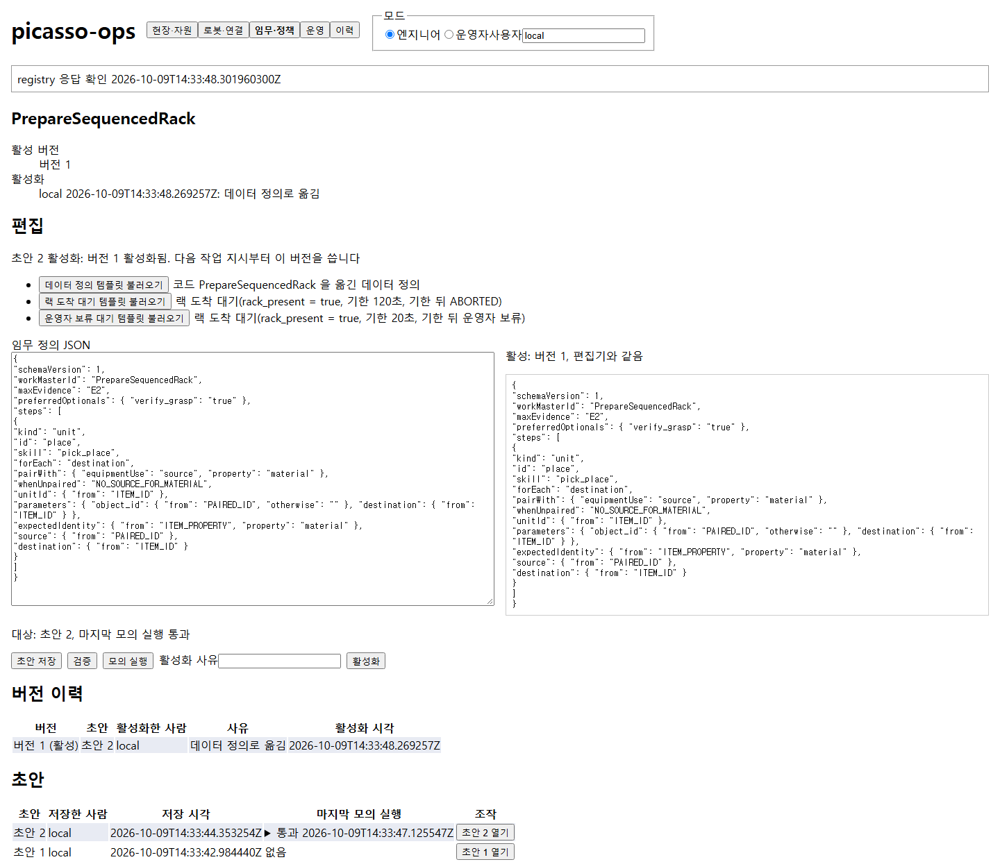

그림 37. 활성화 뒤. 버전 1 활성, 초안 둘, 편집기 | 활성 정의 2열. 실제 스택.

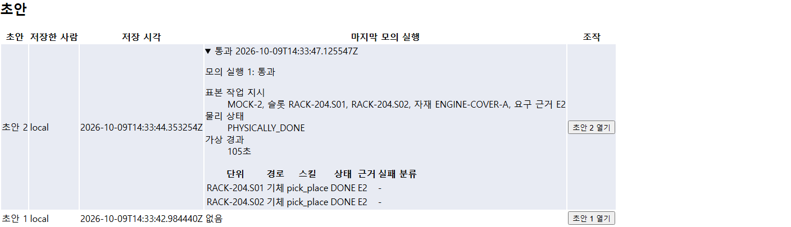

그림 38. 초안 목록, 마지막 모의 실행을 펼침. 실제 스택.

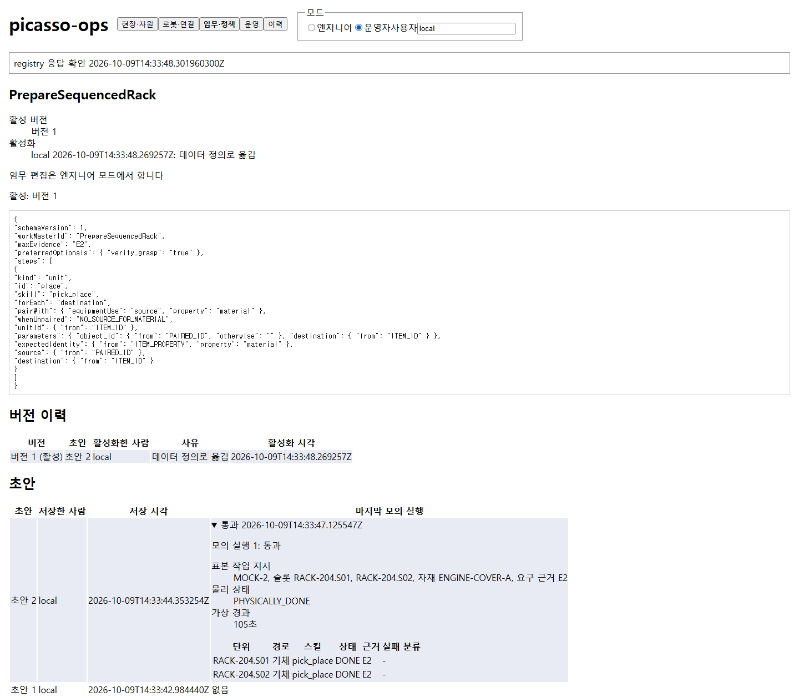

그림 39. 운영자 모드. 편집기 없이 활성 정의만. 실제 스택.

연결: 활성화한 버전은 다음 작업 지시부터 쓰이고, 운영 영역 실행 목록의 «임무 버전» 칸과 인시던트의 «임무 버전» 에 보입니다(§3.4.3, §3.4.4). 검증은 셀 대역의 신호 사양을 씁니다(저장소 README).

### 3.4 운영 (`OperationsArea.tsx`)

배치(위에서 아래, `:220-258`): `.split`[region «작업 지시» | region «배정 가능»] → region «실행» → region «인시던트» → region «셀 대역» → region «작업 응답 송신 기록». 여섯 구역이 한 페이지에 이어지며 탭, 접기, 앵커는 없습니다.

실행 호스트를 거치는 읽기는 이 영역을 열었을 때만 합니다. 호스트가 멈춰도 다섯 조회는 직전 값이 되지 않습니다(`:46-57`).

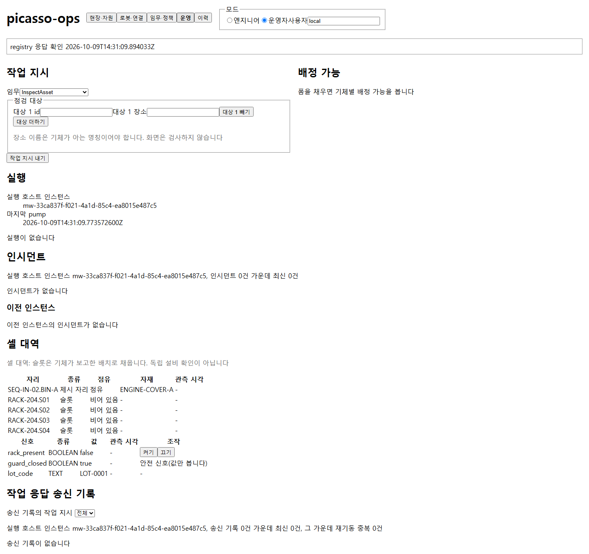

그림 05. 실행, 인시던트, 송신 기록이 없는 상태. 운영자 모드, 실제 스택.

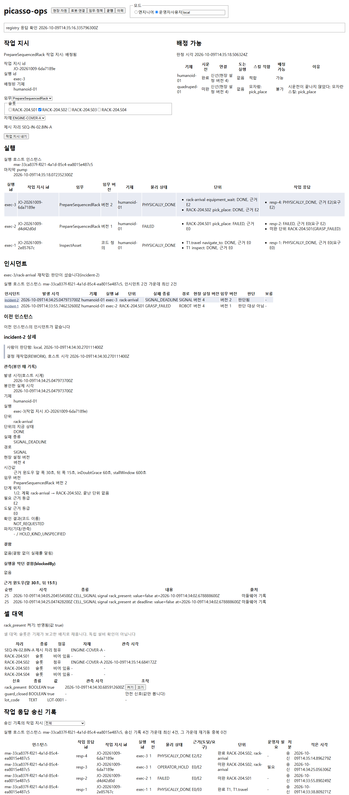

그림 52. 흐름을 돈 뒤 운영 영역 전체. 운영자 모드, 실제 스택.

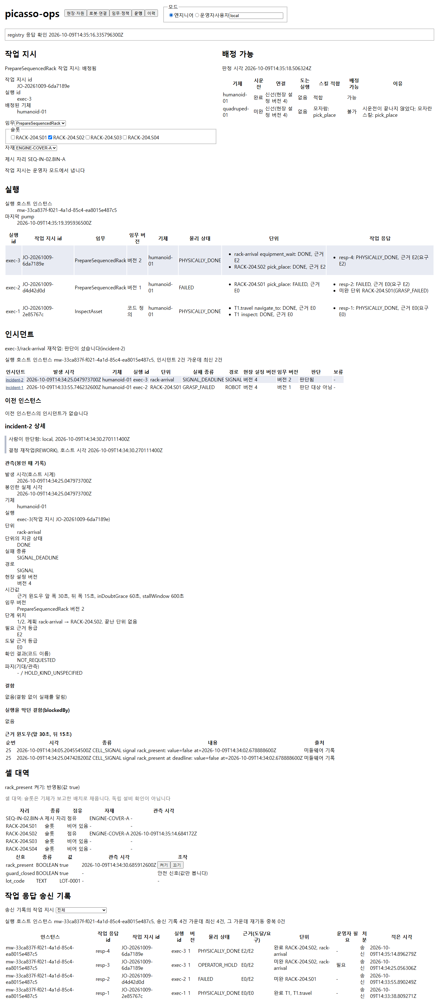

그림 53. 같은 상태, 엔지니어 모드. 제출 버튼 자리에 모드 문장. 실제 스택.

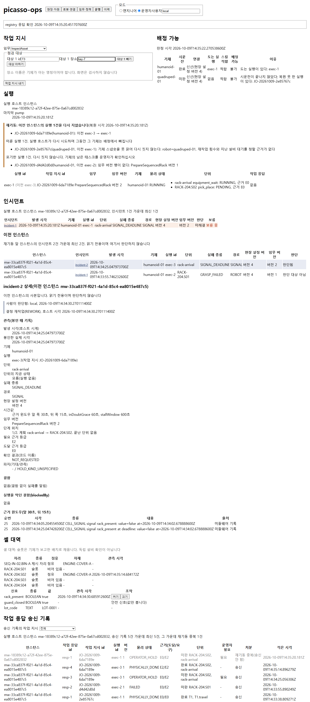

그림 59. 실행 호스트 재기동 뒤. 대역 응답으로 그린 화면.

#### 3.4.1 작업 지시 (region «작업 지시», h2 «작업 지시»)

| 모드 | 할 수 있는 것 |
|---|---|
| 운영자 | 폼 입력, 버튼 «작업 지시 내기» |
| 엔지니어 | 폼 입력(배정 가능 판정은 보임). 버튼 자리에 «작업 지시는 운영자 모드에서 냅니다» (`JobOrderFormView.tsx:50-56`) |

배치: 결과 알림 `JobOrderNotice` → 폼 `JobOrderFormView` (`OperationsArea.tsx:223-235`).

폼(form «작업 지시 폼», `JobOrderFormView.tsx`):

| 임무 | 칸 |
|---|---|
| «임무» select | «InspectAsset», «PrepareSequencedRack» (`:17,32-44`). 영역을 옮기면 처음 값 InspectAsset 으로 돌아옴(`PW:267`) |
| InspectAsset | fieldset «점검 대상». 대상마다 «대상 ${i} id», «대상 ${i} 장소», 버튼 «대상 ${i} 빼기». 버튼 «대상 더하기». 회색 «장소 이름은 기체가 아는 명칭이어야 합니다. 화면은 검사하지 않습니다» (`:68-104`). 처음 대상 하나(`jobOrderDraft.ts:14-19`) |
| PrepareSequencedRack | 셀 대역 못 읽음이면 «모름: 셀 대역을 읽지 못해 슬롯과 자재를 고를 수 없습니다». 아니면 fieldset «슬롯»(슬롯 id 마다 체크박스, 라벨 = 슬롯 id), «자재» select(«고르십시오» + 점유된 제시 자리의 자재), «제시 자리 ${id\|-}» (`:107-139`) |

덜 채운 폼(`jobOrderDraft.ts:56-67`, alert): «점검 대상을 하나 이상 넣으십시오», «점검 대상마다 대상 id 와 장소 이름을 넣으십시오», «셀 대역을 읽지 못해 슬롯과 자재를 고를 수 없습니다», «슬롯을 하나 이상 고르십시오», «자재를 고르십시오», «${material} 를 든 제시 자리가 셀 대역에 없습니다».

API 는 `POST /api/job-orders` (`api.ts:615`), what 은 «${workMasterId} 작업 지시» 입니다(`OperationsArea.tsx:182`).

결과(`JobOrderNotice.tsx`, status «제출 결과»):

| 경우 | 글자 | 행 |
|---|---|---|
| 사전 거부 | «${what}: 막힘(${풀이})» + «${detail}» | 17-25 |
| 비정상 | «${what}: 결과 모름(${cause}). 실행 목록을 다시 읽어 확인하십시오» | 27-34 |
| 호스트 응답 없음 | «${what}: 응답은 없었으나 다시 읽어 보니 실행이 있음. 실행 목록에서 보십시오» / «…응답 없음. 다시 읽어 보니 실행이 없음. 다시 하려면 새로 내십시오» / «…반영되었을 수 있음. 다시 읽지도 못해 확인하지 못했습니다. 실행 목록에서 확인하십시오» + dl «작업 지시 id» | 37-48, 106-115 |
| 결과 있음 | «${what}: ${SUBMIT_RESULT_LABEL}» + dl «작업 지시 id», «실행 id», «배정된 기체», «거부 사유»(있는 것만) + list «기체별 미배정 사유» + list «실행 호스트가 후보에서 뺀 기체» | 50-102 |

제출한 작업 지시의 실행 행은 실행 목록에서 `selected` 로 강조됩니다(`OperationsArea.tsx:218,243`, `ExecutionList.tsx:59`).

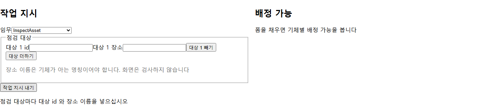

그림 26. 덜 채운 폼이라 보내지 않고 배정 가능도 묻지 않음. 실제 스택.

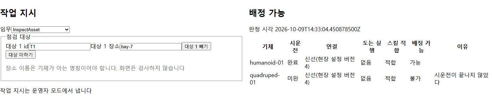

그림 28. 엔지니어 모드. 입력과 판정은 보이고 제출 버튼은 없음. 실제 스택.

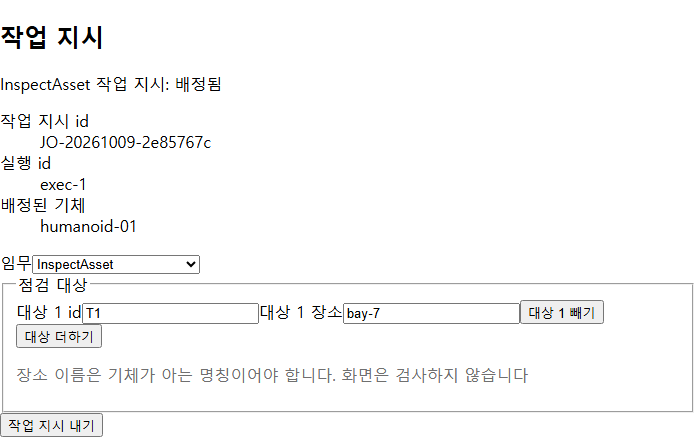

그림 29. 제출 결과 배정됨. 실제 스택.

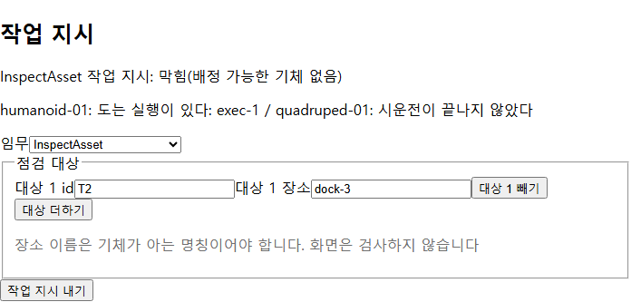

그림 31. 배정 가능한 기체가 없어 막힘. 실제 스택.

#### 3.4.2 배정 가능 (region «배정 가능», h2 «배정 가능», `EligibilityTable.tsx`)

두 모드 모두 봅니다. 판정은 폼이 다 찼을 때만 묻습니다(§2.5).

| 상태 | 글자 | 행 |
|---|---|---|
| 폼 덜 참 | «폼을 채우면 기체별 배정 가능을 봅니다» | 25 |
| 사전 거부 | `<p role="alert">` «${풀이}: ${detail}» | 26-32 |
| 판정 전 | «판정 중» | 35 |
| 못 읽음 | «모름: 배정 가능을 읽지 못했습니다 (${error})» | 35 |
| 직전 값 | «직전 값입니다 (${error})», «폼이 바뀌어 다시 판정하는 중입니다» | 39-40 |
| 판정 시각 | «판정 시각 ${checkedAt}» | 41 |
| 기체 목록 모름, 없음 | «모름: 기체 목록을 아직 읽지 못했습니다», «이 사이트에 기체가 없습니다» | 43, 45 |

table «기체별 배정 가능»(`:47-73,79-89`), 열 순서:

| 순서 | 열 | 값 |
|---|---|---|
| 1 | 기체 | id |
| 2 | 시운전 | `COMMISSIONING_LABEL` 또는 «모름» |
| 3 | 연결 | «${라벨}(현장 설정 버전 ${n})» 또는 «모름» |
| 4 | 도는 실행 | 실행 id, «없음», «모름» |
| 5 | 스킬 적합 | «적합», «모자람: ${스킬들}», «모름» |
| 6 | 배정 가능 | «가능», «불가» |
| 7 | 이유 | «; » 로 연결 |

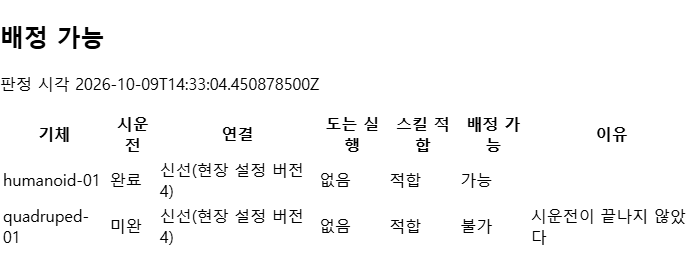

그림 27. 가능 하나, 불가 하나. 실제 스택.

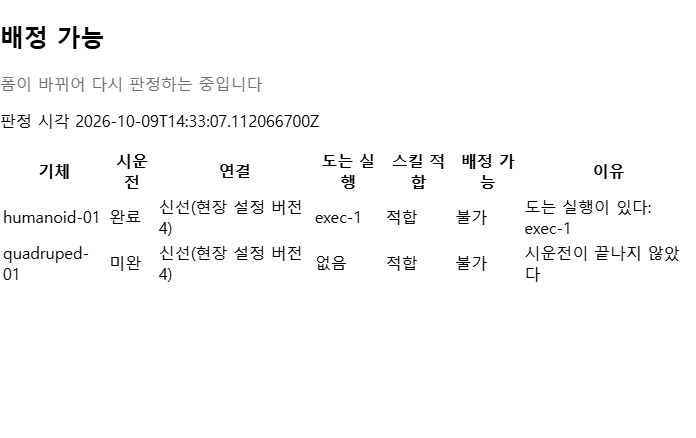

그림 30. 실제 스택.

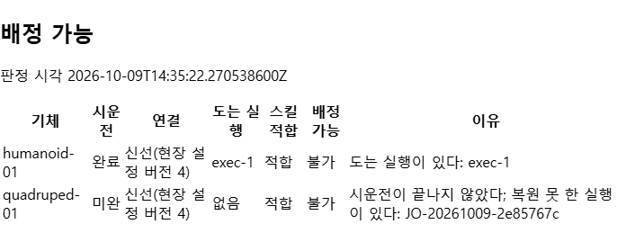

그림 58. 복원 못 한 실행이 있는 기체를 배정에서 뺌. 대역 응답으로 그린 화면.

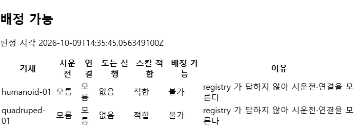

그림 65. registry 불통 중의 판정. 실제 스택(런처를 끔).

#### 3.4.3 실행 (region «실행», h2 «실행», `ExecutionList.tsx`)

두 모드 모두 보기만 합니다.

| 요소 | 사실 | 행 |
|---|---|---|
| 못 읽음 | «모름: 실행 목록을 아직 읽지 못했습니다» (+ « (${error})») | 25 |
| 직전 값 | «직전 값입니다. 실행 호스트 불통: ${error}» | 29 |
| dl | «실행 호스트 인스턴스» ${instanceId}, «마지막 pump» ${pumpedAt\|아직 없음} | 30-35 |
| 복원 보고 띠 | 아래 | 99-140 |
| 표 | table «실행 목록», 최신부터 | 42-88 |
| 빈 상태 | «실행이 없습니다» | |

재기동 복원 보고 띠는 재기동 뒤 행이 있을 때만 섭니다(region «재기동 복원 보고», `.restore`: 왼쪽 4px `#b26b1d` 선). 표 «실행 목록» 보다 앞에 옵니다.

| 순서 | 글자 |
|---|---|
| 1 | 굵게 «재기동: 이전 인스턴스의 실행 ${n}건을 다시 지었습니다» + «(복원 시각 ${at})» |
| 2 | list «다시 지은 실행»: «${jobOrderId}(${robotId}): 이전 ${prev} → ${exec}» |
| 3 | «미룬 실행 ${n}건. 실행 호스트가 다시 시도하며 그동안 그 기체는 배정에서 빠집니다» + list «미룬 실행» |
| 4 | «포기한 실행 ${n}건. 다시 짓지 않습니다. 기체의 남은 태스크를 운영자가 확인하십시오» + list «포기한 실행» |
| 항목 꼴 | «${jobOrderId}(${robotId}, 이전 ${prev}): ${reason\|사유 없음}» |

table «실행 목록» 열 순서(`:42-88,143-159`):

| 순서 | 열 | 값 |
|---|---|---|
| 1 | 실행 id | 재기동으로 다시 지었으면 뒤에 `span.restored`(회색) « (이전 ${id})», title «이전 인스턴스 ${instanceId}» |
| 2 | 작업 지시 id | |
| 3 | 임무 | |
| 4 | 임무 버전 | «코드 정의», «버전 ${n}» |
| 5 | 기체 | |
| 6 | 물리 상태 | 코드 값 |
| 7 | 단위 | `<ul>` 항목 «${unitId} ${skillType}: ${state}, 근거 ${reached}» |
| 8 | 작업 응답 | «없음» 또는 `<ul>`: «${id}: ${physicalState}, 근거 ${reached}(요구 ${required})», «미확인 단위 …», «미완 단위 ${id}(${사유})…», «불확실 단위 …», «운영자 개입 필요» |

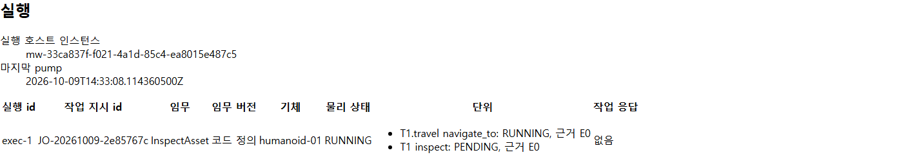

그림 32. 코드 정의 임무 실행 중. 실제 스택.

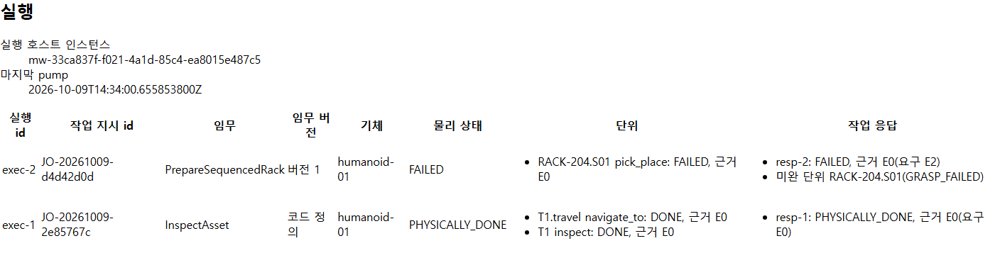

그림 43. 데이터 정의 버전 1 실행의 단위 실패. 실제 스택.

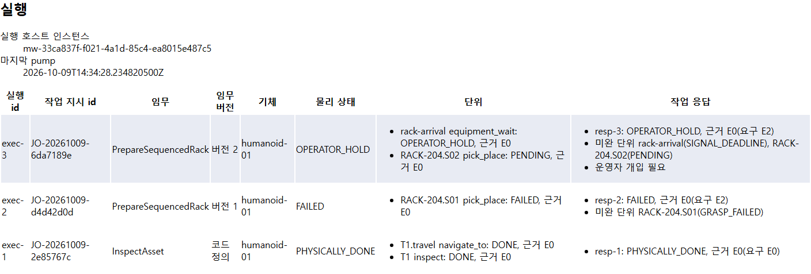

그림 45. 설비 대기 기한이 지나 운영자 보류에 선 실행. 실제 스택.

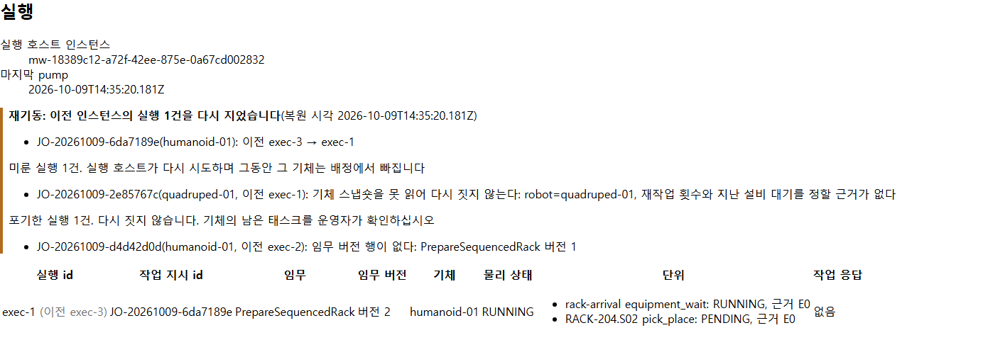

그림 55. 복원 보고 띠(다시 지음 1, 미룸 1, 포기 1)와 «exec-1 (이전 exec-3)» 행. 대역 응답으로 그린 화면.

#### 3.4.4 인시던트 (region «인시던트», h2 «인시던트», `IncidentSection.tsx`)

| 모드 | 할 수 있는 것 |
|---|---|
| 운영자 | 보기, 보류 단위 판단(완료 확인, 재작업) |
| 엔지니어 | 보기. 판단 폼 자리에 «보류 중입니다. 운영자 판단은 운영자 모드에서 합니다» |

배치(`:107-175`): 판단 결과 알림 → (직전 값) → 머리 줄 → 지금 인스턴스 표 → region «이전 인스턴스» → region «인시던트 상세».

| 요소 | 사실 | 행 |
|---|---|---|
| 머리 줄 | «실행 호스트 인스턴스 ${id}, 인시던트 ${total}건 가운데 최신 ${n}건» | 115-117 |
| 빈 상태 | «인시던트가 없습니다» | |
| 못 읽음 | «모름: 인시던트 목록을 아직 읽지 못했습니다» (+ « (${error})») | |
| 직전 값 | «직전 값입니다. 실행 호스트 불통: ${error}» | 114 |

table «인시던트 목록»(`:190-253`), 열 순서:

| 순서 | 열 | 값 |
|---|---|---|
| 1 | 인시던트 | `button.link`, 글자는 id, 접근 이름 «${id} 상세 보기» |
| 2 | 발생 시각 | |
| 3 | 기체 | |
| 4 | 실행 id | |
| 5 | 단위 | |
| 6 | 실패 종류 | 코드 값, 없으면 «-» |
| 7 | 경로 | 코드 값 |
| 8 | 현장 설정 버전 | «버전 ${n}», «모름» |
| 9 | 임무 버전 | «버전 ${n}», «코드 정의» |
| 10 | 판단 | «판단됨(설비 근거 없이 완료 확인)», «판단됨», «미해결», «판단 대상 아님» (`:42-47`) |
| 11 | 보류 | «보류 중» (`<strong>`, 빨강) 또는 «-» |

보류 행은 `tr.held`(배경 `#fbeee6`, 굵은 글자 `#b23a1d`), 고른 행은 `tr.selected` 입니다.

이전 인스턴스(region «이전 인스턴스», h3 «이전 인스턴스», `:128-143`)는 실행 호스트가 `earlier` 배열을 실으면 섭니다. 지금 실제 스택은 빈 배열을 실으므로 재기동 전에도 «이전 인스턴스의 인시던트가 없습니다» 가 보입니다(그림 05, 52). 배열이 차 있으면 «재기동 앞 인스턴스의 인시던트 ${total}건 가운데 최신 ${n}건. 읽기 전용이며 여기서 판단하지 않습니다» 와 table «이전 인스턴스 인시던트 목록» 을 보입니다. 이 표는 맨 앞에 «인스턴스» 열이 더 있고 «보류» 열이 없으며, 버튼 접근 이름은 «${instanceId} ${id} 상세 보기» 입니다.

상세(region «인시던트 상세», `:146-173`). h3 «${id} 상세», 이전 인스턴스면 뒤에 «(이전 인스턴스 ${id})». 위에서 아래:

| 순서 | 요소 | 사실 | 행 |
|---|---|---|---|
| 1 | 이전 인스턴스 표시 | «이전 인스턴스의 사본입니다. 읽기 전용이며 판단하지 않습니다» | |
| 2 | 읽기 상태 | «상세를 읽는 중입니다» / «모름: 상세를 읽지 못했습니다 (${error})» / «실행 호스트에 이 인시던트가 없습니다. 실행 호스트를 재기동했을 수 있습니다» | 153 등 |
| 3 | 사람의 판단 | 없으면 «사람의 판단 없음. 아래 값은 모두 관측입니다». 있으면 region «사람의 판단» `.asserted`(왼쪽 4px 이중선 `#2b3f6b`): «사람이 판단함: ${id}, ${wallClockAt}», «결정 ${완료 확인\|재작업}(${코드}), 호스트 시각 ${at}», 해당하면 굵게 «설비 근거 없이 완료 확인» | 393-411 |
| 4 | 관측 | region «관측» `.observed`, h4 «관측(봉인 때 기록)», dl 순서: 발생 시각(호스트 시계), 봉인한 실제 시각, 기체, 실행(«${exec}(작업 지시 ${jo})»), 단위, 단위의 지금 상태(없으면 «모름(실행 없음)»), 실패 종류, 경로, 현장 설정 버전, 시간값(«근거 윈도우 앞 폭 ${s}, 뒤 폭 ${s}, inDoubtGrace ${s}, stallWindow ${s}»), 임무 버전(«${wm} ${버전}»), 단계 위치(«${at}/${n}. 계획 ${a → b}. 끝난 단위 ${…\|없음}», 0 이면 «계획에 없음(계획 ${n}개)»), 필요 근거 등급, 도달 근거 등급, 확인 결과(코드 이름), [위반된 사전 조건], 파지(기대/관측), [효과와 관측의 어긋남], [연결 «연결이 끊긴 채 돌던 중»] | 276-338 |
| 5 | h4 «결함» | «없음(결함 없이 실패를 알림)» 또는 결함 카드 «이 단위의 결함» | 339-344 |
| 6 | h4 «실행을 막던 결함(blockedBy)» | «없음» 또는 «실행을 막던 결함 ${i}» 카드들 | 345-352 |
| 7 | h4 «근거 윈도우(앞 ${s}, 뒤 ${s})» | [«윈도우 밖이라 버린 관측이 있습니다»] → 없으면 «윈도우 안의 관측이 없습니다», 있으면 table «근거 윈도우»: 순번, 시각, 종류, 내용, 출처(«미들웨어 기록», «현장 관측») | 353-382 |
| 8 | 판단 폼 | 지금 인스턴스이고 보류 중일 때만. 아래 | 384, 454-488 |

결함 카드(`<dl aria-label>`, `:413-441`): 분류(«${failureClass}(${errorType})»), 조치 힌트(빈 값 «없음»), [벤더 원문], 참조(«k=v, …» 또는 «없음»), 지금 태스크 계속(«가능», «불가»), 새 태스크 받기, 유지(`activeUntilKind` + 시각).

판단 폼(운영자, form «운영자 판단»): «${exec}/${unit} 보류를 판단합니다. 판단자는 ${user} 입니다», «판단 사유» 입력, `.actions` 안 버튼 «완료 확인», «재작업». 사유가 비면 alert «판단 사유를 넣으십시오» 가 섭니다. 확인 대화 없이 바로 보냅니다. API 는 `POST /api/executions/{exec}/units/{unit}/resolve` `{decision, instanceId, reason}` 입니다(`api.ts:1057-1066`). 판단 사유는 picasso 인시던트에 실리지 않고 조작 기록(이력 영역)에만 남습니다(저장소 README).

판단 결과(status «판단 결과», what «${exec}/${unit} ${완료 확인\|재작업}», `:502-523`):

| 경우 | 글자 |
|---|---|
| 섰음 | «판단이 섰습니다(${incidentId})» |
| 보류 아님 | «보류 단위가 아닙니다» |
| 에이전트 | «에이전트 판단은 거부됩니다» (+ «. ${detail}») |
| 호스트 거부 | «실행 호스트가 거부함(${풀이})» (+ «. ${detail}») |
| 응답 없음 세 갈래 | «응답은 없었으나 다시 읽어 보니 판단이 붙음» / «응답 없음. 다시 읽어 보니 판단이 붙지 않음. 늦게 붙을 수 있으니 인시던트 목록에서 확인하십시오» / «응답 없음. 판단이 붙었을 수 있음. 다시 읽지도 못해 확인하지 못했습니다. 인시던트 목록에서 확인하십시오» |
| 사전 거부 | «보내지 않음(${풀이}). ${detail}» |
| 비정상 | «결과 모름(${cause}). 인시던트 목록에서 확인하십시오» |

관측과 사람의 판단을 다르게 보이는 것은 설계 요구입니다. S4a 스펙 §2.2·§8.2 가 운영 관리 화면 설계 제안 §9 를 따라 «판단된 인시던트는 사람이 판단함: <판단자>, <시각> 과 결정을 함께 보여 관측과 다르게 표시합니다» 라고 정했습니다. 지금은 `.asserted`(이중선)와 `.observed`(h4 아래 여백만) 클래스, 그리고 «사람의 판단» / «관측» 두 region 으로 가릅니다(§4.2).

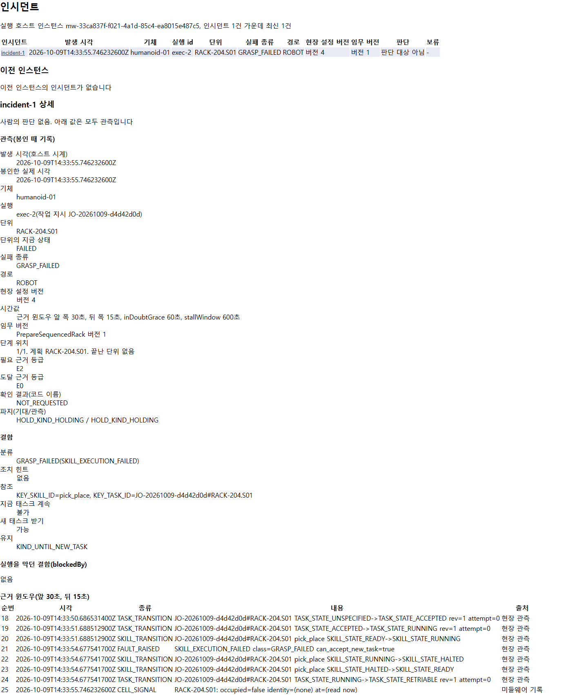

그림 42. 실패 인시던트(판단 대상 아님)와 상세(관측, 결함, 근거 윈도우). 실제 스택.

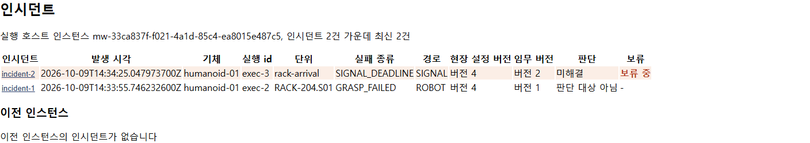

그림 44. 보류 중 인시던트(미해결) 행 강조. 실제 스택.

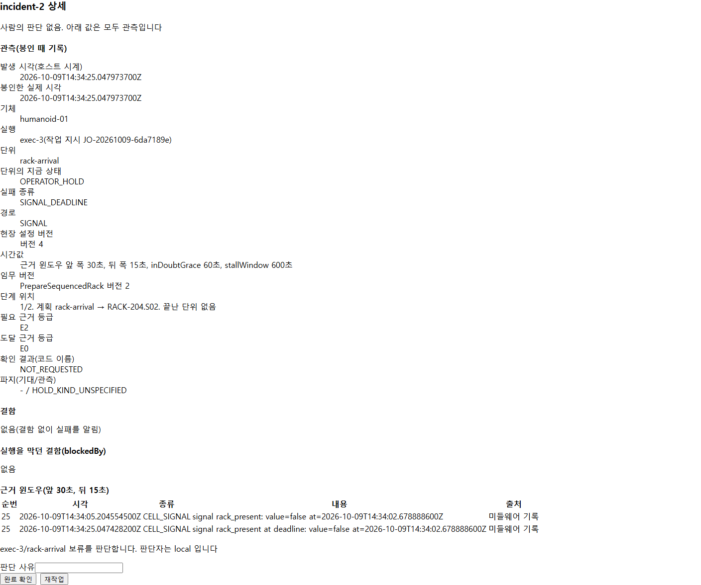

그림 46. 보류 중 상세와 운영자 판단 폼. 운영자 모드, 실제 스택.

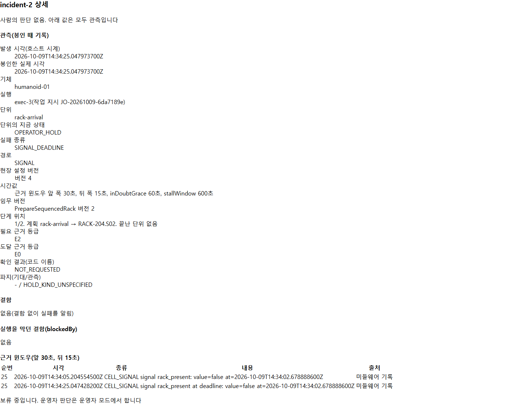

그림 47. 엔지니어 모드라 판단 폼 없음. 실제 스택.

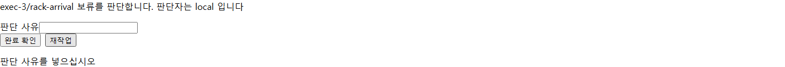

그림 48. 사유가 비어 보내지 않음. 실제 스택.

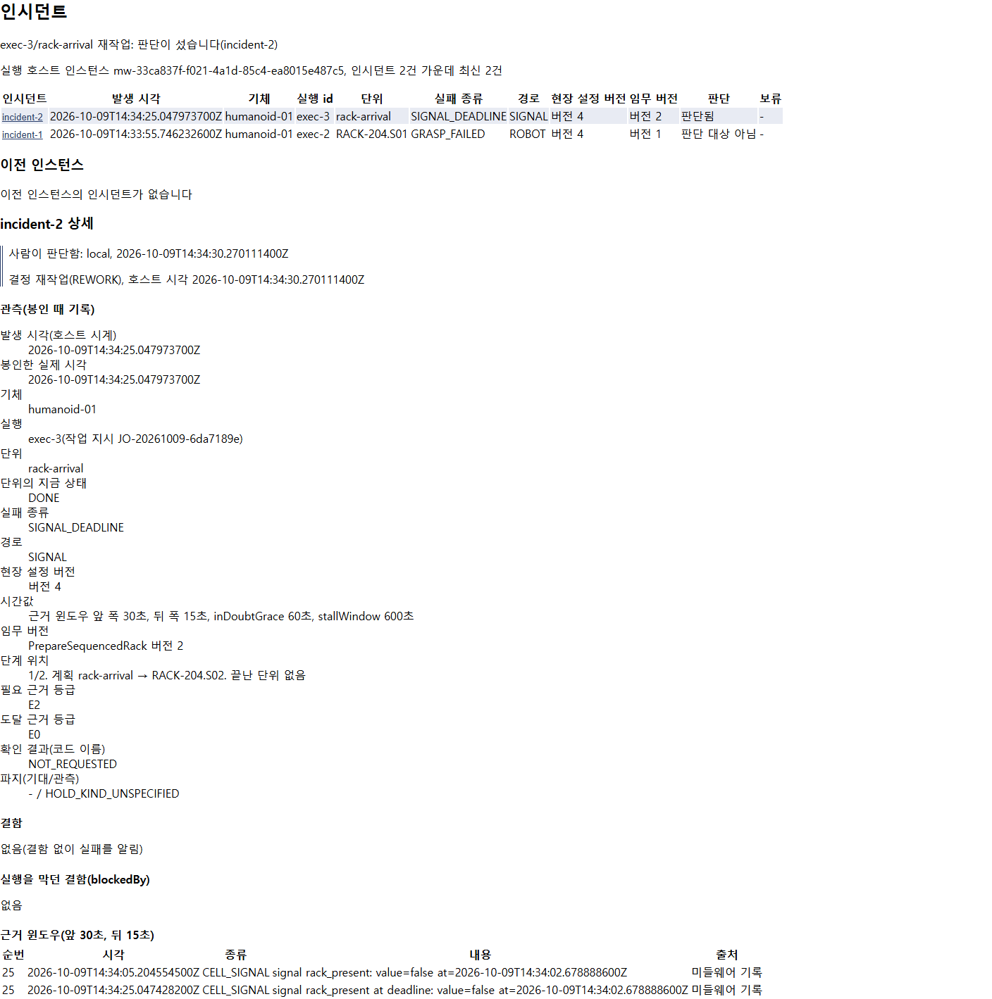

그림 49. 판단 결과 알림, 판단 칸 «판단됨», 사람의 판단 구역(이중선). 실제 스택.

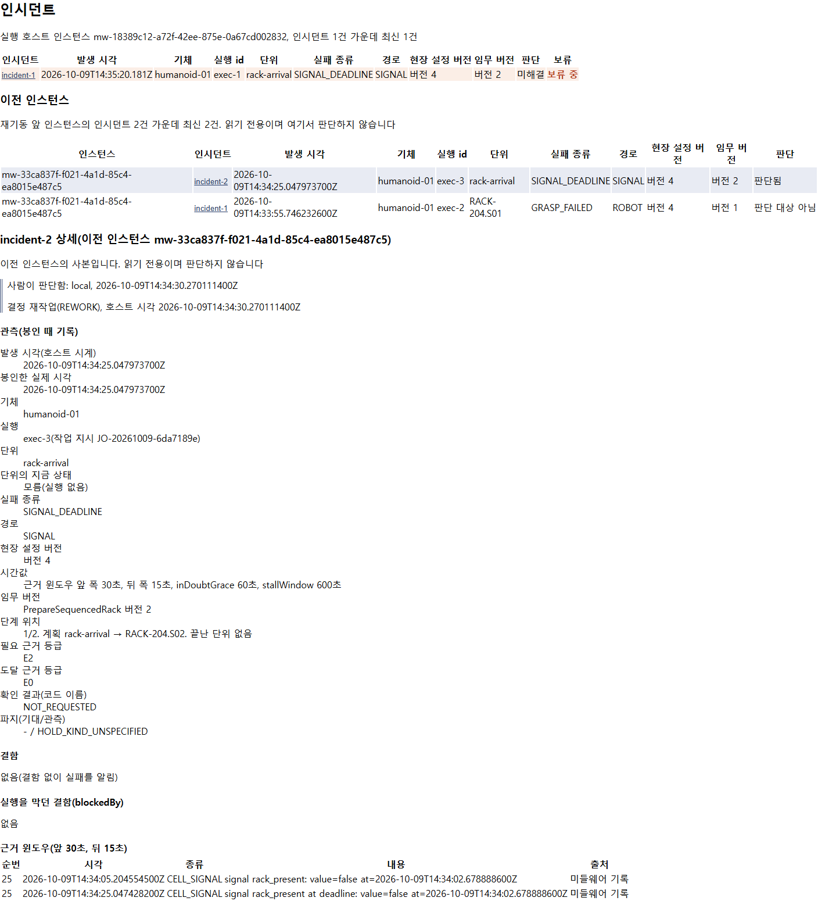

그림 56. 재기동 뒤 새 인스턴스의 보류, 이전 인스턴스 표, 이전 인스턴스 사본 상세(판단 폼 없음). 대역 응답으로 그린 화면.

연결: 장애 주입(§3.1.2)이 인시던트를 만듭니다. 판단 뒤 실행 목록과 인시던트는 바로 바뀌지만, 작업 응답은 바로 갱신되지 않습니다(저장소 README). 판단 기록은 이력 영역에 남습니다(§3.5).

#### 3.4.5 셀 대역 (region «셀 대역», h2 «셀 대역», `CellBand.tsx`)

두 모드 모두 보고, 안전 신호가 아닌 BOOLEAN 신호를 켜고 끕니다.

배치: 신호 조작 결과(`SignalNotice`) → 회색 «셀 대역: 슬롯은 기체가 보고한 배치로 채웁니다. 독립 설비 확인이 아닙니다» (`:21`) → 자리 표 → 신호 표 (`OperationsArea.tsx:246-250`).

| 상태 | 글자 | 행 |
|---|---|---|
| 못 읽음 | «모름: 셀 대역을 아직 읽지 못했습니다» (+ « (${error})») | 23 |
| 호스트가 셀을 못 읽음 | «모름: 실행 호스트가 셀 대역을 읽지 못했습니다» + «모름: 신호 값을 읽지 못했습니다» | 29-30 |
| 직전 값 | «직전 값입니다. 실행 호스트 불통: ${error}» | 26 |
| 신호 목록 없음, 빈 목록 | «모름: 셀 대역이 신호 목록을 싣지 않았습니다», «셀 대역에 신호가 없습니다» | 68-69 |

| 표 | 열 순서 | 값 |
|---|---|---|
| table «셀 대역 자리» (`:34-52,121-131`) | 자리, 종류, 점유, 자재, 관측 시각 | 종류 «제시 자리»/«슬롯», 점유 «점유»/«비어 있음», 자재와 시각 없으면 «-». 제시 자리 먼저, 슬롯 다음 |
| table «셀 대역 신호» (`:71-117`) | 신호, 종류, 값, 관측 시각, 조작 | 관측 시각 없으면 «-». 조작: 안전 신호 «안전 신호(값만 봅니다)», 안전 아닌 BOOLEAN 은 버튼 «켜기»(접근 이름 «${name} 켜기»)와 «끄기»(«${name} 끄기»), 그 밖 «-» |

API 는 `POST /api/cell/signals/{name}` `{value: "true"|"false"}` (`api.ts:820-821`), what 은 «${name} 켜기|끄기» 입니다(`OperationsArea.tsx:208`).

결과(`SignalNotice.tsx:22-37`, status «신호 조작 결과»): «반영됨(값 ${v})», «현장이 거부함(${풀이})» (+ «. ${detail}»), «응답은 없었으나 다시 읽어 보니 그 값임», «응답 없음. 다시 읽어 보니 그 값이 아님. 다시 하려면 새로 누르십시오», «반영되었을 수 있음. 다시 읽지도 못해 확인하지 못했습니다. 셀 대역 신호 표에서 확인하십시오», «보내지 않음(${풀이}). ${detail}», «결과 모름(${cause}). 셀 대역 신호 표에서 확인하십시오».

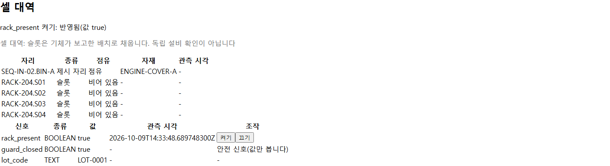

그림 40. 신호 켜기 반영 알림. 실제 스택.

연결: 슬롯과 자재는 작업 지시 폼의 PrepareSequencedRack 보기가 됩니다(§3.4.1). `rack_present` 는 대기 템플릿의 설비 대기를 끝냅니다(저장소 README).

#### 3.4.6 작업 응답 송신 기록 (region «작업 응답 송신 기록», h2 같은 글자, `JobResponseLog.tsx`)

두 모드 모두 보고, 거르개 하나를 씁니다.

| 요소 | 사실 | 행 |
|---|---|---|
| 거르개 | «송신 기록의 작업 지시» select: «전체» + 고른 것 + 실행 목록의 작업 지시(최신부터) + 읽은 행의 작업 지시(중복 제거). 바꾸면 행을 비우고 다시 읽음 | 34, 39-49, `OperationsArea.tsx:141-144` |
| 못 읽음 | «모름: 송신 기록을 아직 읽지 못했습니다» (+ « (${error})») | |
| 직전 값 | «직전 값입니다. 실행 호스트 불통: ${error}» | 54 |
| 머리 줄 | «실행 호스트 인스턴스 ${id}, 송신 기록 ${total}건 가운데 최신 ${n}건, 그 가운데 재기동 중복 ${k}건» | 55-58 |
| 빈 상태 | «송신 기록이 없습니다» | |

table «송신 기록 목록»(최근부터, `:62-100,15-25`), 열 순서:

| 순서 | 열 | 값 |
|---|---|---|
| 1 | 인스턴스 | |
| 2 | 작업 응답 id | |
| 3 | 작업 지시 id | |
| 4 | 실행 id | |
| 5 | 버전 | |
| 6 | 물리 상태 | 코드 값 |
| 7 | 근거(도달/요구) | «${r}/${q}» |
| 8 | 단위 | «완료 …; 미확인 …; 미완 …; 불확실 …; 막은 결함 …», 다 비면 «-» |
| 9 | 운영자 필요 | «필요», «-» |
| 10 | 처분 | `DISPOSITION_LABEL` |
| 11 | 적은 시각 | |

재기동 중복 행은 `tr.duplicate`(회색)입니다.

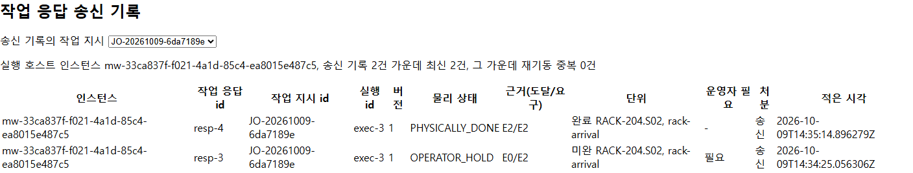

그림 50. 보류 작업 지시 하나로 고름. 실제 스택.

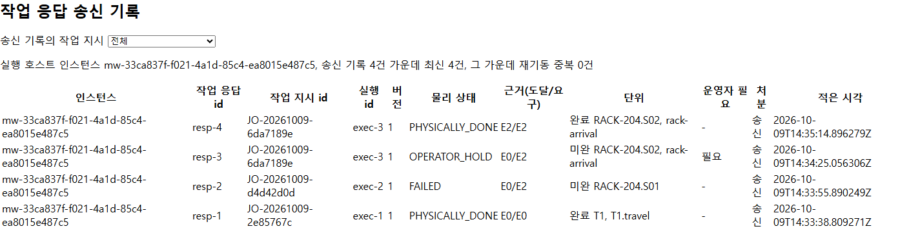

그림 51. 전체 작업 지시. 실제 스택.

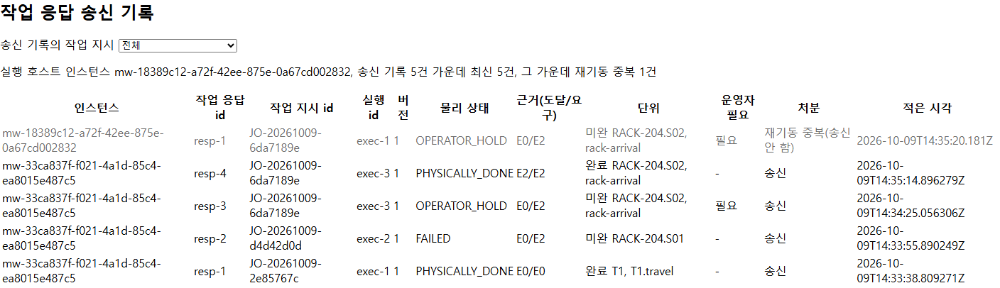

그림 57. 새 인스턴스의 첫 보류 응답이 재기동 중복(회색 행). 대역 응답으로 그린 화면.

### 3.5 이력 (`HistoryArea.tsx`)

목적: 조작 기록(행위자, 사유, 결과)을 봅니다. 두 모드 모두 보기만 합니다. 데이터는 `App` 의 `GET /api/operations`(5초)입니다.

감싸는 section 과 h2 가 없고 표에도 aria-label 이 없습니다. 정렬, 필터, 쪽 나눔, 조작도 없습니다.

| 상태 | 글자 | 행 |
|---|---|---|
| 못 읽음 | «모름: 조작 기록을 아직 읽지 못했습니다» | 11 |
| 직전 값 | «직전 값입니다» | 14 |
| 빈 상태 | «조작 기록이 없습니다» | 16 |

표 열(`:18-41`): 시각, 행위자(«엔지니어|운영자/${user}»), 대상(코드 꼴 그대로, 예 `robot humanoid-01`), 사유(없으면 빈칸), 결과(코드 값 SUCCEEDED 등).

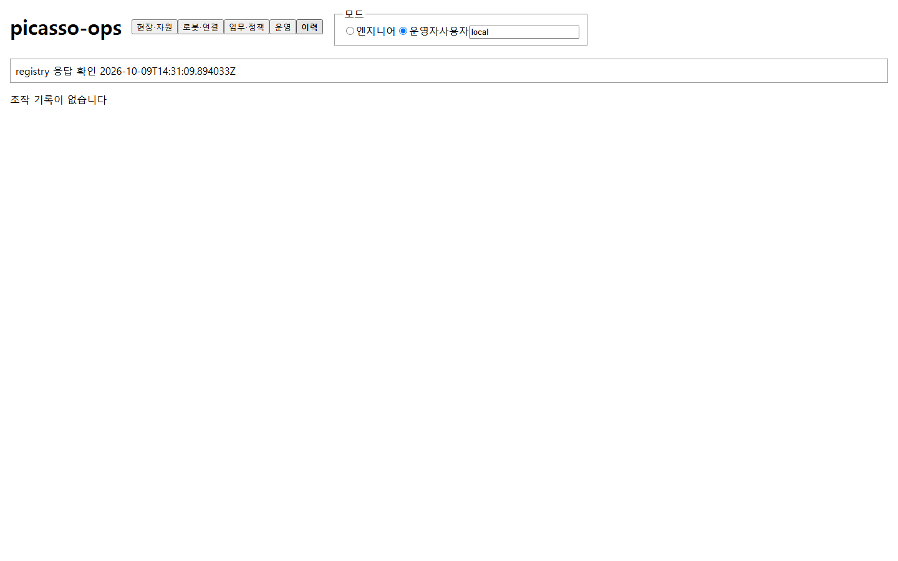

그림 06. 빈 상태. 실제 스택.

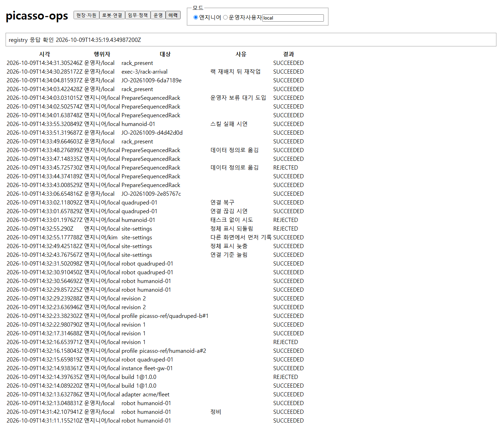

그림 54. 흐름을 돈 뒤의 조작 기록. 실제 스택.

---

## 4. 디자이너 리터치 지침

### 4.1 마음대로 바꿔도 되는 것

시험은 색, 크기, 여백, 글꼴, 테두리를 보지 않습니다. 아래는 시험을 고치지 않고 바꿀 수 있습니다.

| 항목 | 범위 |
|---|---|
| 색 | 글자, 배경, 테두리, 강조색 전부. 단 §4.2 의 의미 구분(모름, 직전 값, 보류, 사람의 판단, 복원, 재기동 중복)은 새 색에서도 서로 달라 보여야 함 |
| 글꼴 | 글꼴 가족, 크기, 굵기, 행간. 편집기와 `pre` 의 고정폭 성격은 유지 권장(JSON 편집) |
| 간격 | margin, padding, gap |
| 테두리와 모서리 | 표의 선과 줄무늬, 카드의 테두리와 배경, 둥근 모서리 |
| 아이콘 | 새로 들여도 됨. 단 아이콘이 글자를 대신하면 안 됨(시험이 글자로 찾음). 장식으로 곁들이거나, 대신할 때는 같은 글자를 접근 이름으로 남겨야 하고 그 경우 §4.2 의 시험 영향을 확인 |
| 구역 안 배치 | 한 구역 안 요소의 가로·세로 놓임, 폼 칸의 줄 바꿈, 폭. 단 §4.2 의 순서 제약(표 열 순서, 복원 띠가 실행 표 앞, dt 바로 뒤 dd)은 지킴 |
| 머리 브랜드 자리 | h1 «picasso-ops» 옆이나 대신 로고를 둘 자리. 시험은 h1 을 보지 않음. 문서 제목 `<title>` 과 파비콘도 시험 밖 |
| 버튼, 입력, select 모양 | 지금은 브라우저 기본. 새 모양으로 바꿔도 됨. 역할(button, textbox, combobox, checkbox, radio)과 라벨은 유지 |

### 4.2 지키거나 시험과 함께 바꿀 것

| 항목 | 지킬 것 | 근거 |
|---|---|---|
| 역할과 접근 이름 | `section aria-label`(region), `form aria-label`, `table aria-label`, `ul aria-label`, `dl aria-label`, `pre aria-label`, fieldset legend(group), `nav aria-label="영역"`, 버튼의 접근 이름(예 «${id} 상세 보기», «rack_present 켜기»). 구역 이름을 바꾸면 Playwright 와 vitest 가 깨짐 | §2.11, §5 |
| 라벨 | 모든 입력의 `<label>` 글자(«robot_id», «일련번호», «연결 기준 시간(초)», «판단 사유» 등) | §5 |
| 글자 | §5 표의 글자는 정확히 같아야 함. nav 버튼 글자 배열은 정확히 [«현장·자원», «로봇·연결», «임무·정책», «운영», «이력»] 이고 버튼 안에 글자를 더하면 깨짐(`App.test:49-56`) | §5 |
| 표 열 순서 | 시험이 `cell.nth(i)` 나 행 글자 전체, 행 이름 정규식으로 보는 표: 기체 목록, 인스턴스 목록, 제품·빌드 목록, 리비전 목록(기종 → 번호), 현장 설정 버전 이력, 기체별 배정 가능(6번째가 «배정 가능»), 실행 목록(2번째가 작업 지시 id), 임무 버전 이력, 임무 초안 목록, 모의 실행 단위, 인시던트 목록(8~11번째), 이전 인스턴스 인시던트 목록(머리 11개), 근거 윈도우, 셀 대역 자리, 셀 대역 신호(신호 → 종류 → 값), 송신 기록 목록(10번째가 처분) | §5 |
| dt → dd 구조 | 시험 도우미 `field(region, 이름)` 이 `dt` 글자로 찾고 바로 다음 형제 `dd` 를 봄. dl 을 표나 카드 격자로 바꾸려면 dt/dd 형제 짝을 남기거나 도우미를 고쳐야 함 | `RobotsArea.test:40-41` 등 여섯 파일, `PW:182-184` |
| 시험이 쓰는 CSS 클래스 | `held`(보류 행), `selected`(고른 행, 실행 목록 강조), `duplicate`(재기동 중복 행), `asserted`(사람의 판단 region) | `IncidentSection.test`, `OperationsArea.test`, `JobResponseLog.test` |
| 순서 제약 | region «재기동 복원 보고» 는 표 «실행 목록» 앞 | `ExecutionRestore.test:66-113` |
| 모드 가르기 | 다른 모드에서는 폼과 버튼을 감추고 모드 문장을 보임. 비활성으로 남기는 것이 아님(시험이 버튼 0개를 셈, 예 운영자 모드의 장애 주입, 엔지니어 모드의 «재작업») | §2.3, `PW:283-284`, `FaultPanel.test` |
| 직전 값과 모름 | «모름: …», «… 없습니다», «직전 값입니다 …» 세 상태는 다르게 보여야 하고 글자도 유지. 직전 값은 앞서 읽은 표를 그대로 둔 채 문장을 덧붙이는 방식 | §2.6 |
| 관측과 사람의 판단 | «사람의 판단» region 과 «관측» region 은 서로 달라 보여야 함(S4a 스펙 §2.2·§8.2, 제안 §9). 판단자와 시각을 함께 보여야 함. «사람의 판단 없음. 아래 값은 모두 관측입니다» 문장 유지 | §3.4.4 |
| 이전 인스턴스와 복원 | 이전 인스턴스 표와 사본 상세는 읽기 전용(판단 폼 없음)이고 그 사실을 문장으로 적음. 복원 보고 띠와 «이전 exec-k» 는 지금 실행과 구분되어 보여야 함 | §3.4.3, §3.4.4 |
| 화면 밖 안내 | 회색 `.offscreen` 문장 넷(화면 밖 작업, 명칭 티칭, 장소 이름, 셀 대역)은 화면이 대신하지 않는 일을 알리는 문장이라 남김. 시험이 일부를 정규식으로 봄 | `RobotsArea.test:77`, `CommissioningCards.test` |
| 코드 값 칸 | §2.9 끝의 코드 값 칸은 풀지 않고 그대로. 확인 결과는 스펙이 풀지 말라고 정함 | S4a 스펙 §8.2 |
| 알림 역할 | 결과 알림 `role="status"`, 입력 오류와 띠 모름 `role="alert"` | §2.7, §2.11 |

### 4.3 지금 시각 기준

`styles.css` 24행 전부입니다.

```css
body { font-family: system-ui, sans-serif; margin: 0 16px; }
header { display: flex; gap: 16px; align-items: center; flex-wrap: wrap; }
nav button[aria-current='page'] { font-weight: 700; }
.banner { padding: 8px; margin: 8px 0; border: 1px solid #999; }
.banner.unknown { border-color: #b23a1d; }
.split { display: grid; grid-template-columns: 1fr 1fr; gap: 16px; }
.stale { color: #6f6f6f; }
.invalid { color: #b23a1d; }
.finding { border-left: 3px solid #b23a1d; padding-left: 8px; }
.finding dt { font-weight: 700; }
.link { background: none; border: none; color: #2b3f6b; text-decoration: underline; cursor: pointer; padding: 0; }
.offscreen { color: #6f6f6f; }
tr.selected { background: #e8ebf3; }
.editor { display: flex; flex-direction: column; }
.editor textarea, pre { font-family: ui-monospace, monospace; font-size: 13px; }
pre { white-space: pre-wrap; border: 1px solid #ccc; padding: 8px; margin: 0; }
.actions { display: flex; gap: 8px; align-items: center; flex-wrap: wrap; }
tr.held { background: #fbeee6; }
tr.held strong { color: #b23a1d; }
.asserted { border-left: 4px double #2b3f6b; padding-left: 8px; }
.observed h4 { margin-bottom: 4px; }
.restore { border-left: 4px solid #b26b1d; padding-left: 8px; margin: 8px 0; }
.restored { color: #6f6f6f; }
tr.duplicate { color: #6f6f6f; }
```

색:

| 값 | 쓰임 |
|---|---|
| `#999` | 띠 테두리 |
| `#b23a1d` (빨강) | 모름 띠 테두리, 입력 오류 글자, 거부 카드 선, 보류 글자 |
| `#6f6f6f` (회색) | 직전 값, 화면 밖 안내, 이전 실행 id, 재기동 중복 행 |
| `#2b3f6b` (남색) | 링크 버튼, 사람의 판단 이중선 |
| `#e8ebf3` | 고른 행 배경 |
| `#ccc` | `pre` 테두리 |
| `#fbeee6` | 보류 행 배경 |
| `#b26b1d` (갈색) | 복원 보고 띠 선 |
| `#863bff` | 파비콘(`ui/public/favicon.svg`, CSS 밖) |

간격: 16px(body 좌우, header gap, `.split` gap), 8px(띠 padding·margin, 카드 padding-left, `.actions` gap, `pre` padding, 복원 띠 margin), 4px(`.observed h4` 아래).

글꼴: 본문은 `system-ui, sans-serif`, 편집기와 `pre` 는 `ui-monospace, monospace` 13px 입니다. 굵기 700 은 고른 nav 버튼과 카드 dt 두 곳에 씁니다. `<strong>` 은 세 곳(보류 중, 설비 근거 없이 완료 확인, 복원 띠 첫 문장)에 있습니다.

없는 것:

| 없는 것 | 사실 |
|---|---|
| CSS 변수 | custom property 가 없어 색과 간격이 규칙마다 직접 적혀 있음 |
| 반응형 | `@media` 없음. `.split` 은 폭과 상관없이 늘 2열 `1fr 1fr`. `header` 와 `.actions` 만 줄 바꿈. 넓은 표(인시던트 11열, 송신 기록 11열, 리비전 9열, 실행 8열)에 가로 스크롤 처리 없음 |
| 다크 모드 | `prefers-color-scheme` 없음 |
| 아이콘과 이미지 | 없음. 체크 표시도 글자 «[v]»/«[ ]» (`CommissioningCards.tsx:107`) |
| 전환 효과 | 없음 |
| 규칙 없는 클래스 | `.mode`, `.banner.ok` 의 `ok`, `.card`, `.observed` 자체(h4 만 규칙) |
| 컴포넌트별 스타일 | 버튼, 입력, select, 표, fieldset 은 브라우저 기본 |

접기(`<details>`)는 세 곳(리비전 DRAFT 사유, 스위트 FAIL 상세, 초안의 마지막 모의 실행)에 있습니다. 시각은 서버 글자 그대로이며 지역 시각 변환이나 상대 시각은 없습니다.

스크린숏에서 보이는 배치 사실:

| 사실 | 그림 |
|---|---|
| 1440 폭에서도 로봇·연결 왼쪽 열이 좁아 프로파일 표 머리와 버튼 글자가 세로로 한 글자씩 접힘 | 16, 17, 64 |
| 로봇·연결 왼쪽에 세 구역과 폼 다섯이 세로로 이어지고 오른쪽 상세가 함께 스크롤됨 | 16 |
| 운영 영역은 1440×3280 까지 길어짐 | 53 |
| 현장·자원은 현장 설정과 장애 주입이 한 열로 이어짐 | 20 |
| 이력은 제목 없이 표만 | 54 |

### 4.4 제안

아래는 사실에 기댄 제안이며 결정이 아닙니다.

| 제안 | 까닭 |
|---|---|
| 제안: 색, 간격, 글꼴을 `:root` 의 CSS 변수로 모으기 | 지금 같은 색이 규칙마다 따로 적혀 있음(`#b23a1d` 네 곳, `#6f6f6f` 네 곳). 테마와 다크 모드의 출발점이 됨. 시험 영향 없음 |
| 제안: 의미별 토큰 이름 두기(모름, 직전 값, 보류, 사람의 판단, 복원, 고른 행) | §4.2 의 의미 구분을 색 하나가 아니라 토큰으로 지키게 됨 |
| 제안: 좁은 폭에서 `.split` 을 1열로 | 지금은 늘 2열이라 왼쪽 표가 접힘(그림 16). 시험은 배치 열 수를 보지 않음 |
| 제안: 넓은 표에 가로 스크롤 감싸개 | 11열 표가 줄 바꿈으로 높아짐(그림 52). 감싸개 div 는 표의 역할과 이름을 바꾸지 않음 |
| 제안: `.card`, `.banner.ok` 에 규칙 주기 | 클래스는 이미 있으나 규칙이 없음 |
| 제안: 성공과 실패 알림에 시각 구분 더하기 | 지금은 같은 문단 모양. 글자와 `role="status"` 는 유지 |

---
## 5. 시험이 기대는 글자

이 절의 글자, 역할, 이름, 클래스, 열 순서를 바꾸면 시험을 함께 고쳐야 합니다. «열 순서» 표기는 시험이 `cell.nth(i)` 나 행 글자 전체(textContent 이어붙임), 행 이름 정규식으로 보는 곳입니다. 시험 개수는 Playwright 1건(`PW:28`)과 vitest `it`·`it.each` 블록 134개(grep 기준: App 10, Adapters 7, Commissioning 8, ExecutionRestore 3, FaultPanel 7, Incident 20, JobResponseLog 5, Missions 14, Operations 22, Profiles 9, Robots 14, Site 15)입니다. `data-testid` 는 쓰지 않습니다.

### 5.1 Playwright (`ui/e2e/lifecycle.spec.ts`)

| 줄 | 선택·단언 | 글자 | 그리는 곳 |
|---|---|---|---|
| 30, 116, 132 | region | «${robotId} 상세» | `RobotDetail.tsx:41` |
| 33, 90 | form | «기체 선언» | `DeclareForm.tsx:23` |
| 34-36, 91-93 | label·button | «robot_id», «일련번호», «선언» | `DeclareForm.tsx:25,29,37` |
| 37, 94 | 글자 exact | «humanoid-01 선언: 반영됨» 꼴 | `OutcomeNotice.tsx:31` + `RobotsArea.tsx:49` |
| 40, 115, 126, 131, 152, 318 | button exact | 기체 id «humanoid-01» 등 | `RobotsArea.tsx:140` |
| 41, 48, 56 | 글자 exact | «CONFIRMED», «RETIRED» (원장 상태 코드 그대로) | `RobotDetail.tsx:45` |
| 42, 57 | 글자 exact | «바인딩 없음» | `labels.ts:44` via `FindingCard.tsx:18` |
| 45, 67, 148, 150, 170, 193, 211, 230, 263, 282, 285 | label check | «운영자», «엔지니어» | `ModeSwitch.tsx:11-12` |
| 46-47 | label·button | «퇴역 사유», «퇴역» | `RobotDetail.tsx:97,101` |
| 51 | 글자 exact | «퇴역 뒤 보고» | `labels.ts:33` |
| 52 | 글자 | «운영자(화면 안): 현장에서 기체를 내리거나 복귀» | `FindingCard.tsx:29` (action 은 서버 글자) |
| 55 | button | «복귀» | `RobotDetail.tsx:86` |
| 60, 66, 139, 151, 159, 171, 194, 212, 231, 240, 252, 264, 316 | nav button | «이력», «로봇·연결», «현장·자원», «운영»(exact), «임무·정책» | `areas.ts:11-15` |
| 61-63 | cell | «운영자/local», «엔지니어/local», «정비» | `HistoryArea.tsx:33,36` |
| 68-72 | form·label·button·글자 | «제품 선언», «vendor», «name», «acme/fleet 제품 선언: 반영됨» | `AdapterForms.tsx:25-36`, `AdaptersSection.tsx:37` |
| 74-79 | form·label·option·글자 | «빌드 선언», «제품», 보기 «acme/fleet», «버전», «계약 semver», «acme/fleet 1.0.0 빌드 선언: 반영됨» | `AdapterForms.tsx:61-83`, `AdaptersSection.tsx:44` |
| 81-85 | form·label·option·글자 | «인스턴스 등록», «instance_id», «빌드», 보기 «acme/fleet 1.0.0», «fleet-gw-01 인스턴스 등록: 반영됨» | `AdapterForms.tsx:110-133`, `AdaptersSection.tsx:53` |
| 86-87 | table·row | «인스턴스 목록», «UNTESTED» | `AdaptersSection.tsx:82,101` |
| 96-97, 324 | region·table | «프로파일», «리비전 목록» | `ProfilesSection.tsx:30,45` |
| 99-101 | form·label·button | «리비전 제출», «프로파일 문서», «제출» | `ProfilesSection.tsx:180-187` |
| 102, 105, 109 | 글자 exact | «picasso-ref/${model}#${rev} 제출\|시험 요청\|활성화: 반영됨» | `ProfilesSection.tsx:96,105,122` |
| 103 | row 이름 정규식 | «picasso-ref/${model} ${rev}». 열 순서 기종 → 번호 | `ProfilesSection.tsx:62-65` |
| 104, 108 | button | «시험 요청», «활성화» | `ProfilesSection.tsx:99,108` |
| 106-107, 110 | row 글자 | «TESTED», «PASS (site-runner)», «ACTIVE» | `ProfilesSection.tsx:67,153` |
| 117-120 | form·label·option·button | «바인딩», «빌드», «리비전», 보기 «acme/fleet 1.0.0», «picasso-ref/${model}#${rev}» | `CommissioningCards.tsx:129-156` |
| 121, 124 | 글자 exact | «${robotId} 바인딩: 반영됨», «${robotId} 명칭 기록: 반영됨» | `RobotsArea.tsx:92,97` |
| 122 | 글자 exact | «명칭 기록 없음» | `labels.ts:45` |
| 123 | button | «명칭 등록 기록» | `CommissioningCards.tsx:81` |
| 127, 133 | heading | «시운전: 완료», «시운전: 미완» | `CommissioningCards.tsx:87` |
| 128 | 글자 exact | «막힘 없음» | `RobotDetail.tsx:69` |
| 134-135 | 글자 | «기체가 아는 명칭 없음», /현장\(화면 밖\): 현장에서 명칭 티칭을 다시/ | `labels.ts:47`, `FindingCard.tsx:29` |
| 140-141 | region·form | «현장 설정», «현장 설정 변경» | `SiteArea.tsx:120,310` |
| 142-144, 161-163 | label·button | «연결 기준 시간(초)», «stallWindow(초)», «변경 사유», «변경» | `SiteArea.tsx:300,320,324` |
| 145, 164 | 글자 exact | «연결 기준 시간 120초로 변경: 반영됨», «stallWindow 600초로 변경: 반영됨» | `SiteArea.tsx:92-95` |
| 146-147, 165-166 | table·row 정규식 | «현장 설정 버전 이력», /^2 120초 local 엔지니어 연결 기준 늘림/, /^3 … 30초 15초 60초 600초$/. 열 순서 전체 | `SiteArea.tsx:165-191` |
| 149 | 글자 exact | «현장 설정 변경은 엔지니어 모드에서 합니다» | `SiteArea.tsx:162` |
| 153 | 글자 exact | «기준 120초, 현장 설정 버전 2» | `RobotDetail.tsx:52` |
| 160, 167 | 글자 exact | «실행 호스트 반영: 버전 ${n}» | `SiteArea.tsx:213` |
| 172-175, 222-224, 268-270 | form·label | «작업 지시 폼», «임무», 보기 «InspectAsset»·«PrepareSequencedRack», «대상 1 id», «대상 1 장소», 체크박스 «RACK-204.S01»·«RACK-204.S02», «자재» | `JobOrderFormView.tsx:26-135` |
| 176-180 | table·cell nth(5) | «기체별 배정 가능», 6번째 열 «가능»/«불가», 행 이름 /^humanoid-01 / (첫 열 기체) | `EligibilityTable.tsx:47-69` |
| 181, 225, 271 | button | «작업 지시 내기» | `JobOrderFormView.tsx:52` |
| 182-184 | status·dt→dd | «제출 결과», «InspectAsset 작업 지시: 배정됨», `dt` «배정된 기체» 바로 뒤 `dd` | `JobOrderNotice.tsx:51-67`. dt/dd 형제 구조에 기댐 |
| 185-189, 226-229, 272-273, 290, 293 | table·row 글자 | «실행 목록», «코드 정의», «PHYSICALLY_DONE», «RACK-204.S01 pick_place: RUNNING», «rack-arrival equipment_wait: RUNNING» | `ExecutionList.tsx:42,72,79` |
| 304 | cell nth(1) | 실행 목록 2번째 열 = 작업 지시 id | `ExecutionList.tsx:70` |
| 195-196 | region·status | «임무 편집», «임무 조작 결과» | `MissionsArea.tsx:197`, `MissionNotice.tsx:30` |
| 197, 253 | button | «데이터 정의 템플릿 불러오기», «운영자 보류 대기 템플릿 불러오기» | `MissionsArea.tsx:365`, `labels.ts:164,166` |
| 198, 200, 202, 205, 254, 256, 259 | button(일부 exact) | «초안 저장», «검증», «모의 실행», «활성화» | `MissionsArea.tsx:231-246` |
| 199, 255 | status 전체 글자 | «초안 저장: 초안 ${n} 저장됨» | `MissionNotice.tsx:42-44` |
| 201 | status 전체 글자 | «초안 1 검증: 통과» | `MissionNotice.tsx:50` |
| 203, 257 | status 포함 | «초안 ${n} 모의 실행: 통과» | `MissionNotice.tsx:59-61` |
| 204, 258 | label | «활성화 사유» | `MissionsArea.tsx:241` |
| 206, 260 | status 전체 글자 | «초안 ${n} 활성화: 버전 ${v} 활성화됨. 다음 작업 지시부터 이 버전을 씁니다» | `MissionNotice.tsx:80-83` |
| 207-208 | table·row 정규식 | «임무 버전 이력», /^버전 1 \(활성\) 초안 1 local 데이터 정의로 옮김 /. 열 순서 | `MissionsArea.tsx:263-287` |
| 213-217, 265-266, 291 | table·row·button | «셀 대역 신호», /^rack_present BOOLEAN (true\|false) /. 열 순서 신호·종류·값, «rack_present 켜기»/«끄기»(aria-label) | `CellBand.tsx:71-108` |
| 216, 292 | status 전체 글자 | «신호 조작 결과», «rack_present 켜기: 반영됨(값 true)» | `SignalNotice.tsx:16-26` |
| 232-236 | form·label·option·button | «장애 주입 폼», «기체», «장애 종류»(값 SKILL_EXECUTION_FAILED), «장애 주입 사유», «장애 넣기» | `FaultPanel.tsx:100-140` |
| 237-238 | status 정규식 | «장애 주입 결과», /^humanoid-01 스킬 실패: 받아들임\(태스크 .+#RACK-204\.S01, RETRIABLE\)$/ | `FaultPanel.tsx:36,153-166` |
| 241-247, 274-277, 297-300 | table·cell nth(7..10) | «인시던트 목록», 8번째 열 현장 설정 버전 «버전 3», 9번째 임무 버전 «버전 1»/«버전 2», 10번째 판단 «판단 대상 아님»/«미해결»/«판단됨», 11번째 보류 «-», 행 글자 «보류 중», «GRASP_FAILED», «SIGNAL_DEADLINE» | `IncidentSection.tsx:205-247` |
| 278 | button 정규식 | /상세 보기$/ (접근 이름) | `IncidentSection.tsx:232` |
| 279-280 | region·글자 | «인시던트 상세», «사람의 판단 없음. 아래 값은 모두 관측입니다» | `IncidentSection.tsx:147,394` |
| 283-284 | 글자 exact·button 없음 | «보류 중입니다. 운영자 판단은 운영자 모드에서 합니다», «재작업» 0개 | `IncidentSection.tsx:457` |
| 286-288 | form·label·button | «운영자 판단», «판단 사유», «재작업» | `IncidentSection.tsx:470-482` |
| 289 | status 정규식 | «판단 결과», /\/rack-arrival 재작업: 판단이 섰습니다\(incident-\d+\)$/ | `IncidentSection.tsx:89,496-508` |
| 294-296 | region·포함 | «사람의 판단», «사람이 판단함: local, », «결정 재작업(REWORK)» | `IncidentSection.tsx:396-401` |
| 305-311 | region·label·table·cell nth(9) | «작업 응답 송신 기록», «송신 기록의 작업 지시», «송신 기록 목록», 10번째 열 처분 «송신», «재기동 중복» 0행, «그 가운데 재기동 중복 0건» | `JobResponseLog.tsx:37-95` |
| 317 | alert 포함 | «모름: registry 가 답하지 않습니다» | `RegistryBanner.tsx:24` |
| 320-324 | region·글자 | «기체 목록», «어댑터», /직전 값입니다/, row /fleet-gw-01/ | `RobotsArea.tsx:43,122`, `AdaptersSection.tsx:25,77`, `ProfilesSection.tsx:37` |

### 5.2 vitest

`field(region, 이름)` 도우미는 `dt` 글자로 찾고 바로 다음 형제(`dd`)의 글자를 봅니다(`RobotsArea.test:40-41`, `CommissioningCards.test:60-61`, `SiteArea.test:45-46`, `MissionsArea.test:81-82`, `OperationsArea.test:111-112`, `IncidentSection.test:82-83`). 그래서 아래 dt 글자와 dt→dd 짝 구조가 모두 시험에 걸립니다. `cells(row)` 는 행의 셀 글자 배열을 통째로 비교하므로 열 순서와 칸 글자 전부가 대상입니다. 시험 위치의 `X.test` 는 `ui/src/components/X.test.tsx` 이고, `App.test` 만 `ui/src/App.test.tsx` 입니다.

| 그리는 곳 | 시험이 쓰는 글자·역할 | 시험 위치 |
|---|---|---|
| `App.tsx` nav | navigation «영역», 버튼 글자 배열 정확히 [«현장·자원», «로봇·연결», «임무·정책», «운영», «이력»](`small` 이 붙으면 깨짐) | `App.test:49-56` |
| `App.tsx` | button «임무·정책», «이력», «운영», «로봇·연결», «현장·자원» | `App.test:64,163`, `OperationsArea.test:681,686`, `IncidentSection.test:435`, `JobResponseLog.test:147`, `SiteArea.test:334,336`, `FaultPanel.test:195` |
| `RegistryBanner` | alert 하나뿐, «모름: registry 가 답하지 않습니다», «운영자 토큰 설정 확인», «모름: 운영 서비스에 닿지 않습니다», /registry 응답 확인/ | `App.test:89,97-98,130`, `RobotsArea.test:208`, `ProfilesSection.test:144`, `OperationsArea.test:689` |
| `ModeSwitch` | label «운영자», «엔지니어», «사용자», /사용자 이름은 영문/ | `App.test:106,139,142`, 모든 영역 시험 |
| `RobotsArea` 목록 | «선언된 기체가 없습니다», «모름: 기체 목록을 아직 읽지 못했습니다», «직전 값입니다 (t1 기준)», region «기체 목록», 행 글자 «humanoid-01CONFIRMED신선완료0»(열 순서) | `App.test:62,76,91,132`, `CommissioningCards.test:77-79`, `SiteArea.test:337` |
| `RobotsArea` | /화면 밖 작업: 로봇 내부 지도와 웨이포인트 티칭, mimic 기동/, «선언은 엔지니어 모드에서 합니다» | `RobotsArea.test:77,94` |
| `DeclareForm` | form «기체 선언», label «robot_id», «일련번호», button «선언» | `RobotsArea.test:51-54,93` |
| `RobotDetail` | region «${id} 상세», dt «원장 상태», «연결», «연결 판정 기준»(«기준 60초, 현장 설정 버전 2»), form «퇴역», label «퇴역 사유», button «퇴역»(비활성 여부), «복귀», «퇴역과 복귀는 운영자 모드에서 합니다» | `RobotsArea.test:63-65,100-122`, `SiteArea.test:362-366` |
| `FindingCard` | dt «종류», «관측값과 기대값», «마지막 확인», «근거 버전», «해결 담당»; 글자 «보고 0회 / 기대: 생존 보고 1회 이상», «현장(화면 밖): …», «운영자(화면 안): 복귀», «해당 없음», «현장 설정 버전 2», button «humanoid-01 상세»(바로 가기), «바로 가기» 없음 | `RobotsArea.test:66-71,139-152`, `AdaptersSection.test:155-158`, `CommissioningCards.test:101-102`, `SiteArea.test:318-321,366`, `MissionsArea.test:201-206` |
| `OutcomeNotice` | «${what}: 반영됨», «: 거절됨», «: 보내지 않음. …», «: 결과 모름(운영 서비스 응답 502)», «응답 없음. 다시 읽어 보니 반영 안 됨», «반영되었을 수 있음. 다시 읽지도 못해 확인하지 못했습니다», «보내지 않음. 운영 서비스가 요청을 거절했습니다(HTTP 400)», `closest('[role="status"]')` | `RobotsArea.test:90,131,139,163,172,181,189,201`, `AdaptersSection.test:111,128,143,154`, `ProfilesSection.test:101,110,126,135`, `CommissioningCards.test:153,164`, `SiteArea.test:149,248,252,316-317` |
| `AdaptersSection`·`AdapterForms` | region «어댑터», table «인스턴스 목록» 행 글자 «fleet-gw-01acme/fleet 1.0.00.9.0UNTESTED직결0», table «제품·빌드 목록» «acme/fleet1.0.00.9.0UNTESTED», «모름: 어댑터 목록을 아직 읽지 못했습니다», «등록된 제품이 없습니다», «등록된 인스턴스가 없습니다», «어댑터 등록은 엔지니어 모드에서 합니다», form «제품 선언»·«빌드 선언»·«인스턴스 등록», label «vendor», «name», «제품», «버전», «계약 semver», «instance_id», «빌드», 보기 «acme/fleet», «acme/fleet 1.0.0», 버튼 비활성 | `AdaptersSection.test:57-158` |
| `ProfilesSection` | region «프로파일», «스킬 2종, 계약 0.9.0», table «리비전 목록», 행 이름 /humanoid-a 2 TESTED/, 행 글자 «PASS (site-runner)PASS (site-runner)PASS (site-runner)끝남», «실행 중», summary «상세», «저장됨: 검증 실패», «CANCEL_UNSUPPORTED: 기대 거절, 관측 수락», «모름: 프로파일 목록을 아직 읽지 못했습니다», button «시험 요청», «활성화», form «리비전 제출», label «프로파일 문서», button «제출», «프로파일 관리는 엔지니어 모드에서 합니다», «직전 값입니다 (t1 기준)» | `ProfilesSection.test:59-154` |
| `CommissioningCards` | region «바인딩», «사이트 명칭», «시운전»; dt «빌드», «리비전», «사람이 기록함», «기체가 답함»; 글자 «기록 없음», «아직 응답 없음», «명칭을 지원하지 않음 (t1)», «아는 명칭 2개 (t1)», /명칭 티칭은 화면 밖 현장 작업입니다/, heading «시운전: 완료», /\[v\] 활성 바인딩 \(근거 \/diag\/bindings\)/, /\[ \] 명칭 상태 CONFIRMED 또는 NOT_REQUIRED/, /소프트웨어 대조 보고 없음, 어댑터 적합성 UNTESTED/, /소프트웨어 대조 불일치/; form «바인딩» 보기 배열 [«고르십시오», «picasso-ref/humanoid-a#2»]; button «명칭 등록 기록» | `CommissioningCards.test:85-171` |
| `SiteArea` | region «현장 설정», «결과 판정 값», «정체 표시»; group 같은 두 이름; dt «현재 버전»(«2»), «연결 기준 시간»(«60초»), «허용 범위»(«60~3600초»), «stallWindow»(«600초»); 묶음 문장 둘 전문; table «현장 설정 버전 이력» 행 글자 «260초kim엔지니어연결 기준 줄임t245초20초90초600초»(열 순서); form «현장 설정 변경»; label 다섯 «…(초)»·«변경 사유»; «허용 범위 5~120초» 등; «기준 버전 1»; button «변경»; alert 범위 문장 다섯·«변경 사유를 넣으십시오»; «실행 호스트 반영: 버전 1/2»·«미적용»·«모름»; «실행 호스트 읽기 실패: …»; «실행 호스트가 적용하지 않은 버전 2(범위 밖): …»; «현장 설정 변경은 엔지니어 모드에서 합니다»; 운영자 모드에 spinbutton 없음; «모름: 현장 설정을 아직 읽지 못했습니다» | `SiteArea.test:51-337` |
| `FaultPanel` | region «장애 주입», form «장애 주입 폼», label «기체», «장애 종류», «연결 상태», «장애 주입 사유», button «장애 넣기»; 보기 배열 [«스킬 실패(진행 중 태스크)», «연결 상태»], [«OFFLINE», «CONNECTION_BROKEN», «ONLINE(복구)»]; status «장애 주입 결과» 글자 받아들임 셋·거부 넷·응답 없음·사전 거부; alert «장애 주입 사유를 넣으십시오»; «장애 주입은 엔지니어 모드에서 합니다»(운영자 모드에 button 0개) | `FaultPanel.test:29-204` |
| `MissionsArea` | region «임무 PrepareSequencedRack»; dt «활성 버전»(«버전 2»·«코드 정의»), «활성화»(«lee t1: 랙 도착 대기 도입»); textbox «임무 정의 JSON»; label «활성 버전 정의», «활성화 사유»; button «초안 저장», «검증», «모의 실행», «활성화», «초안 7 열기», 템플릿 «… 불러오기» 셋(비활성 여부 포함); «임무 편집은 엔지니어 모드에서 합니다»; «코드 정의는 정의 JSON 이 없습니다»; «활성화한 버전이 없습니다. 코드 정의로 돕니다»; 대상 줄 셋 전문; «활성: 버전 1, 편집기와 같음/다름»; table «임무 버전 이력» cells [«버전 2 (활성)», «초안 7», «lee», «랙 도착 대기 도입», «t1»]; table «임무 초안 목록» cells [«초안 7», «local», «t1»], summary «통과 t3»·«실패(정착하지 않음) t3»; alert «활성화 사유를 넣으십시오»; /^모름: 임무 버전을 아직 읽지 못했습니다 \(/; «직전 값입니다. 실행 호스트 불통: …» | `MissionsArea.test:89-476` |
| `MissionNotice`·`MockRunReport` | status «임무 조작 결과»; «초안 저장: 초안 7 저장됨», «초안 7 검증: 거부됨», «초안 7 모의 실행: 통과», «초안 7 활성화: 버전 3 활성화됨. 다음 작업 지시부터 이 버전을 씁니다», «초안 7 활성화: 막힘», «… 막힘. 이 초안에 통과한 모의 실행이 없습니다. 모의 실행을 먼저 하십시오», «마지막 모의 실행: 실패(정착하지 않음)», «… 모름. … 판정하지 않았습니다», «실행 호스트가 거부함(없는 초안)초안이 없다: 7», «결과 모름(운영 서비스 응답 500)», 응답 없음 셋; table «모의 실행 5 단위» cells [«rack-arrival», «설비 대기», «equipment_wait», «DONE», «E2», «-»]; dt «표본 작업 지시» «MOCK-7, 슬롯 …, 자재 …, 요구 근거 E2»; «모의 실행 6: 실패(정착하지 않음). …» | `MissionsArea.test:188-444` |
| `JobOrderFormView`·`jobOrderDraft` | form «작업 지시 폼», label «임무», «대상 ${i} id», «대상 ${i} 장소», «RACK-204.S01/S03», «자재»; button «대상 더하기», «대상 ${i} 빼기», «작업 지시 내기»; «제시 자리 SEQ-IN-02.BIN-A»; «작업 지시는 운영자 모드에서 냅니다»; alert «점검 대상마다 대상 id 와 장소 이름을 넣으십시오», «점검 대상을 하나 이상 넣으십시오»; «모름: 셀 대역을 읽지 못해 슬롯과 자재를 고를 수 없습니다» | `OperationsArea.test:123-206,458-459` |
| `JobOrderNotice` | status «제출 결과»; «InspectAsset 작업 지시: 배정됨|거부됨|미배정|막힘(배정 가능한 기체 없음)|막힘(이 모드에서 할 수 없는 조작)|결과 모름(운영 서비스 응답 500)»; dt «작업 지시 id», «실행 id», «배정된 기체», «거부 사유»; list «기체별 미배정 사유», «실행 호스트가 후보에서 뺀 기체»; 응답 없음 셋 | `OperationsArea.test:130,217-325` |
| `EligibilityTable` | table «기체별 배정 가능» cells 7열 전체(«모름», «신선(현장 설정 버전 1)», «모자람: pick_place», «가능»/«불가» 등); «폼을 채우면 기체별 배정 가능을 봅니다»; alert «작업 지시 폼 오류: …» | `OperationsArea.test:194,201,407-440` |
| `ExecutionList` | region «실행», table «실행 목록», dt «실행 호스트 인스턴스», 행 cells 8열 전체(단위 칸 «RACK-204.S01 pick_place: RUNNING, 근거 E0», 작업 응답 칸 «resp-1: PHYSICALLY_DONE, 근거 E0(요구 E0)»), 강조 행 클래스 `selected`, «직전 값입니다. 실행 호스트 불통: …», «모름: 실행 목록을 아직 읽지 못했습니다 (…)» | `OperationsArea.test:221-222,346-370,602-610,683` |
| `ExecutionList` 복원 | region «재기동 복원 보고»(표 «실행 목록» 앞에 와야 함), 첫 줄·미룬·포기 문장 전문, list «다시 지은 실행», «미룬 실행», «포기한 실행»; 첫 칸 «exec-1 (이전 exec-3)», title «이전 인스턴스 mw-0» | `ExecutionRestore.test:66-113` |
| `IncidentSection` | region «인시던트», «인시던트 상세», «관측», «사람의 판단»(클래스 `asserted`), «이전 인스턴스»; table «인시던트 목록» cells 11열 전체, «이전 인스턴스 인시던트 목록» columnheader 11개 배열; 행 클래스 `held`, `selected`; button «${id} 상세 보기», «mw-0 incident-1 상세 보기»; heading «incident-1 상세», level 3 «incident-1 상세(이전 인스턴스 mw-0)»; 머리 «실행 호스트 인스턴스 mw-1, 인시던트 7건 가운데 최신 3건»; dt «현장 설정 버전», «시간값», «임무 버전», «단계 위치», «필요 근거 등급», «도달 근거 등급», «확인 결과(코드 이름)», «단위의 지금 상태», «단위», «분류», «참조», «조치 힌트», «유지», «새 태스크 받기»; label «이 단위의 결함», «실행을 막던 결함 1», «판단 사유»; table «근거 윈도우» cells 5열; «근거 윈도우(앞 30초, 뒤 15초)», «윈도우 밖이라 버린 관측이 있습니다», «없음(결함 없이 실패를 알림)», «사람의 판단 없음. 아래 값은 모두 관측입니다», «사람이 판단함: kim, w20», «결정 재작업(REWORK), 호스트 시각 h20», «결정 완료 확인(CONFIRM_DONE)», «설비 근거 없이 완료 확인», 판단 칸 넷; form «운영자 판단» 버튼 배열 [«완료 확인», «재작업»], «exec-1/rack-arrival 보류를 판단합니다. 판단자는 kim 입니다», alert «판단 사유를 넣으십시오», «보류 중입니다. 운영자 판단은 운영자 모드에서 합니다»; «이전 인스턴스의 사본입니다. 읽기 전용이며 판단하지 않습니다», «이전 인스턴스의 인시던트가 없습니다», «재기동 앞 인스턴스의 인시던트 4건 가운데 최신 2건. 읽기 전용이며 여기서 판단하지 않습니다», «실행 호스트에 이 인시던트가 없습니다. …», «인시던트가 없습니다», «모름: 인시던트 목록을 아직 읽지 못했습니다 (…)»; 확인 결과 칸에 «확인 안 함» 이 없어야 함 | `IncidentSection.test:91-597` |
| `DecisionNotice` | status «판단 결과»; «${exec}/${unit} 재작업: 판단이 섰습니다(incident-1)», «보류 단위가 아닙니다», «에이전트 판단은 거부됩니다. …», 응답 없음 셋, «실행 호스트가 거부함(이유 없음)», «실행 호스트가 거부함(실행 호스트가 재기동해 인스턴스가 다름). …», «보내지 않음(이 모드에서 할 수 없는 조작). …» | `IncidentSection.test:331-400,597-599` |
| `CellBand` | region «셀 대역», table «셀 대역 자리» cells [«SEQ-IN-02.BIN-A», «제시 자리», «점유», «ENGINE-COVER-A», «-»], [«RACK-204.S01», «슬롯», «비어 있음», «-», «-»]; table «셀 대역 신호» cells [«rack_present», «BOOLEAN», «true», «t2», «켜기끄기»], [«guard_closed», …, «안전 신호(값만 봅니다)»], [«lot_code», «TEXT», «LOT-0001», «-», «-»]; 구역 안 버튼 aria-label 배열 정확히 [«rack_present 켜기», «rack_present 끄기»]; «모름: 실행 호스트가 셀 대역을 읽지 못했습니다», «모름: 신호 값을 읽지 못했습니다», «모름: 셀 대역이 신호 목록을 싣지 않았습니다», «셀 대역에 신호가 없습니다», /직전 값입니다. 실행 호스트 불통/ | `OperationsArea.test:446-595,612` |
| `SignalNotice` | status «신호 조작 결과»(셀 대역 region 안); «rack_present 켜기: 반영됨(값 true)», «rack_present 끄기: 반영됨(값 false)», «현장이 거부함(신호 종류에 맞지 않는 값). …», 응답 없음 셋 | `OperationsArea.test:487-561` |
| `JobResponseLog` | region «작업 응답 송신 기록», table «송신 기록 목록» cells 11열 전체(«E0/E2», «미완 rack-arrival», «완료 RACK-204.S01, rack-arrival», «필요», «재기동 중복(송신 안 함)», «송신»), 행 클래스 `duplicate`; label «송신 기록의 작업 지시» 보기 배열 [«전체», «JO-NEW», «JO-20261009-aaaaaaaa», «JO-B»]; 머리 «실행 호스트 인스턴스 mw-1, 송신 기록 7건 가운데 최신 3건, 그 가운데 재기동 중복 1건»; «송신 기록이 없습니다»; «모름: 송신 기록을 아직 읽지 못했습니다 (…)»; «직전 값입니다. 실행 호스트 불통: …» | `JobResponseLog.test:65-148` |
| `HistoryArea` | «운영자/kim», «정비» | `App.test:164-165` |

화면 글자는 아니지만 시험이 보는 헤더와 본문도 있습니다: `X-Ops-Mode`, `X-Ops-User`, `Content-Type: application/json` (`App.test:105-146`, `MissionsArea.test:192-194`, `OperationsArea.test:161-163,492-510`, `FaultPanel.test:59-61`, `IncidentSection.test:336-337`).

---

## 6. 알려진 어긋남

화면, 코드, 스펙, 용어집 사이에서 이 버전 기준으로 서로 맞지 않는 곳입니다. 고치지 않고 적어 둡니다. 화면 글자를 고치려면 §5 의 시험을 함께 고쳐야 합니다.

| 번호 | 어긋남 | 사실 | 근거 |
|---|---|---|---|
| 6.1 | 화면 글자에 «거절» 과 «거부» 가 섞임 | 용어집의 새 이름은 «거부» 입니다. 옛 이름 «거절» 이 남은 화면 글자: registry 조작 결과 «${what}: 거절됨», 토큰 거부 결과 «registry 가 운영자 토큰을 거절했습니다», 띠 «registry 가 운영자 토큰을 거절합니다», 사전 거부 기본 문장 «운영 서비스가 요청을 거절했습니다(HTTP ${status})». 새 이름을 쓰는 곳: 임무 «거부됨», «실행 호스트가 거부함», 작업 지시 «거부됨», 장애 주입·신호 «현장이 거부함». Playwright 와 vitest 가 양쪽 글자에 다 기댑니다. 촬영 스크립트의 상태 설명(`img/INDEX.md` 09, 11, 21 행의 «거절»)도 옛 이름입니다 | `OutcomeNotice.tsx:33,38`, `RegistryBanner.tsx:31`, `api.ts:364` / `MissionNotice.tsx:139,166`, `labels.ts:142`, `FaultPanel.tsx:172` |
| 6.2 | 코드 주석의 옛 이름 | 화면에는 보이지 않으나 주석에 «개정판»(새 이름 «리비전»)과 «거절» 이 남아 있습니다 | `CommissioningCards.tsx:116`, `ProfilesSection.tsx:20`, `testing/fakeOps.ts:223`, `labels.ts:29`, `OutcomeNotice.tsx:12` |
| 6.3 | 헤더 이름 | `ModeSwitch.tsx:16` 주석과 S1 스펙 §8 은 모드가 `X-Actor` 에 실린다고만 적습니다. 브라우저는 `X-Ops-Mode`, `X-Ops-User` 를 보내고(`api.ts:316`), `X-Actor: <모드>/<사용자>` 는 운영 서비스가 registry 로 갈 때 짓는 헤더입니다 | `ops-service/.../actor/Actor.kt:26`, `ops-service/.../registry/RegistryClient.kt:300` |
| 6.4 | 시험 요청 시각을 보이지 않음 | P2·S1d 스펙 §10 은 «화면은 요청 시각과 집힌 시각을 그대로 보입니다» 라고 적었으나, 리비전 표의 «시험 요청» 칸은 상태 라벨 하나(«요청 없음», «대기», «실행 중», «만료», «끝남»)만 보입니다 | `docs/superpowers/specs/2026-10-08-p2-s1d-runner-binding-commissioning-design.md:379`, `ProfilesSection.tsx:84` |
| 6.5 | «설비 근거 없이 완료 확인» 의 판정 주체 | S4a 스펙 §8.2 는 판단이 CONFIRM_DONE 이고 봉인 때 확인 결과가 MATCHED 가 아니면 «화면이 이 둘로 판정합니다» 라고 적었으나, 코드는 실행 호스트가 준 `confirmedWithoutEvidence` 를 그대로 씁니다. 시험 이름도 «화면이 다시 계산하지 않는다» 입니다 | `docs/superpowers/specs/2026-10-09-s4a-faults-incidents-design.md:172`, `IncidentSection.tsx:44,273`, `IncidentSection.test:217` |
| 6.6 | «모름» 이 읽는 중을 겸함 | 첫 읽기를 기다리는 동안과 읽기에 실패한 뒤가 같은 글자 «모름: … 아직 읽지 못했습니다» 입니다. 따로 읽는 중을 보이는 곳은 셋뿐입니다(«확인 중», «판정 중», «상세를 읽는 중입니다») | §2.6, §2.10 |
| 6.7 | 시험 요청 상태 «끝남» | `TEST_REQUEST_LABEL` 의 DONE 은 «끝남» 입니다. 용어집 새 이름 목록에 «종료» 가 있으나 이 칸이 그 대상인지는 이 문서에서 확인하지 못했습니다. 확인 필요로 둡니다 | `labels.ts:119`, `ProfilesSection.test`(«끝남» 을 행 글자로 봄) |
| 6.8 | 쓰이지 않는 갈래 | `ready: false` 갈래(«다음 단계», «이 영역은 다음 단계에서 엽니다.»)는 다섯 영역이 모두 열려 쓰이지 않습니다. 영역을 찾지 못했을 때 기본값은 `AREAS[1]`(로봇·연결)입니다 | `App.tsx:64,78,86` |
| 6.9 | 이력 영역의 구조 | 다른 영역과 달리 감싸는 region 과 h2 가 없고 표에도 이름이 없습니다. 시험은 셀 글자로만 봅니다 | `HistoryArea.tsx`, `App.test:164-165`, `PW:61-63` |
| 6.10 | 문구가 한곳에 모이지 않음 | 화면 글자가 컴포넌트 안과 `labels.ts` 에 흩어져 있습니다. 문구를 바꾸려면 컴포넌트와 `labels.ts` 를 모두 찾아야 합니다 | `labels.ts`, 각 컴포넌트 |
